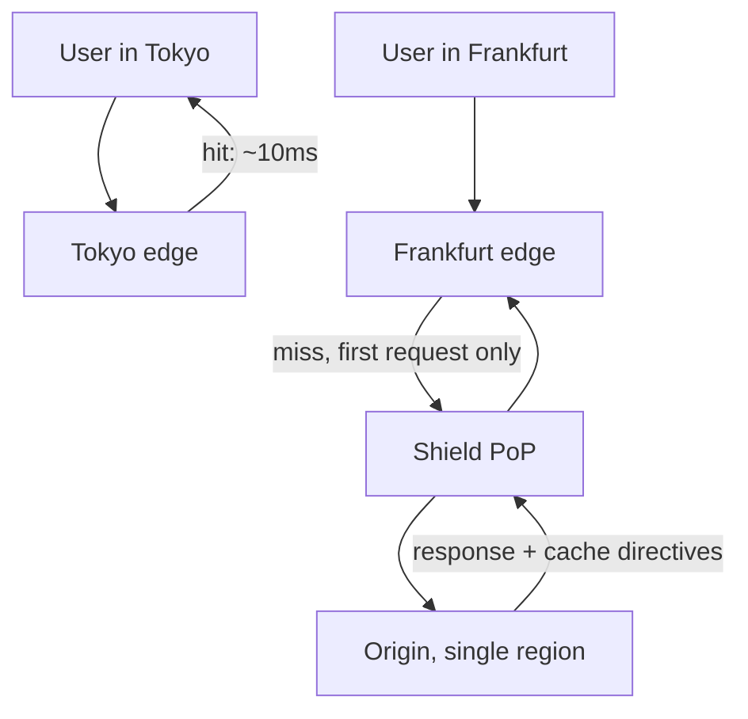

# Content Delivery Network {#ch-cdn}

> Serve bytes from near the user, count how many never reach your origin, and change the URL rather than waiting for a TTL.

**In this chapter:** what a CDN actually offloads · anycast and edge routing · what belongs at the edge · origin shielding · invalidation without purging

## 💡 The Core Idea

A CDN is a cache with a map. It keeps copies of your responses in hundreds of locations and answers
each user from the nearest one. Two things follow, and only one of them is the famous one.

The famous one is latency. A request that would have crossed an ocean is answered a few milliseconds
away. The more valuable one is offload. Every response served at the edge is a request your servers
never see. That makes a CDN the cheapest capacity you can buy. You are not scaling the origin (your
own servers); you are removing traffic from it.

## How It Works

### Anycast and the edge

With anycast, every edge location announces the same address. Internet routing delivers the request
to whichever one is nearest. That edge either has the response or fetches it once and keeps it.


```mermaid
flowchart TD
    U1[User in Tokyo] --> E1[Tokyo edge]
    U2[User in Frankfurt] --> E2[Frankfurt edge]
    E1 -->|hit: ~10ms| U1
    E2 -->|miss, first request only| SH[Shield PoP]
    SH --> O[Origin, single region]
    O -->|response + cache directives| SH
    SH --> E2
```

**A miss costs the origin one request; every later user in that region is answered locally.**

Without a CDN, that Tokyo user pays a 150-millisecond round trip to a US origin on every asset. With
one, they pay ten to the local edge. The origin's location stops being a product decision.

### The offload arithmetic

Origin load is total traffic times the miss rate. So the hit ratio is the number to argue about:

```typescript
function originRps(totalRps: number, hitRatio: number): number {
  return Math.round(totalRps * (1 - hitRatio));
}

originRps(50_000, 0.8); // 10,000 req/s reach the origin
originRps(50_000, 0.9); //  5,000 req/s — ten more points halve the origin load
```

What hit ratio you can reach depends entirely on what you are serving:

| Content | Achievable hit ratio | Why |
| --- | --- | --- |
| Content-hashed assets — JS, CSS, images | 95–99% | The URL changes when the bytes do, so it can be cached for a year |
| Media segments | 95%+ | Immutable once published, and requested by everyone watching |
| Public HTML with a short TTL | 60–80% | Shared across users, but expires often |
| Public JSON APIs | 70–90% | Cacheable if the response does not depend on who asked |
| Anything personalised | 0% | Every response is different, and a shared cache would leak it |

> ⚠️ A hit ratio below 70% on assets usually means the cache key has something in it that varies per
> user, such as a cookie or a tracking query parameter. The fix is in the cache key, not in the TTL.

### What belongs at the edge

| Path | Directive | Reasoning |
| --- | --- | --- |
| `/assets/app.7f3c9a.js` | `max-age=31536000, immutable` | Hashed filename; a new build is a new URL |
| `/` and other public HTML | `s-maxage=300, stale-while-revalidate=60` | Shared, but must reflect a deploy quickly |
| `/api/products` | `s-maxage=60, stale-while-revalidate=30` | Public list; a minute of lag is invisible |
| `/api/me`, anything behind a login | `private, no-store` | A shared cache holding this is a data leak |

`max-age` speaks to the browser and `s-maxage` to the shared cache. `stale-while-revalidate` removes
the latency spike at expiry. The edge answers at once from the stale copy and refreshes it behind the
request. The full mechanics of those directives belong to
[Chapter ?? — Cloud Fundamentals, Storage and Delivery](#ch-cloud-fundamentals).

### Origin shielding

Edges do not share caches. When a cold object is requested worldwide, every edge misses at once. The
origin then takes hundreds of identical requests for one file. A shield is one chosen PoP (point of
presence, a CDN site) that every edge fetches through, so a global miss costs the origin one request.

This matters most for large, popular, immutable objects, such as a video segment or a launch-day
bundle. There the fan-out is widest and the object is expensive to serve.

### Invalidation, and why hashing beats purging

Purging paths is slow, usually metered, and eventually consistent. Worse, "purge everything" after a
deploy throws away the cache you spent all day filling. It hands the next few minutes of traffic
straight to the origin.

The alternative is to change the URL instead. With content-hashed filenames, a new build produces URLs
the edge has never seen. Nobody requests the old objects again, so there is no purge and no window of
staleness. The only thing left to invalidate is the small HTML entry point that references them. That
is one path, not a wildcard.

```typescript
// The only purge a healthy deploy needs: the entry points, by exact path.
async function purgeEntryPoints(cdn: CdnClient, distributionId: string): Promise<void> {
  await cdn.purge({ distributionId, paths: ["/", "/index.html", "/sitemap.xml"] });
}
```

### Media and range requests

Streaming splits a video into segments of a few seconds each. The edge caches each segment on its own,
and a viewer who skips ahead pulls only what they watch. Players also send byte-range requests, which
the edge must answer with partial content, not the whole object. Both are the default on any serious
CDN. Name them in an interview: they explain how a platform serves millions of concurrent viewers from
one origin.

## When to Use It

| Scenario | What the CDN buys |
| --- | --- |
| Static assets of any kind | Near-total offload, at the lowest effort of anything on this list |
| Users across more than one continent | Three to ten times lower latency without a second region |
| A launch or a traffic spike | The edge absorbs it; the origin sees the miss rate, not the spike |
| Large media files | Bandwidth savings, plus segment and range handling you would otherwise build |
| Hostile traffic | Attack volume terminates at the edge, far from your servers |

**Do not reach for it** when responses are personalised, when the data changes faster than a useful
TTL, or for writes. A POST has nothing to cache and gains only a hop.

## Common Mistakes

❌ **Caching a response that carries `Set-Cookie`.** The edge stores one user's session and hands it to
the next. ✅ Put `private, no-store` on anything authenticated. Check that the cache key never includes a
session cookie.

❌ **Static filenames.** `main.js` cached for a year is a deploy that never reaches users. ✅ Let the
build hash the content into the filename.

❌ **Purging the world on every deploy.** The cache empties, the origin absorbs the refill, and the
deploy looks like an incident. ✅ Purge the entry points by exact path. Let hashed URLs handle the rest.

❌ **No shield on a globally popular object.** One cold object becomes hundreds of simultaneous origin
requests. ✅ Turn shielding on for large immutable assets.

❌ **A publicly readable origin behind the CDN.** Users find the direct URL and skip the cache. Your
hit ratio and access rules both stop meaning anything. ✅ Restrict the origin to the CDN's identity.

## 🔑 Key Takeaways

- The offload matters more than the latency: a response served at the edge is one your origin never sees.
- Origin load is traffic times miss rate, so each point of hit ratio is worth more the higher you go.
- What you can cache is decided by whether the response is the same for everyone, not by its size.
- Content-hashed URLs replace invalidation. Purging is a fallback for entry points, not a deploy step.
- Origin shielding is what stops a global cache miss becoming a global origin stampede.

## Interview Questions

**Q: Why is a CDN a scaling tool and not just a performance one?**

Because it changes how much traffic your origin sees. At a 90% hit ratio, nine of every ten requests
are answered without touching your infrastructure, so the same servers absorb ten times the traffic.
Adding origin capacity costs servers and operational work. Raising the hit ratio costs a change to
cache headers. That is why the caching question comes before the capacity question.

**Q: After a deploy, users still get the old JavaScript. What went wrong?**

Either the asset filenames did not change, so the edge still serves bytes it correctly believes are
current. Or the HTML that references them is itself cached too long. The structural fix is content
hashing on assets with a one-year TTL. Give the HTML entry point a short `s-maxage`, and make it the
only thing you ever purge.

**Q: What is origin shielding and when do you need it?**

A chosen middle PoP that all edges fetch through. A cache miss at fifty locations becomes one origin
request, not fifty. You need it when objects are large, globally popular and often cold, such as media
segments or a launch bundle. For small, warm assets in a single-region audience
it adds a hop for little gain.

**Q: When is a CDN the wrong answer?**

When responses are personalised. A shared cache holding a logged-in user's dashboard is a data leak,
not a performance win. Marking it cacheable is one of the few CDN mistakes that causes a security
incident, not just a stale page. The move is to cache the shared parts and leave the personalised
part to the origin, near its data.

## What to Read Next

- [Chapter ?? — Caching](#ch-caching) — the same idea one layer in, where the data is not public
- [Chapter ?? — Cloud Fundamentals, Storage and Delivery](#ch-cloud-fundamentals) — configuring the edge and its origin in practice
- [Chapter ?? — Load Balancing](#ch-load-balancing) — what handles the traffic that does reach you
