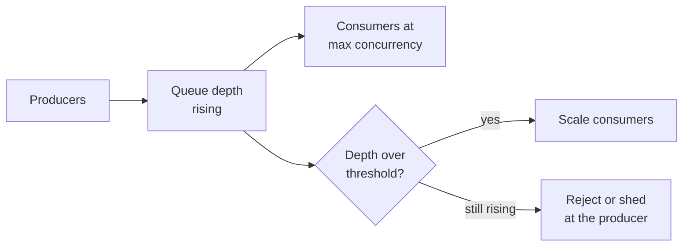
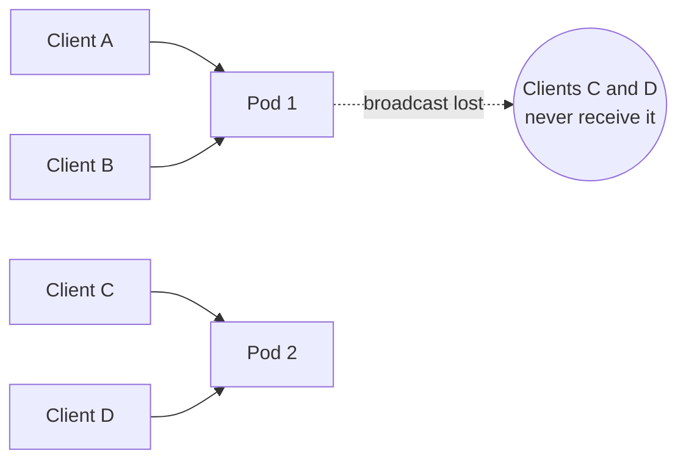

# Queues, Async Work and WebSockets {#ch-message-queues}

> Move work off the request path, make the worker safe to run twice, and push the result back over a connection that survives more than one server.

**In this chapter:** queue versus pub/sub versus log · delivery guarantees and idempotent workers · retries and back-pressure · WebSocket, SSE or polling · scaling held connections and fan-out

## 💡 The Core Idea

Some work does not fit inside one request and one response. It is too slow, or nobody waits for it.
There are two ways out. You can **queue the work behind the request** and answer "accepted" instead of
"done". Or you can **push the result back** over a long-lived connection when it is ready.

Both change the contract with the user. A queue absorbs spikes and retries by itself, but the work may
happen twice and the caller no longer knows when it finished. A held connection delivers news in
milliseconds, but it belongs to one process, so every server you add makes broadcast harder.

## How It Works

### Three shapes, often confused

| Shape          | Delivery                                    | Message life                  | Use for                             |
| -------------- | ------------------------------------------- | ----------------------------- | ----------------------------------- |
| **Work queue** | One consumer gets each message              | Deleted after acknowledgement | Tasks: send email, resize image     |
| **Pub/sub**    | Every subscriber gets a copy                | Dropped once delivered        | Notifying interested services       |
| **Event log**  | Every consumer group reads the whole stream | Retained for days, replayable | Event sourcing, analytics, rebuilds |

RabbitMQ and SQS are work queues, SNS is pub/sub, and Kafka is a log. **The deciding question is
replay.** If a consumer broken for a day must catch up on what it missed, you need a log. Otherwise a
queue is simpler and cheaper.

### What belongs off the request path

The test: **does the response change based on the result?** Writing the order record and charging the
card stay synchronous, because the UI depends on them. The confirmation email does not, so queue it.

**Accepted, then told — the handler does two cheap things and returns:**

```typescript
interface JobAccepted { jobId: string; statusUrl: string }

async function requestExport(userId: string, queue: Queue, store: JobStore): Promise<JobAccepted> {
  const jobId: string = crypto.randomUUID();
  await store.create({ jobId, userId, state: "queued" }); // durable before enqueue
  await queue.send({ jobId, userId, type: "export" });
  return { jobId, statusUrl: `/jobs/${jobId}` }; // HTTP 202
}
```

Write the job record **before** you enqueue. If the enqueue fails, the client still has an ID to retry
with. Reverse the order and a worker can pick up a job whose record does not exist yet. The client then
learns the outcome by polling `statusUrl`, or by listening on a push channel, covered below.

### Delivery guarantees and idempotent workers

| Guarantee     | What really happens                               | Cost                                                   |
| ------------- | ------------------------------------------------- | ------------------------------------------------------ |
| At most once  | Fire and forget; messages can be lost             | Only acceptable for telemetry                          |
| At least once | Redelivered until acknowledged; duplicates happen | The consumer must be idempotent                        |
| Exactly once  | Only inside one broker's own transaction          | Throughput and complexity; never covers your side effects |

Assume **at least once**. "Exactly once" across a broker and a payment provider cannot be achieved. The
acknowledgement can be lost after the side effect has already happened.

**An idempotent worker, keyed on the business fact:**

```typescript
interface Processed { has(key: string): Promise<boolean>; add(key: string): Promise<void> }

async function handleCharge(msg: { orderId: string }, seen: Processed): Promise<void> {
  // A redelivery reuses the same orderId, so the key survives it; a message ID might not.
  const key = `charge:${msg.orderId}`;
  if (await seen.has(key)) return;
  await chargeCard(msg.orderId);
  await seen.add(key);
}
```

Prefer, in order: an operation that is naturally idempotent (a `PUT` of a final state), then an
idempotency key the downstream honours, then a processed-set like this one. The processed-set has a race
between the side effect and the record, so use it only when nothing better exists.

### Retries, dead letters and back-pressure

Retry with exponential backoff **and jitter**. Without jitter, every failed message retries at the same
instant and knocks the recovering service over again. Retry timeouts, 503s and 429s (honour
`Retry-After`). Send malformed messages and business rejections straight to a **dead letter queue**.
Alert when it holds anything, and keep the original message with its error so it can be replayed.



**A queue that grows forever is a system failing slowly; scale the consumers, then shed at the producer.**

Alert on the **age of the oldest message**, not depth alone. A million messages draining in ten seconds
is healthy. Fifty messages whose oldest is an hour old means a consumer has stalled.

### Pushing the result back

"Real-time" is a requirement, not a technology: the server must tell the client something without being
asked. Three transports meet it at very different prices.

| | **WebSocket** | **SSE** | **Polling** |
| --- | --- | --- | --- |
| Direction | Bidirectional | Server → client | Client asks |
| Protocol | Own protocol after `101` upgrade | Plain HTTP | Plain HTTP |
| Reconnect | You build it | ✅ Automatic, `Last-Event-ID` replay | N/A |
| Proxies, CDNs, HTTP/2 | ⚠️ Often needs config; compression lost | ✅ Just HTTP | ✅ |
| Server cost | One held connection per client | One held connection per client | Spiky, but stateless |

**The deciding question: does the client also send frequent messages?** If yes, you need a socket and
you accept stateful infrastructure. If no, you are pushing one way, and plain HTTP already does that.
SSE is the most under-used of the three. Job progress, notifications and token streams all belong on it.

> ⚠️ **The HTTP/1.1 caveat:** browsers cap HTTP/1.1 at about six connections per origin, so several tabs
> holding SSE streams starve each other. Over HTTP/2 they share one connection and the problem goes away.

### The stateful connection problem

A held connection belongs to exactly one process. Every scaling difficulty follows from that.



**Client A emits to a room. Pod 2 holds half the room and never hears about it.**

The fix is a pub/sub broker that every pod subscribes to. Each pod publishes outbound messages to a
shared channel and delivers what it receives to its own sockets. Redis Pub/Sub is the usual choice.

| Concern                 | What it means at scale                                                                                  |
| ----------------------- | ------------------------------------------------------------------------------------------------------- |
| **Fan-out cost**        | Every message reaches every pod. Past a few dozen pods, shard the channel by room                        |
| **No durability**       | Redis Pub/Sub drops what a disconnected pod missed, so the database is the source of truth               |
| **Deploys are outages** | A rolling deploy drops every socket on a pod at once. Stop accepting, tell clients to reconnect, exit on a stagger |
| **Capacity**            | About 50k idle sockets per Node.js process; memory runs out before CPU                                   |

**Know when to buy.** A managed service (Ably, Pusher, AWS API Gateway WebSockets) takes connection
scaling, sharding and draining off your team. "I would buy this" is a senior answer if you can name the
cost: a per-connection price, and a vendor in your most latency-sensitive path.

### Fan-out

Notifications are the classic fan-out problem: one event becomes thousands of deliveries.

| Pattern          | How                                                         | Use when                                         |
| ---------------- | ----------------------------------------------------------- | ------------------------------------------------ |
| Fan-out on write | Expand the recipient list at publish time, one message each | Recipient lists are small and reads are frequent |
| Fan-out on read  | Store the event once, expand when each user asks            | Recipient lists are huge (the celebrity problem) |
| Hybrid           | Write-side for normal accounts, read-side for the outliers  | Real systems, almost always                      |

Every fan-out needs **deduplication** keyed on the business event, so a redelivery never sends a push
twice, and **per-channel rate limits**, because providers reject a burst of a million emails.

## When to Use It

| Situation                                      | Choose                     | Why                                    |
| ---------------------------------------------- | -------------------------- | -------------------------------------- |
| Background tasks, one worker per message       | Work queue (SQS, RabbitMQ) | Simplest thing that works              |
| Consumers must replay history                  | Event log (Kafka)          | Retention and offsets are the feature  |
| The caller needs the answer now                | No queue                   | Async here just adds a polling problem |
| Server pushes, client listens — progress, alerts | SSE                      | One direction, and proxies handle it   |
| Client sends often — chat, cursors, editing    | WebSocket                  | Genuinely bidirectional                |
| "Fresh within 30 seconds" is fine              | Polling                    | Stateless, cacheable, trivial to run   |

## Common Mistakes

❌ **A worker that is not safe to run twice.** Charging a card on message receipt with no key will
double-charge, usually during an incident, when redelivery is most likely.
✅ Send `Idempotency-Key: order-8821`, so a redelivery returns the original charge.

❌ **Reaching for a socket because the feature is called "live".** Most live features push one way.
✅ Ask whether the client sends anything. If not, use SSE.

❌ **Designing broadcast on a single instance.** It works in development and fails on the second pod.
✅ Assume more than one process from the first sketch, and persist events outside the broker.

## 🔑 Key Takeaways

- A queue decouples when work happens from when it was requested, and the user contract changes from "done" to "accepted".
- Assume at-least-once delivery and make every consumer idempotent, keyed on the business fact rather than the message.
- Alert on the age of the oldest message, because depth alone hides a stalled consumer.
- Choose a WebSocket only when the client sends frequent messages; otherwise SSE or polling costs far less to run.
- A held connection belongs to one process, so cross-server broadcast needs a pub/sub broker and still needs the database for durability.

## Interview Questions

**Q: Your consumer processes the same message twice. Whose bug is it?**

Nobody's — at-least-once delivery guarantees it, because an acknowledgement can be lost after the work
succeeded. The consumer must be idempotent: a naturally idempotent operation, an idempotency key the
downstream honours, or a processed-set keyed on the business identifier.

**Q: When would you pick Kafka over SQS?**

When consumers need to replay, when several consumer groups read the same stream, or when ordering within
a partition matters. SQS is simpler and cheaper for plain background tasks. Kafka for a job queue means
running a cluster for features you do not use.

**Q: When is a queue the wrong answer to a slow endpoint?**

When the caller needs the result to continue. Turning a slow call into a job plus polling moves the
latency rather than removing it. It also adds a job store, a status endpoint and a client state machine.
Fix the slow work first, and queue it only when nobody is waiting.

**Q: WebSocket or SSE for streaming job progress to the browser?**

SSE. Progress flows one way, SSE is plain HTTP so proxies and HTTP/2 multiplexing work, and browsers
reconnect by themselves with `Last-Event-ID` replay. A WebSocket earns its cost only when traffic is
genuinely bidirectional, such as chat or collaborative cursors.

**Q: How do you scale real-time connections across many servers?**

Every server subscribes to a shared pub/sub channel and delivers messages to its own sockets. That makes
broadcast correct but leaves two gaps. The broker is fire-and-forget, so durability comes from the
database. Every message also reaches every server, which stops scaling in the low dozens of nodes; past
that, shard by room or buy a managed service.

## What to Read Next

- [Chapter ?? — Real-Time and Streaming APIs](#ch-realtime-streaming) — the server code behind SSE and WebSockets: typed events, authentication, rooms
- [Chapter ?? — Resilience Patterns](#ch-resilience-patterns) — timeouts, retries and circuit breakers around the calls a worker makes
- [Chapter ?? — Design an Infinite Feed](#ch-design-infinite-feed) — fan-out on write versus on read, worked end to end
