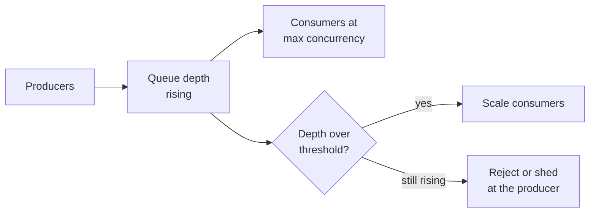

# Queues and Asynchronous Work {#ch-message-queues}

> Move work off the request path, pick between a queue and a log, and make the worker safe to run twice.

**In this chapter:** queue versus pub/sub versus log · what belongs off the request path · delivery guarantees · idempotent workers · retries and dead letters · back-pressure · fan-out

## 💡 The Core Idea

A queue is a buffer between something that produces work and something that does it. Adding one changes
the contract with the user: instead of "your report is ready", the answer becomes "we have accepted your
request". Everything good and everything difficult about async work follows from that one change. The
system absorbs spikes, survives a slow downstream, and retries by itself. In exchange, the caller no
longer knows when the work finished, and the work may happen twice.

> A queue does not make work disappear. It decouples *when* it happens from *when it was asked for*.

## How It Works

### Three shapes, often confused

| Shape             | Delivery                                   | Message life           | Use for                             |
| ----------------- | ------------------------------------------ | ---------------------- | ----------------------------------- |
| **Work queue**    | One consumer gets each message              | Deleted after acknowledgement | Tasks: send email, resize image |
| **Pub/sub**       | Every subscriber gets a copy                | Dropped once delivered | Notifying interested services       |
| **Event log**     | Every consumer group reads the whole stream | Retained for days, replayable | Event sourcing, analytics, rebuilds |

RabbitMQ and SQS are work queues. SNS and Redis pub/sub are pub/sub. Kafka and Kinesis are logs.

**The deciding question is replay.** If a consumer that has been broken for a day should be able to
catch up on everything it missed, you need a log. If missed messages are simply gone, a queue is
simpler and cheaper.

### What belongs off the request path

| Work                          | Sync or async | Why                                        |
| ----------------------------- | ------------- | ------------------------------------------ |
| Writing the order record      | Sync          | The user needs the confirmation to be true |
| Charging a card               | Sync          | The result changes what the UI shows       |
| Sending the confirmation email | Async        | The user does not wait for their inbox     |
| Generating thumbnails         | Async         | Seconds of work, no one is watching        |
| Updating a search index       | Async         | Eventually consistent is acceptable        |
| Recalculating recommendations | Async         | Nobody asked for it in this request        |

The test: **does the response change based on the result?** If not, it belongs in a queue.

### The accepted-then-poll shape

```typescript
interface JobAccepted { jobId: string; statusUrl: string }

// The handler does two cheap things and returns. It never does the work.
async function requestExport(userId: string, queue: Queue, store: JobStore): Promise<JobAccepted> {
  const jobId: string = crypto.randomUUID();
  await store.create({ jobId, userId, state: "queued" }); // durable before enqueue
  await queue.send({ jobId, userId, type: "export" });
  return { jobId, statusUrl: `/jobs/${jobId}` }; // HTTP 202
}
```

Write the job record **before** enqueuing. If the enqueue fails, the client has an ID to retry with; if
the order is reversed, a worker can pick up a job whose record does not exist yet.

### Delivery guarantees

| Guarantee     | What really happens                                      | Cost                                |
| ------------- | -------------------------------------------------------- | ----------------------------------- |
| At most once  | Fire and forget; messages can be lost                     | Only acceptable for telemetry       |
| At least once | Redelivered until acknowledged; duplicates happen         | The consumer must be idempotent     |
| Exactly once  | Only within one broker's own transaction boundary         | Throughput, complexity, and it does not extend to your side effects |

Assume **at least once** and design for it. "Exactly once" across a broker and an external API — a
payment provider, an email service — is not achievable, because the acknowledgement can be lost after
the side effect has happened.

### Idempotent workers

```typescript
interface Processed { has(key: string): Promise<boolean>; add(key: string): Promise<void> }

async function handleCharge(msg: { orderId: string }, seen: Processed): Promise<void> {
  // The key is the business fact, not the message ID — a redelivery reuses the same orderId.
  const key = `charge:${msg.orderId}`;
  if (await seen.has(key)) return;
  await chargeCard(msg.orderId);
  await seen.add(key);
}
```

Three ways to get there, in order of preference: make the operation naturally idempotent (a `PUT` of a
final state), give it a unique key the downstream honours (an idempotency key on the payment API), or
keep a processed-set as above. The processed-set has a race between the side effect and the record, so
prefer the first two when the downstream supports them.

### Retries and the dead letter queue

Retry with exponential backoff **and jitter** — without jitter, every failed message retries at the same
instant and the recovering service is knocked over again.

| Failure                       | Retry?                | Then                              |
| ----------------------------- | --------------------- | --------------------------------- |
| Network timeout, 503          | Yes, with backoff     | Succeeds when the dependency heals |
| 429 rate limited              | Yes, honour `Retry-After` | Slows the consumer down       |
| 400 malformed message         | No                    | Straight to the dead letter queue |
| Business rule rejection       | No                    | Dead letter queue, and alert      |

A dead letter queue holds what failed after the last attempt. Two rules make it useful rather than
decorative: **alert on depth greater than zero**, and keep the original message plus the error, so a
message can be fixed and replayed rather than read and guessed at.

### Back-pressure

A queue that grows forever is a system that is failing slowly.



**Queue depth and message age are the two metrics to alert on; consumer CPU tells you nothing about the backlog.**

Alert on **oldest message age**, not depth alone. A queue of a million messages draining in ten seconds
is healthy; a queue of fifty messages whose oldest is an hour old is broken.

### Fan-out

Notifications are the canonical fan-out problem: one event becomes thousands of deliveries across email,
push and SMS.

| Pattern            | How                                                      | Use when                          |
| ------------------ | -------------------------------------------------------- | --------------------------------- |
| Fan-out on write   | Expand the recipient list at publish time, one message each | Recipient lists are small and reads are frequent |
| Fan-out on read    | Store the event once, expand when each user asks          | Recipient lists are huge (the celebrity problem) |
| Hybrid             | Write-fan-out for normal accounts, read for the outliers  | Real systems, almost always       |

Two things every fan-out needs: **deduplication**, keyed on the business event rather than the message,
so a redelivery does not send the same push twice; and **per-channel rate limits**, because providers
throttle and a burst of a million emails will be rejected rather than queued.

## When to Use It

| Situation                                | Choose                     | Why                                    |
| ---------------------------------------- | -------------------------- | -------------------------------------- |
| Background tasks, one worker per message | Work queue (SQS, RabbitMQ) | Simplest thing that works              |
| Several services care about one event    | Pub/sub or a log           | Producers should not know consumers    |
| Consumers must replay history            | Event log (Kafka)          | Retention and offsets are the feature  |
| Spiky traffic, steady processing capacity | Any queue                 | The buffer is the point                |
| The caller needs the answer now          | No queue                   | Async here just adds a polling problem |

## Common Mistakes

**❌ A worker that is not safe to run twice**

> Charging a card directly on message receipt, with no idempotency key.

At-least-once delivery means this *will* double-charge, usually during an incident when redelivery is
most likely.

**✅ Keyed on the business fact**

> The payment call carries `Idempotency-Key: order-8821`, so a redelivery returns the original charge.

**❌ Alerting on queue depth only**

Depth without age hides a stalled consumer behind a low number and pages you for a healthy burst.

**❌ Unbounded retries**

A poison message retried forever occupies a consumer permanently and can saturate the whole pool. Cap
attempts and dead-letter the rest.

## 🔑 Key Takeaways

- A queue decouples when work happens from when it was requested, and the user contract changes to "accepted", not "done".
- Choose a log over a queue only when a consumer must replay history; otherwise the queue is simpler.
- Assume at-least-once delivery and make every consumer idempotent, keyed on the business fact.
- Alert on the age of the oldest message, not queue depth alone.
- Fan-out is write-side for small recipient lists, read-side for huge ones, and hybrid in every real system.

## Interview Questions

**Q: Your consumer processes the same message twice. Whose bug is it?**

Nobody's — at-least-once delivery guarantees it will happen, because an acknowledgement can be lost
after the work succeeded. The consumer is responsible for being idempotent, using a natural idempotent
operation, an idempotency key the downstream honours, or a processed-message set keyed on the business
identifier.

**Q: When would you pick Kafka over SQS?**

When consumers need to replay, when several independent consumer groups read the same stream, or when
ordering within a partition matters. SQS is simpler to operate and cheaper for plain background tasks,
and picking Kafka for a job queue means running a cluster to get features you are not using.

**Q: When is a queue the wrong answer to a slow endpoint?**

When the caller needs the result to continue. Converting a slow synchronous call into a job plus polling
moves the latency rather than removing it, and adds a job store, a status endpoint and a client state
machine. Fix the slow work first; queue it only when nobody is waiting.

## What to Read Next

- [Chapter ?? — Resilience Patterns](#ch-resilience-patterns) — timeouts, retries and circuit breakers around the calls a worker makes
- [Chapter ?? — Service Boundaries](#ch-service-boundaries) — events as the contract between services
- [Chapter ?? — Design a News Feed](#ch-design-news-feed) — fan-out on write versus on read, worked end to end
