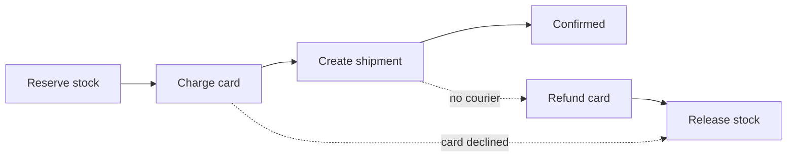

# Service Boundaries and the API Gateway {#ch-service-boundaries}

> Draw the line between services where the data and the team already are, and keep the edge in front of them thin.

**In this chapter:** monolith versus services · finding the seam · requests, events and sagas · what the gateway owns · the backend-for-frontend pattern

## 💡 The Core Idea

A service boundary is a promise. It says two pieces of code can be changed, deployed and scaled on
their own. The promise is expensive. A function call becomes a network call that can fail. A
transaction becomes a distributed workflow. A schema change becomes a negotiation between teams.

The API gateway is the other side of that decision. It stands in front of the services and routes,
authenticates and rate-limits once. That is a good deal until business logic moves in.

> Splitting a system is a coordination decision before it is a technical one. If one team owns both
> sides of a boundary, that boundary buys you nothing.

## How It Works

### Monolith or services

| | Modular monolith | Services |
| --- | ---------------- | -------- |
| Deploy | One artefact, all or nothing | Each service on its own |
| Failure | An exception, in-process | Network calls that time out |
| Data | One database, real transactions | One store each, no cross-service transaction |
| Scaling | Everything scales together | The hot part scales alone |
| Right for | Most systems under a few dozen engineers | Independent teams, or very different workloads |

The default interview answer is a **modular monolith with clear internal boundaries**, then splitting
out the one module that has earned it. Opening with "microservices" reads as a résumé.

### Finding the seam

Good boundaries come from the domain, not from technical layers. Split by **what changes together**.

| Signal | What it suggests |
| ------ | ---------------- |
| Two areas are always deployed together | **Not** a boundary — they are one thing |
| A distinct set of nouns and rules | A bounded context, such as orders, payments or catalogue |
| A different scaling shape | Image processing, search indexing, report generation |
| A separate team with its own roadmap | Conway's law will draw this line whether you plan it or not |

> ⚠️ A boundary that needs a synchronous call in both directions is not a boundary. Two services that
> call each other on every request are one function call spread across a network.

**Layer-shaped splits are the classic mistake.** A "database service", an "API service" and a "logic
service" mean every feature touches all three. Nothing can deploy on its own.

### Requests or events

| | Synchronous request | Event |
| --- | ------------------- | ----- |
| Coupling | Caller knows the callee | Publisher does not know subscribers |
| Failure | Caller sees it at once | Broker retries; caller is unaffected |
| Consistency | Immediate | Eventual |
| Latency | The sum of the chain | Producer returns straight away |

Use a request **when the caller needs the answer to respond**. Checking stock before confirming an
order is a request. Emailing the receipt is an event.

Keep **at most one synchronous hop on the critical path**. Three chained calls at 99.9% availability
each give 99.7%, and their latencies add up.

**An event that carries what subscribers need:**

```typescript
// Past tense, immutable, self-contained.
interface OrderPlaced {
  eventId: string; // lets consumers drop duplicates
  type: "order.placed";
  occurredAt: string;
  orderId: string;
  userId: string;
  total: number; // copied, so no subscriber has to call back
}
```

An event with only an ID forces every subscriber to call back, which restores the coupling.

### Database per service, and sagas

Each service owns its store, and no other service reads it directly. This is what makes a boundary
real. A shared database means a shared schema, and a shared schema means coordinated deploys forever.

The price is that cross-service joins and transactions disappear. To show data from two services on
one page, compose it in a BFF. To query across services, build a read model from events. To update two
services together, use a **saga**: a chain of local transactions, each with a **compensating action**
that undoes it.



**A checkout saga: every forward step has an inverse, and the saga is only as reliable as those inverses.**

A saga has **no isolation**. Other requests can see the half-finished state, so the UI needs a pending
status. Compensation is not a rollback either: a refund is a new transaction. Two-phase commit is not
the fix, because it holds locks across the network. Short flows can be choreographed, with each
service reacting to events. Past about four steps, one orchestrator driving the steps is clearer.

### The gateway at the edge

Without a gateway, every client knows every service's address, and every service checks tokens and
limits traffic in its own way. The gateway does this once, from a route table kept in a config store.

| Concern | What the gateway does |
| ------- | --------------------- |
| Authentication | Validates the token once and forwards a verified identity header |
| Rate limiting | Rejects at the edge, before any service spends compute |
| TLS | Terminates once; plain HTTP inside the network |
| Routing | Maps `/api/orders/*` to the order service; clients know one URL |

| | Load balancer | API gateway | Service mesh |
| --- | ------------- | ----------- | ------------ |
| Routes between | Replicas of **one** service | **Different** services, by path | Services, hop by hop |
| Traffic | Any | North–south: client to cluster | East–west: service to service |
| Owns | Spreading load, health checks | Auth, quotas, TLS, routing | mTLS, retries, per-hop tracing |

Interviewers blur these on purpose. They compose: an L4 load balancer usually fronts a stateless
gateway cluster, and a large estate adds the mesh.

> ⚠️ The gateway is the authoritative limit, not the only one. Internal callers bypass it entirely, so a
> service that must not be overwhelmed still needs its own limit as defence in depth.

### Backend for frontend

One gateway serving web, mobile and partners becomes a shared bottleneck. Each client wants a
different shape. **A BFF is one gateway per client type**, owned by the team that owns that client.

**Two BFFs over the same order service:**

```typescript
// Mobile BFF — only the fields the app renders
async function getMobileOrder(orderId: string): Promise<MobileOrderSummary> {
  const order = await orderService.getOrder(orderId);
  return { id: order.id, status: order.status, totalAmount: order.totalAmount };
}

// Web BFF — aggregates what the desktop detail page shows
async function getWebOrder(orderId: string): Promise<FullOrderDetail> {
  const order = await orderService.getOrder(orderId);
  const [user, stock] = await Promise.all([
    userService.getUser(order.userId),
    inventoryService.getStock(order.lineItems),
  ]);
  return assembleOrderDetail(order, user, stock);
}
```

The cost is real: three BFFs mean three deploys and three places a shared change lands. A BFF earns
that when client needs truly diverge, not when one client wants two fewer fields.

## When to Use It

| Situation | Do | Why |
| --------- | -- | --- |
| Under ~20 engineers, one product | Modular monolith | The split costs more than it returns |
| One workload with a different scaling shape | Extract that one service | The clearest possible reason |
| Teams blocking each other on deploys | Split along team lines | Independence is the actual product |
| A flow that must update several services | Saga with explicit compensations | No distributed transaction exists |
| Several services with external clients | API gateway | The duplicated auth and limits already cost you |
| Clients that need very different shapes | A BFF per client type | One shape actively harms one client |

## Common Mistakes

**❌ The distributed monolith.** Eight services that must deploy together because their contracts
change in lockstep. Every cost of distribution, none of the independence.

**✅ One service extracted for a stated reason.** "Image processing is CPU-bound and spiky, so it
scales on its own, and its failures do not touch checkout."

**❌ A shared database between services.** A schema migration becomes a cross-team event. Each service
should own its store, and others read it through its API or its events.

**❌ Business logic in the gateway**, such as discount rules or entitlement checks. Every team now
changes the most critical shared component together.

**✅ The gateway routes and protects.** Aggregation lives in a service or a GraphQL layer behind it.

> ⚠️ An upstream with no timeout or circuit breaker piles up gateway connections. One slow service can
> then make the whole edge unresponsive. Give every upstream its own timeout and breaker.

## 🔑 Key Takeaways

- A service boundary buys independent deploys and scaling, and charges network failure, eventual consistency and schema negotiation for it.
- Split by domain and by team, never by technical layer, and merge two services that call each other constantly.
- Database-per-service makes a boundary real, and a saga with compensating steps replaces the cross-service transaction it removes.
- A gateway earns its hop by owning auth, limits, TLS and routing once, and stops earning it when business logic moves in.
- A BFF is the answer when client needs truly diverge, and its cost is one more deployable per client type.

## Interview Questions

**Q: How do you decide where to split a monolith?**

Look for a part that changes at a different rate, scales differently, or belongs to a team blocked by
everyone else's releases. Then check the data. If the extracted part must reach back into the main
database on every request, the seam is in the wrong place. Extract one service and prove the boundary
holds before you consider the next.

**Q: Two services need to update atomically. What do you do?**

Accept that a distributed transaction is not available and use a saga. Each service commits locally and
publishes an event, and each step has a compensating action. Say the consequence up front: there is a
visible window where the system is half-updated, so the user-facing model needs a pending state.

**Q: When are microservices the wrong answer?**

When there is one team. The independence being bought is organisational, so one team gets nothing for
the network failures, distributed debugging and deployment matrix. A modular monolith with enforced
internal boundaries gets most of the design benefit and can be split later, when there is a reason.

**Q: What is the difference between an API gateway and a load balancer?**

A load balancer spreads traffic across replicas of one service, at L4 or L7. A gateway works at L7 and
routes between different services by path, while owning auth, rate limits and request shaping. They
compose: an L4 load balancer usually sits in front of a stateless gateway cluster.

**Q: The gateway is now a single point of failure. What do you do about it?**

Keep it stateless so it scales out, and run it active-active across at least two availability zones.
Cache the route table in memory, so a config-store outage does not take the edge down. Then add
per-upstream circuit breakers, so the gateway is not only as reliable as its weakest service.

## What to Read Next

- [Chapter ?? — Queues, Async Work and WebSockets](#ch-message-queues) — the transport that carries events between services
- [Chapter ?? — Resilience Patterns](#ch-resilience-patterns) — timeouts and circuit breakers for every call across a boundary
- [Chapter ?? — Rate Limiting](#ch-rate-limiting) — the algorithms and the atomic counter behind the gateway's quota check
