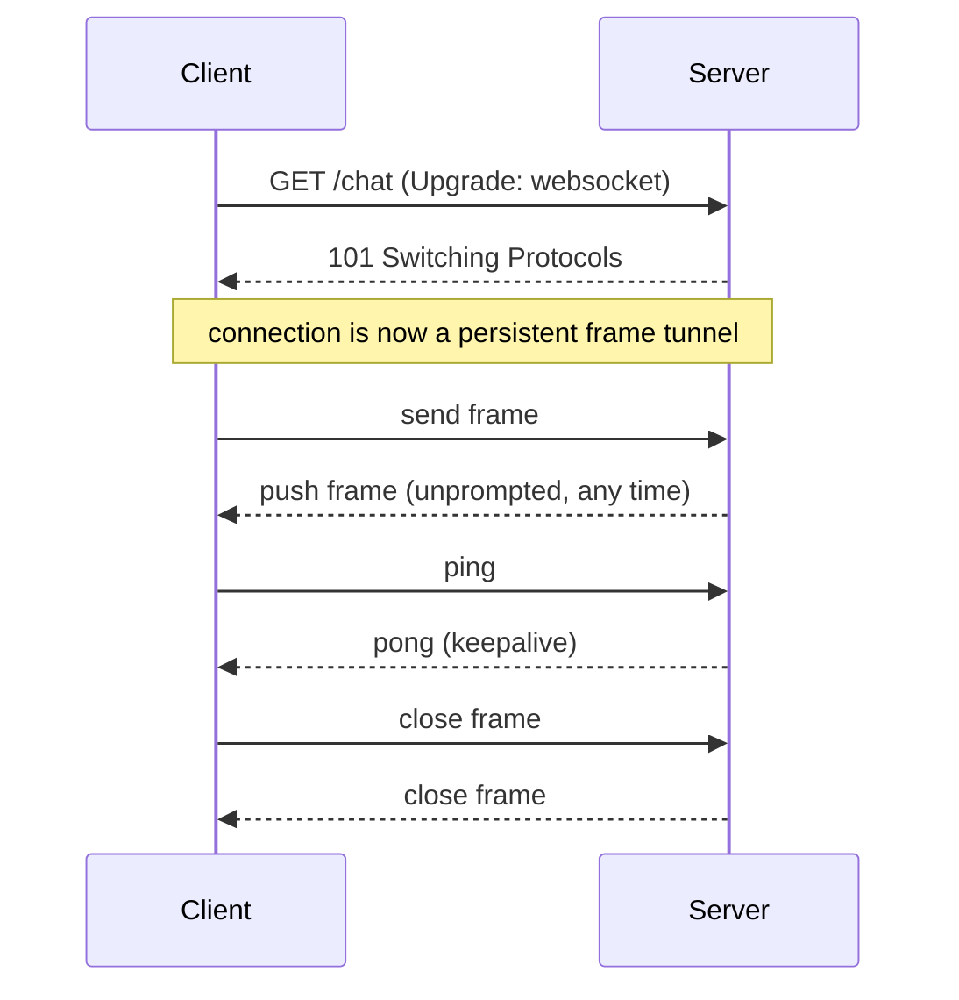
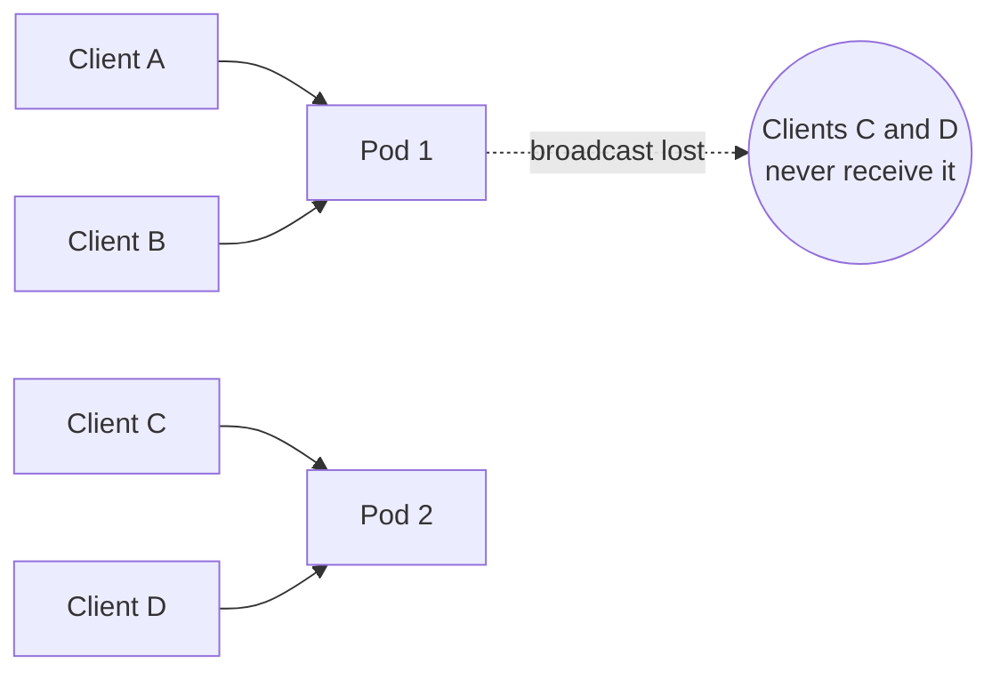

# Real-Time Communication {#ch-realtime-communication}

> Choose between a socket, SSE and polling on the requirement, then reason about what holding those connections costs.

**In this chapter:** the three transports compared · the handshake · the stateful connection problem · fan-out topology · capacity and cost

## 💡 The Core Idea

"Real-time" is not one technology. It is a requirement — the server needs to tell the client something without being asked — and three transports satisfy it at very different prices.

The question that decides between them is narrow: **does the client also need to send frequent messages?** If yes, you need a bidirectional socket and you accept stateful infrastructure. If no, you are pushing one way, and plain HTTP already does that.

This chapter owns the choice and the topology. The server code lives in [Chapter ?? — WebSockets](#ch-websockets); the browser code lives in [Chapter ?? — Frontend Real-Time Features](#ch-frontend-real-time-features).

## How It Works

A WebSocket begins as an HTTP request carrying `Upgrade: websocket`. After a `101 Switching Protocols` the TCP connection stops speaking HTTP and carries framed messages in both directions.

**The upgrade handshake, and the frame traffic that follows it.** The `101` is the last HTTP message on that connection.

SSE never leaves HTTP. It is one response that stays open, with events written as `data:` lines. Polling is ordinary requests on a timer. That difference in *protocol* is what drives the difference in *cost* — every proxy, CDN and load balancer already understands the second two.

### The Three Transports

| | **WebSocket** | **SSE** | **Polling** |
| --- | --- | --- | --- |
| Direction | Bidirectional | Server → client | Client asks |
| Protocol | Own protocol after upgrade | Plain HTTP | Plain HTTP |
| Latency | < 50 ms | < 100 ms | Half the interval, on average |
| Framing overhead | 2–10 bytes per message | Small | Full headers every request |
| Reconnect | You build it, or a library does | ✅ Automatic, with `Last-Event-ID` replay | N/A |
| Through proxies and CDNs | ⚠️ Often needs config | ✅ It is just HTTP | ✅ |
| Compression, caching, HTTP/2 | ❌ Mostly lost | ✅ Kept | ✅ Kept |
| Server cost | One held connection per client | One held connection per client | Spiky, but stateless |
| Complexity | High | Low | Lowest |

**SSE is the most under-used of the three.** Browsers reconnect automatically and replay from `Last-Event-ID`, and every intermediary already understands the response. If the feature is "the server tells the client something happened", SSE gets you there with a fraction of the operational burden.

> ⚠️ **The HTTP/1.1 caveat worth knowing:** SSE under HTTP/1.1 is limited by the roughly six-connections-per-origin cap, so several tabs starve each other. Over HTTP/2 they share one connection and the problem disappears.

## When to Use It

| Need | Use | Why |
| ---- | --- | --- |
| Client sends frequent messages — chat, cursors, gameplay | **WebSocket** | Genuinely bidirectional; nothing cheaper works |
| Collaborative editing with per-keystroke sync | **WebSocket** | Latency and volume both matter |
| Server pushes, client only listens — notifications, live prices, job progress, token streams | **SSE** | One-directional, and proxies already handle it |
| "Fresh within ~30 seconds" is acceptable | **Polling** | Stateless, cacheable, trivial to operate |
| Rare updates, client may be offline | **Webhook or push notification** | No connection to hold at all |

## The Stateful Connection Problem

A held connection belongs to exactly one process. That single fact causes every scaling difficulty in this chapter.

**Client A emits to a room. Pod 2 holds half the room and never hears about it.** Broadcast is correct only within one process.

**The fix is a broker every pod subscribes to.** Each pod publishes outbound messages to a shared channel and delivers what it receives to its own sockets. Redis Pub/Sub is the usual choice; Kafka or NATS when you also want retention.

| Concern | What it means at scale |
| ------- | ---------------------- |
| **Fan-out cost** | Every message goes to every pod, whether or not it holds a relevant socket. Beyond a few dozen pods, shard the channel by room or move to a purpose-built service |
| **No durability** | Redis Pub/Sub is fire-and-forget. A briefly disconnected pod loses those messages, so the database — not the broker — is the source of truth |
| **Sticky sessions** | Needed only if you allow an HTTP long-polling fallback, since those separate requests must reach the same pod. A pure socket is one TCP stream and needs none |
| **Deploys are outages** | Rolling a deploy disconnects every socket on each pod at once. Drain deliberately: stop accepting new connections, tell clients to reconnect, then exit on a stagger |

## Capacity and Cost

The numbers to have ready, because interviewers ask for them:

| Quantity | Rough figure |
| -------- | ------------ |
| Concurrent sockets one Node.js process holds comfortably | ~50k, memory-bound before CPU-bound |
| Memory per idle connection | Tens of kilobytes, including the outbound buffer |
| Heartbeat interval that reaps dead connections without wasting traffic | 30 s ping, 10 s to answer |
| Point at which building this stops paying | Tens of thousands of concurrent connections on a small team |

**Know when to buy instead of build.** A managed service (Ably, Pusher, AWS API Gateway WebSockets) removes connection scaling, fan-out sharding and deploy draining from your remit. "I would buy this rather than run it" is a legitimate senior answer, provided you can state the tradeoff: per-connection cost, and a vendor in the hot path of your most latency-sensitive feature.

## Common Mistakes

❌ **Reaching for a socket because the feature is called "live".** Most live features push one way.
✅ Ask whether the client sends anything. If not, SSE.

❌ **Designing broadcast on a single instance.** It works in development and fails on the second pod.
✅ Assume more than one process from the first design sketch.

❌ **Treating the broker as durable storage.** Pub/Sub drops what a disconnected subscriber missed.
✅ Persist events; let the transport carry latency, not guarantees.

❌ **Sending large payloads over the socket.** Frames are not built for bulk transfer.
✅ Send a pre-signed URL and let the client fetch the object over HTTP.

## 🔑 Key Takeaways

- The deciding question is whether the client sends frequent messages; if it does not, SSE or polling is almost always the right answer.
- WebSockets leave HTTP behind, which is why they lose compression, caching and easy proxying, and why they need their own reconnection story.
- A held connection belongs to one process, so cross-instance broadcast needs a pub/sub broker and still needs the database for durability.
- Fan-out to every pod is fine at ten pods and wasteful at a hundred; sharding or a managed service is the next step.
- Every deploy disconnects every client, so draining and staggered reconnection are part of the design, not an operational detail.

## Interview Questions

**Q: WebSocket or SSE?**

SSE unless the client needs to send frequent messages. SSE is plain HTTP, so proxies, compression and HTTP/2 multiplexing all work, and browsers reconnect automatically with `Last-Event-ID` replay. WebSockets earn their complexity when traffic is genuinely bidirectional — chat, collaborative cursors, gameplay. Notifications, progress bars and token streams are one-directional and belong on SSE.

**Q: How does a WebSocket differ from HTTP, and why does it matter architecturally?**

It begins as an HTTP request with `Upgrade: websocket`; after a `101` the connection carries framed messages both ways with a couple of bytes of overhead each. HTTP is one client-initiated request per response, and stateless. The architectural consequence is statefulness: a connection belongs to one process, so load balancing, broadcast, deploys and autoscaling all become harder than they are for a stateless API.

**Q: How do you scale real-time connections across many servers?**

Every server subscribes to a shared pub/sub channel and delivers received messages to its own sockets. That makes broadcast correct but leaves two gaps: the broker is fire-and-forget, so durability comes from the database, and every message reaches every server regardless of relevance, which stops scaling in the low dozens of nodes. Past that I would shard the channel by room, or move to a managed service.

**Q: Roughly how many connections fit on one node, and what runs out first?**

Around fifty thousand per Node.js process, and memory goes before CPU — each connection carries socket state and an outbound buffer. That figure is what turns a connection count into a node count, and it is also why a slow consumer matters: an unbounded outbound buffer is how a single client takes down a node holding fifty thousand others.

**Q: When would you not use any of this?**

When updates are rare or the client is often offline. Holding a connection open to deliver three messages a day is pure cost; a webhook or a mobile push notification delivers the same thing with no connection at all. I would also avoid a socket when the update is genuinely user-triggered — that is a request, not a push.

## What to Read Next

- [Chapter ?? — WebSockets](#ch-websockets) — the server implementation: typed events, authentication, rooms, backpressure
- [Chapter ?? — Frontend Real-Time Features](#ch-frontend-real-time-features) — the client: reconnection, jitter, and recovering missed messages
- [Chapter ?? — Design a Notification System](#ch-design-notification-system) — where this building block sits inside a full design
