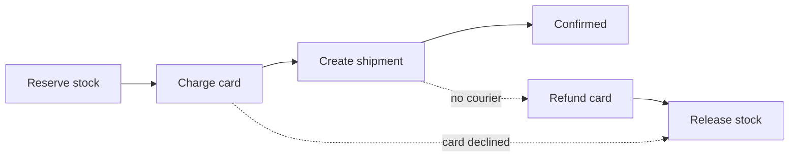

# Service Boundaries {#ch-service-boundaries}

> Draw the line between services where the data and the team already are, and pay for every line you draw.

**In this chapter:** what a service boundary really is · monolith versus services · finding the seam · synchronous versus event-driven calls · database per service · sagas

## 💡 The Core Idea

A service boundary is a promise that two pieces of code can be changed, deployed and scaled
independently. The promise is expensive: a function call becomes a network call that can fail, a
transaction becomes a distributed workflow, and a schema change becomes a negotiation. It is worth the
cost only when independence is worth something concrete — usually because two teams are blocking each
other, or two workloads need very different scaling.

> Splitting a system is a coordination decision before it is a technical one. If one team owns both
> sides of a boundary, that boundary is buying you nothing.

## How It Works

### Monolith or services

| | Modular monolith | Services |
| --- | ---------------- | -------- |
| Deploy | One artefact, all or nothing | Independent, per service |
| Failure | In-process; an exception, not a partition | Network calls that time out |
| Data | One database, real transactions | One store each, no cross-service transaction |
| Scaling | The whole thing scales together | The hot part scales alone |
| Refactoring a boundary | An afternoon | A migration with two deploys and a compatibility window |
| Right for | Almost every system under a few dozen engineers | Independent teams, or genuinely divergent workloads |

The default answer in an interview is a **modular monolith with clear internal boundaries**, and a
willingness to split the one module that has earned it. That reads as judgement. "Microservices" as an
opening move reads as a résumé.

### Finding the seam

Good boundaries come from the domain, not the layers. Split by **what changes together**, and the
strongest available signals are:

| Signal                                | Suggests a boundary                                    |
| ------------------------------------- | ------------------------------------------------------ |
| Two areas are always deployed together | **Not** a boundary — they are one thing                |
| A distinct set of nouns and rules      | A bounded context — orders, payments, catalogue         |
| A workload with a different scaling shape | Image processing, search indexing, report generation |
| A different rate of change             | A stable core versus an experimental surface           |
| A separate team with its own roadmap   | Conway's law will produce this boundary whether you plan it or not |

> ⚠️ A boundary that needs a synchronous call in both directions is not a boundary. Two services that
> call each other on every request have a distributed function call and all of the costs of a split with
> none of the independence.

**Layer-shaped splits are the classic mistake.** A "database service", an "API service" and a "business
logic service" means every feature touches all three, so nothing can be deployed independently.

### Talking across the boundary

| | Synchronous request | Event |
| --- | ------------------- | ----- |
| Coupling | Caller knows the callee | Publisher does not know subscribers |
| Failure | Caller sees it immediately | Retried by the broker; caller unaffected |
| Consistency | Immediate | Eventual |
| Latency | Sum of the chain | Producer returns straight away |
| Debugging | A stack trace, roughly | A trace across systems, if you built one |

**Synchronous when the caller needs the answer to respond.** Checking stock before confirming an order is
synchronous — the response depends on it. Emailing the receipt is an event.

The rule that keeps chains short: **at most one synchronous hop on the critical path.** Three chained
calls at 99.9% availability each give 99.7%, and their latencies add.

```typescript
// Events describe something that happened. Past tense, immutable, self-contained.
interface OrderPlaced {
  eventId: string;      // for consumer-side deduplication
  type: "order.placed";
  occurredAt: string;
  orderId: string;
  userId: string;
  total: number;        // copied, not referenced — the subscriber must not call back
}
```

Copying the fields subscribers need is deliberate. An event that carries only an ID forces every
subscriber to call back into the publisher, which recreates the coupling the event was meant to remove.

### Choreography or orchestration

| | Choreography | Orchestration |
| --- | ------------ | ------------- |
| Control | Each service reacts to events | One coordinator drives the steps |
| Adding a step | Subscribe a new service | Change the coordinator |
| Understanding the flow | Read every subscriber | Read one file |
| Fits | Two or three loosely related reactions | Multi-step workflows with compensation |

Choreography is simpler until nobody can say what happens after an order is placed. Once a flow has more
than about four steps, or needs to roll back, an explicit orchestrator earns its keep.

### Database per service

Each service owns its store, and no other service reads it directly. This is the boundary that makes the
others real — a shared database means a shared schema, and a shared schema means coordinated deploys
forever.

The price is that cross-service queries and transactions disappear. Three answers, in order of how often
they apply:

| Need                                    | Answer                                                  |
| --------------------------------------- | ------------------------------------------------------- |
| Show data from two services on one page  | Compose in a BFF or aggregation service                  |
| Query joining data across services       | A read model, built from events, owned by the reader     |
| Update two services atomically           | A saga — there is no distributed transaction to reach for |

### Sagas

A saga is a sequence of local transactions where each step has a **compensating action** that undoes it.



**Every forward step needs an inverse; the saga is only as reliable as its compensations.**

Two properties to state when you propose one. There is **no isolation**: another request can observe the
half-finished state between steps, so anything user-visible needs a pending status rather than a silent
gap. And compensation is not a rollback — a refund is a new transaction that leaves both records in
history, which is usually what the business wants anyway.

Two-phase commit is the alternative and is almost never the answer across services: it holds locks across
the network and blocks every participant when the coordinator dies.

## When to Use It

| Situation                                    | Do                                      | Why                                    |
| -------------------------------------------- | --------------------------------------- | -------------------------------------- |
| Under ~20 engineers, one product              | Modular monolith                         | The split costs more than it returns   |
| One workload with a different scaling profile | Extract that one service                | The clearest possible justification    |
| Teams blocking each other on deploys          | Split along team lines                   | The independence is the actual product |
| A flow spanning several services atomically   | Saga with explicit compensations         | No distributed transaction exists      |
| Two services calling each other constantly    | Merge them                               | The boundary is in the wrong place     |

## Common Mistakes

**❌ The distributed monolith**

> Eight services that must be deployed together because their contracts change in lockstep.

Every cost of distribution, none of the independence. It is the most common failure of a split done for
its own sake.

**✅ One service extracted for a stated reason**

> "Image processing is CPU-bound and spiky, so it scales separately and its failures do not touch
> checkout."

**❌ A shared database between services**

Then a schema migration is a cross-team event, and nobody can change a column safely. It is the fastest
way to get all the operational cost of services and none of the autonomy.

**❌ Events that only carry an ID**

Every subscriber calls back to fetch the details, so the publisher is now on the critical path of every
consumer. Carry the fields subscribers need.

## 🔑 Key Takeaways

- A boundary buys independent deploys and scaling, and charges network failure, eventual consistency and schema negotiation for it.
- Split by domain and by team, never by technical layer, and merge two services that call each other constantly.
- Keep at most one synchronous hop on the critical path; everything else should be an event.
- Database-per-service is what makes a boundary real, and it removes cross-service joins and transactions.
- A saga replaces the distributed transaction, has no isolation, and is only as good as its compensating steps.

## Interview Questions

**Q: How do you decide where to split a monolith?**

Look for a part that changes at a different rate, scales differently, or is owned by a team that is
blocked by everyone else's release cycle. Then check the data: if extracting it requires reaching back
into the main database on every request, the seam is in the wrong place. Extract one service, prove the
boundary holds, and only then consider the next.

**Q: Two services need to update atomically. What do you do?**

Accept that a distributed transaction is not available and use a saga: each service commits locally and
publishes an event, and each step has a compensating action. State the consequence up front — there is
an observable window where the system is half-updated, so the user-facing model needs a pending state
rather than pretending the operation is instantaneous.

**Q: When are microservices the wrong answer?**

When there is one team. The independence being bought is organisational, so with a single team it buys
nothing while charging network failure, distributed debugging and a deployment matrix. A modular
monolith with enforced internal boundaries gets most of the design benefit and can be split later, when
there is a reason.

## What to Read Next

- [Chapter ?? — Queues and Asynchronous Work](#ch-message-queues) — the transport that carries events between services
- [Chapter ?? — Resilience Patterns](#ch-resilience-patterns) — what to do when a call across the boundary fails
- [Chapter ?? — Consistency and CAP](#ch-consistency-and-cap) — the guarantees a saga can and cannot offer
