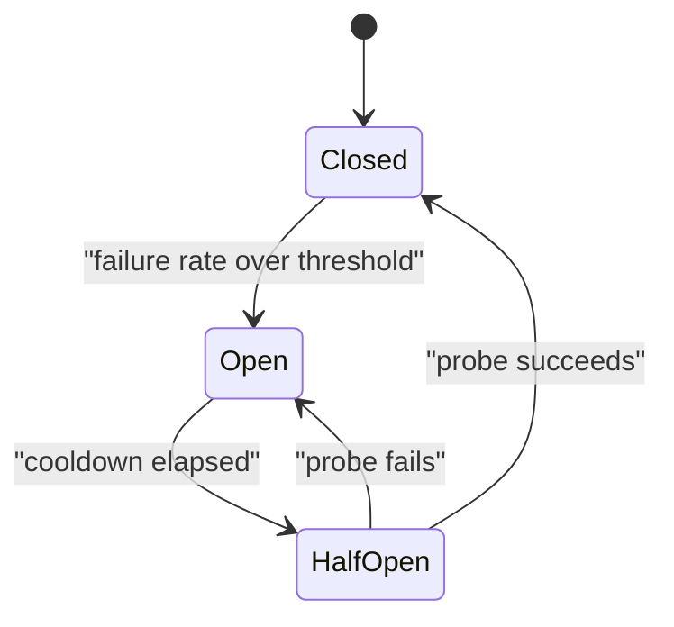

# Resilience Patterns {#ch-resilience-patterns}

> Stop one failing dependency from taking the caller down with it, using four patterns that only work together.

**In this chapter:** timeouts as the foundation · retries with backoff and a budget · circuit breakers · bulkheads · load shedding · graceful degradation

## 💡 The Core Idea

In a distributed system, a dependency being slow is worse than a dependency being down. A service that
is down returns an error immediately and the caller moves on. A service that takes thirty seconds holds
one of the caller's connections for thirty seconds, and at any real request rate the caller runs out of
connections and fails too — for requests that had nothing to do with the slow dependency.

Resilience is the set of patterns that convert *slow* into *fast failure*, and then decide what to show
the user instead.

> Every remote call needs an answer to one question: what happens if this never comes back?

## How It Works

### Timeouts come first

Every other pattern depends on this one. A retry cannot fire and a circuit breaker cannot open if the
call simply hangs.

```typescript
async function callWithTimeout<T>(fn: (signal: AbortSignal) => Promise<T>, ms: number): Promise<T> {
  const controller = new AbortController();
  const timer = setTimeout(() => controller.abort(), ms);
  try {
    return await fn(controller.signal);
  } finally {
    clearTimeout(timer); // release the timer even when the call throws
  }
}
```

Set the timeout from the dependency's observed p99, not from a round number — usually p99 plus a small
margin. And keep the budget **decreasing down the call chain**: if the gateway allows 3 seconds, the
service it calls must allow less, or the inner call will still be running after the outer one has given
up and the work is wasted.

| Layer                   | Timeout          |
| ----------------------- | ---------------- |
| Client to gateway       | 5 s              |
| Gateway to service      | 3 s              |
| Service to database     | 1 s              |
| Service to cache        | 100 ms           |

### Retries, with a budget

A retry helps only with **transient** failure. Retrying a 400 or a business rejection just multiplies
load for a result that will never change.

| Response                     | Retry?                    |
| ---------------------------- | ------------------------- |
| Connection reset, timeout    | Yes                       |
| 502, 503, 504                | Yes                       |
| 429                          | Yes, honouring `Retry-After` |
| 400, 401, 403, 404, 422      | No                        |
| Any non-idempotent write with no idempotency key | No — a duplicate is worse |

```typescript
// Full jitter: without the random factor, every client retries at the same instant.
const delayMs = (attempt: number, baseMs: number = 100, capMs: number = 10_000): number =>
  Math.random() * Math.min(capMs, baseMs * 2 ** attempt);
```

> ⚠️ Retries are the most common cause of a small incident becoming a large one. Three attempts per
> client is a 3× load multiplier applied exactly when the system is weakest. Cap attempts, always add
> jitter, and never retry at more than one layer of the stack — a retrying client behind a retrying
> gateway behind a retrying SDK is a 27× multiplier nobody designed.

### Circuit breakers

A breaker stops calling a dependency that is already failing, so the caller fails in microseconds
instead of at the timeout.



**Closed passes traffic, open rejects instantly, half-open lets a single probe decide.**

| Setting            | Sensible start        | Why                                             |
| ------------------ | --------------------- | ----------------------------------------------- |
| Failure threshold  | 50% over a rolling window | A rate, not a count — a count trips on a quiet service |
| Minimum volume     | 20 requests           | Two failures out of two is not evidence         |
| Open duration      | 30 s                  | Long enough for a restart, short enough to recover quickly |
| Half-open probes   | 1                     | More probes re-flood a service that is still fragile |

One breaker **per dependency**, never one for the whole service, or a failing analytics call will block
checkout.

### Bulkheads

A bulkhead limits how much of a shared resource one dependency can consume, so its failure cannot starve
everything else.

```typescript
// Separate concurrency pools mean a stalled payment provider cannot consume every worker.
const pools: Record<string, { limit: number; inFlight: number }> = {
  payments: { limit: 20, inFlight: 0 },
  recommendations: { limit: 5, inFlight: 0 },
  analytics: { limit: 2, inFlight: 0 },
};

function tryAcquire(name: string): boolean {
  const pool = pools[name];
  if (pool.inFlight >= pool.limit) return false; // shed, do not queue forever
  pool.inFlight += 1;
  return true;
}
```

The limits encode priority. Analytics gets two slots because losing analytics is acceptable and losing
payments is not.

### Load shedding and degradation

When the system cannot serve everything, choose what to drop rather than letting the queue choose.

| Level                       | Drop first                                  |
| --------------------------- | ------------------------------------------- |
| Nice-to-have enrichment     | Recommendations, related items, live counts |
| Non-critical writes         | Analytics events, activity logs             |
| Expensive read paths        | Search facets, full history                 |
| Never                       | Authentication, checkout, the core read     |

Degradation is what the user sees instead. A feed page that renders without the "people you may know"
rail is a working page. A feed page that returns 500 because that one call timed out is an outage, and
it was a choice.

### The patterns compose

Applied to a single outbound call, in order: **bulkhead** decides whether there is capacity, **circuit
breaker** decides whether the dependency is worth calling, **timeout** bounds the wait, **retry** handles
a transient failure, and **fallback** decides what to return when all of that has been exhausted.

## When to Use It

| Situation                                    | Reach for                        |
| -------------------------------------------- | -------------------------------- |
| Any outbound network call                     | A timeout — no exceptions        |
| A flaky dependency with transient errors      | Retry with jitter and a cap      |
| A dependency that fails for minutes at a time | Circuit breaker                  |
| Several dependencies sharing a thread pool    | Bulkhead per dependency          |
| A non-essential feature on a critical page    | Fallback and graceful degradation |
| Sustained overload                            | Load shedding, by priority       |

## Common Mistakes

**❌ No timeout on an outbound call**

> `await fetch(url)` with the runtime default, which may be minutes or may be none at all.

One slow dependency then consumes every connection the caller has, and the caller's own health check
starts failing.

**✅ A timeout derived from the dependency's p99**

> `callWithTimeout(fn, 400)` for a dependency whose p99 is 250 ms, with a fallback for the timeout case.

**❌ Retrying non-idempotent writes**

A timed-out payment may well have succeeded. Retrying without an idempotency key charges twice.

**❌ One circuit breaker for the whole service**

A failing recommendations call opens the breaker and takes checkout with it. Scope breakers per
dependency.

## 🔑 Key Takeaways

- A slow dependency is more dangerous than a dead one, because it consumes the caller's connections while producing nothing.
- Timeouts are the foundation: every other pattern needs a bounded wait to act on.
- Retries multiply load during an incident, so cap them, add jitter, and retry at exactly one layer.
- Circuit breakers are scoped per dependency; one breaker for a whole service couples unrelated features.
- Decide in advance which features degrade, so overload produces a reduced page rather than an error page.

## Interview Questions

**Q: A downstream service starts taking 30 seconds instead of 200 ms. What happens to your service?**

Without a timeout, requests pile up holding connections and thread-pool slots until the pool is
exhausted, and then every request fails — including ones that never touch that dependency. With a
timeout plus a circuit breaker, the first few requests fail fast, the breaker opens, and subsequent calls
are rejected in microseconds while the rest of the service keeps working.

**Q: How do you choose retry settings?**

Retry only transient failures and only idempotent operations, cap at two or three attempts, use
exponential backoff with full jitter, and enforce a global retry budget so retries stay a small fraction
of total traffic. The most important constraint is that only one layer retries — client, gateway and SDK
all retrying multiplies the load by their product.

**Q: When would you not add a circuit breaker?**

When the dependency has no meaningful fallback and the request is worthless without it — opening the
breaker just converts a slow failure into a fast one with no benefit to the user, while adding a
component that can trip incorrectly. A timeout and a clear error is enough there.

## What to Read Next

- [Chapter ?? — Reliability and Availability](#ch-reliability-and-availability) — the cascade these patterns exist to break
- [Chapter ?? — Service Boundaries](#ch-service-boundaries) — the calls that need this protection in the first place
- [Chapter ?? — The API Gateway Pattern](#ch-api-gateway-pattern) — where breakers and timeouts belong at the edge
