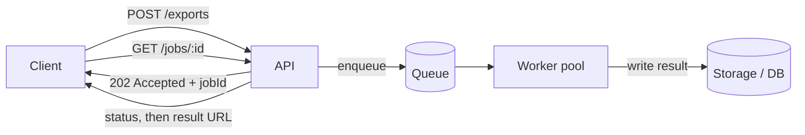

# Asynchronous Processing {#ch-asynchronous-processing}

> Take work out of the request path, and design the worker for the day it runs the same job twice.

**In this chapter:** what belongs off the request path · the accepted-then-poll shape · idempotent workers · retries and the dead letter queue · back-pressure

## 💡 The Core Idea

Asynchronous processing separates two things that look like one: accepting a piece of work, and doing
it. The API records the request, returns immediately, and a worker does the slow part later.

The obvious win is response time. The larger one is that the work now survives its surroundings. A
job in a queue outlives the request that created it, the process that accepted it, and a downstream
service being briefly unavailable — so a third-party outage becomes a delay rather than a failed user
action. That is why this is a reliability pattern before it is a performance one.

## How It Works

### What belongs off the request path

| | Synchronous | Asynchronous |
| --- | --- | --- |
| **The user waits for** | The whole operation | The enqueue, a few milliseconds |
| **Response time** | However long the work takes | Flat, regardless of the work |
| **A downstream failure** | The user sees an error | The job retries; the user never knows |
| **A traffic spike** | Saturates the slowest dependency | Lands in the queue and drains |
| **Cost** | Nothing extra | A queue, workers, and a way to report status |

The rule of thumb: anything over roughly 200 milliseconds that the user does not need the result of
belongs behind a queue. Emails, exports, transcoding, third-party syncs, fan-out notifications. What
stays synchronous is anything the next screen depends on.

### The accepted-then-poll shape



**The API's job is to accept and record; everything after the 202 is the worker's.**

```typescript
interface Job<T = unknown> {
  id: string;
  type: string;
  payload: T;
  status: "pending" | "processing" | "done" | "failed";
  attempts: number;
}

interface JobQueue {
  enqueue<T>(type: string, payload: T): Promise<string>;
  dequeue<T>(type: string): Promise<Job<T> | null>;
  complete(jobId: string): Promise<void>;
  fail(jobId: string, error: string): Promise<void>;
}

// Accept the work, record it, return. Nothing slow happens here.
async function requestExport(
  queue: JobQueue,
  db: DatabaseClient,
  userId: string,
  config: ExportConfig,
): Promise<{ jobId: string; status: string }> {
  const jobId = await queue.enqueue("generate_export", { userId, config });
  await db.query(
    "INSERT INTO jobs (id, user_id, type, status) VALUES ($1, $2, $3, 'pending')",
    [jobId, userId, "generate_export"],
  );
  return { jobId, status: "pending" };
}
```

The status row in the database is not optional bookkeeping. Without it the user has a job id and no
way to learn what happened to it, which is how "the export never arrived" becomes unanswerable.

### Idempotent workers

Queues deliver at least once. A worker that crashes after doing the work but before acknowledging will
see the same job again, so every worker must be safe to run twice.

```typescript
async function processExport(
  queue: JobQueue,
  db: DatabaseClient,
  storage: StorageClient,
  job: Job<{ userId: string; config: ExportConfig }>,
): Promise<void> {
  // The idempotency check: has this exact job already produced a result?
  const existing = await db.query("SELECT file_key FROM exports WHERE job_id = $1", [job.id]);
  if (existing.rows.length > 0) {
    await queue.complete(job.id); // already done — acknowledge and move on
    return;
  }

  try {
    const file = await generateExport(job.payload.config);
    const fileKey = await storage.upload(`exports/${job.id}.csv`, file);
    await db.query("UPDATE jobs SET status = 'done', file_key = $1 WHERE id = $2", [fileKey, job.id]);
    await queue.complete(job.id);
  } catch (err) {
    await queue.fail(job.id, String(err)); // the queue decides whether to retry
  }
}
```

Keying the result by the job id is what makes the check possible. A worker that writes to an external
system instead — charging a card, calling a partner API — needs the same idea carried outward, as an
idempotency key the other side honours.

### Retries and the dead letter queue

A job fails for one of two reasons, and they need opposite responses. A transient failure — a timeout,
a rate limit, a restarting dependency — should retry with exponential backoff. A permanent one — a
malformed payload, a deleted record — will fail identically forever, and retrying it burns a worker
slot on every cycle.

The dead letter queue is where the second kind goes after a fixed number of attempts, usually three to
five. It is not an error log. It is a queue you are expected to look at: a job in it means a user is
still waiting for something that will never arrive.

> ⚠️ A poison message with unlimited retries does not just fail — it occupies a worker permanently and
> starves everything behind it. The retry cap is what stops one bad job from stopping the pipeline.

### Back-pressure

When producers enqueue faster than workers drain, the queue grows without bound and every job's
latency grows with it. Queue depth and the ratio of enqueue rate to processing rate are the two
numbers to alert on.

```typescript
interface QueueMetrics {
  depth: number;
  processingRatePerSecond: number;
  enqueueRatePerSecond: number;
}

function isFallingBehind(m: QueueMetrics): boolean {
  return m.depth > 10_000 || m.enqueueRatePerSecond > m.processingRatePerSecond * 1.5;
}
```

The responses, in the order most teams should try them: add workers, then rate-limit the producer,
then shed low-priority work. Separate queues per job type prevent the most common self-inflicted
version of this, where a queue of thirty-second video jobs delays every password reset email behind it.
The mechanics of consumer groups and delivery guarantees belong to
[Chapter ?? — Message Queues and Event Streaming](#ch-message-queues).

## When to Use It

| Scenario | Shape |
| --- | --- |
| Email, SMS, push | Enqueue and forget; the user never waits |
| Report or data export | Enqueue, return a job id, poll for a download URL |
| Media transcoding | Enqueue, notify by webhook when done |
| Fan-out to millions of recipients | One job that produces many, so no single job is enormous |
| A rate mismatch between tiers | The queue as a buffer, absorbing bursts the database cannot |
| A multi-service transaction | A saga, not a plain queue — see the microservices part |

## Common Mistakes

❌ **A worker that is not idempotent.** At-least-once delivery means the duplicate will happen, and it
will be the day a worker crashes mid-job. ✅ Check for an existing result keyed by the job id before
doing anything.

❌ **No way to see a job's status.** The user gets an id and no answer. ✅ Persist status alongside the
queue and expose an endpoint for it.

❌ **Unbounded retries.** One malformed job cycles forever and blocks the queue. ✅ Cap attempts, then
route to a dead letter queue somebody actually monitors.

❌ **One queue for every job type.** Slow jobs delay fast ones for no reason other than sharing a line.
✅ A queue per job class, sized and scaled separately.

❌ **Treating the dead letter queue as an archive.** Jobs land there and nobody looks. ✅ Alert on it —
a non-empty DLQ means a user is waiting for something that will never happen.

## 🔑 Key Takeaways

- Moving work off the request path decouples response time from completion time, and makes the work survive failures.
- Queues deliver at least once, so idempotency is a requirement rather than a refinement.
- Anything asynchronous needs a status the user can query; a job id with no lookup is a dead end.
- Cap retries and route the survivors to a dead letter queue you alert on.
- Separate queues by job class, or the slowest work sets the latency for everything.

## Interview Questions

**Q: What decides whether an operation goes behind a queue?**

Whether the user needs its result to continue. If the next screen depends on it, it stays synchronous
however slow it is, and the fix is to make it faster. If it does not — an email, an export, a sync to
a third party — it goes behind a queue, and the request returns as soon as the work is durably
recorded. The 200-millisecond figure is a heuristic on top of that question, not a substitute for it.

**Q: Why must a worker be idempotent?**

Because delivery is at least once. A worker can complete its work and then fail before acknowledging,
and the queue will hand the same job to another worker. Without an idempotency check that means two
charges, two emails, two rows. The usual implementation is to key the result by the job id and check
for it before doing anything with a side effect.

**Q: A job keeps failing and retrying forever. What have you got wrong?**

There is no attempt cap, so a permanent failure is being retried as though it were transient. Failures
need to be split: back off and retry the transient ones, and after three to five attempts move the
rest to a dead letter queue. Otherwise one malformed payload occupies a worker indefinitely and delays
everything behind it.

**Q: Queue depth is growing steadily. What do you do?**

Confirm it is a rate problem rather than a stuck consumer, then add workers, since that is the only
response that does not degrade something. If the workers are already at the limit of what a downstream
dependency can take, rate-limit the producer or shed low-priority jobs instead — pushing harder just
moves the failure into the dependency. Long-term, the enqueue rate exceeding the drain rate is a
capacity plan, not an incident.

**Q: When is asynchronous processing the wrong choice?**

When the user needs the answer, and when the operation is fast enough that the queue, the workers, the
status endpoint and the polling are more machinery than the problem deserves. It also fits badly where
ordering across jobs matters and the queue does not guarantee it — that needs a stream with a
partition key, not a work queue.

## What to Read Next

- [Chapter ?? — Message Queues and Event Streaming](#ch-message-queues) — the component underneath, and its delivery guarantees
- [Chapter ?? — Notifications](#ch-notifications) — the highest-volume consumer of this pattern
- [Chapter ?? — Scalability](#ch-scalability) — where taking work off the request path sits among the levers
