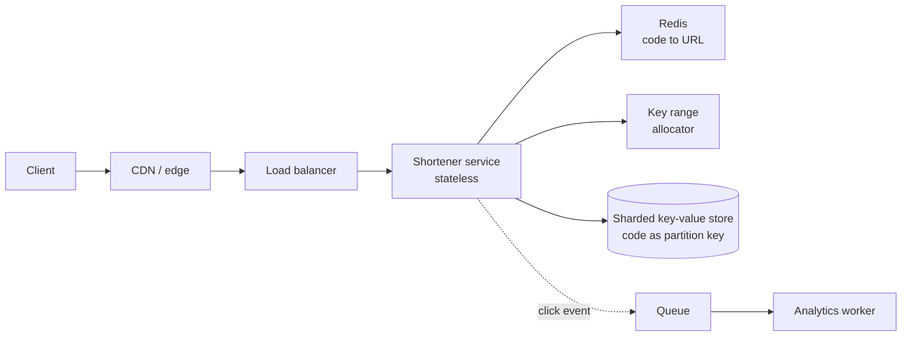

# Design a URL Shortener {#ch-design-url-shortener}

> Generate a short unique key with no coordination bottleneck, then serve almost every read from cache.

**In this chapter:** requirements and scale · the architecture · key generation · the data model · caching and redirect semantics

## 💡 The Core Idea

A URL shortener looks trivial and is a good interview problem for exactly that reason: there is nowhere
to hide. Two decisions carry the whole design. **How do you mint a unique seven-character key without a
central counter that everything queues behind**, and **how do you serve ten billion redirects a day
without touching a database**. Everything else is plumbing.

> This is a read-heavy key-value problem wearing a web application's clothes. Recognise that in the
> first minute and the rest of the round follows.

## How It Works

### Requirements

**Functional:** shorten a long URL, redirect a short code to it, optional custom alias, optional
expiry, click counts.

**Out of scope, said out loud:** user accounts, analytics dashboards, link previews, spam detection.

**Non-functional:** redirects under 100 ms at p99, short links must never break or be reassigned, and
availability matters more than consistency — a redirect that works is worth more than a creation that is
instantly visible everywhere.

**Scale:** 100 million new links a day and 10 billion redirects — a 100:1 read-to-write ratio. That is
about 1,000 writes and 100,000 reads a second on average, and roughly three times that at peak. Storage
at 500 bytes a row is 50 GB a day, so about 18 TB a year before replication.

### Architecture



**Reads stop at Redis; the datastore sees only misses and writes.**

Click counting goes through a queue. Incrementing a row on every redirect would make the write path a
hundred times busier than the create path, for data nobody reads in real time.

### Key generation

This is the decision the round is really about.

| Approach                     | Works?                                            | Problem                                    |
| ---------------------------- | ------------------------------------------------- | ------------------------------------------ |
| Hash the URL, take 7 chars   | Yes, and it deduplicates identical URLs            | Collisions must be detected and retried    |
| Random 7 characters          | Yes                                                | Needs a uniqueness check on every write    |
| Auto-increment, base62       | Yes                                                | One global counter is a write bottleneck and the codes are guessable |
| **Pre-allocated key ranges** | **Yes — the answer to give**                       | Wasted keys when an instance dies          |

Base62 over `[a-zA-Z0-9]` gives 62⁷ ≈ **3.5 trillion** codes, which is 95 years at 100 million a day.
Seven characters is the right length, and being able to say why is part of the answer.

```typescript
const ALPHABET = "0123456789abcdefghijklmnopqrstuvwxyzABCDEFGHIJKLMNOPQRSTUVWXYZ";

function toBase62(n: number): string {
  let out = "";
  do {
    out = ALPHABET[n % 62] + out;
    n = Math.floor(n / 62);
  } while (n > 0);
  return out.padStart(7, "0");
}

// Each instance claims a block of one million ids, then mints locally with no coordination.
class KeyAllocator {
  private next = 0;
  private limit = 0;
  constructor(private readonly claimBlock: () => Promise<{ from: number; to: number }>) {}

  async take(): Promise<string> {
    if (this.next >= this.limit) {
      const block = await this.claimBlock(); // one round trip per million keys
      this.next = block.from;
      this.limit = block.to;
    }
    return toBase62(this.next++);
  }
}
```

An instance that dies wastes the rest of its block. At 3.5 trillion keys, that is not a problem worth
solving.

### Data model

```typescript
interface Link {
  code: string;       // partition key — every read is a point lookup
  longUrl: string;
  createdAt: number;
  expiresAt?: number; // TTL handled by the store, not by a cleanup job
  ownerId?: string;
}
```

The access pattern is one query: given a code, return a URL. That makes a key-value or wide-column store
the right home, sharded on `code`, and makes a relational store a defensible but unnecessary choice.

Custom aliases need a uniqueness check, which is the one place a conditional write matters: insert with
"if not exists" and return 409 rather than reading first and then writing.

### Interface

| Operation                     | Notes                                              |
| ----------------------------- | -------------------------------------------------- |
| `POST /links`                 | Body carries the long URL and an optional alias; returns 201 with the code |
| `GET /{code}`                 | The hot path — a redirect, and nothing else         |
| `GET /links/{code}/stats`     | Read from the analytics store, never the hot path   |

### Optimisations

**Caching.** With a 95% hit ratio, 100,000 reads a second becomes 5,000 reaching the store. The access
pattern is heavily skewed — a small fraction of links take most of the traffic — so LRU with a few
hundred gigabytes of Redis holds the working set comfortably.

**Redirect status code.** This is a trade, not a default.

| Code | Browser behaviour        | Consequence                                          |
| ---- | ------------------------ | ---------------------------------------------------- |
| 301  | Caches the redirect       | Fastest for the user, and later clicks never reach you — so no click counts and no ability to change the target |
| 302  | Re-asks every time        | Every click is measurable and the target can change; you pay for every request |

Use **302** when analytics or editable targets are in the requirements, which they usually are. Say why.

**Multi-region.** Codes are immutable once created, so replicas can serve reads anywhere without a
consistency problem. Writes go to one region; a new link taking a second to appear elsewhere is
invisible to the user who just created it, provided their own read is routed to the write region.

## When to Use It

This shape — mint an opaque key, write once, read enormously — recurs far beyond shorteners. It is the
same design as an invite-code service, a file-share link, a public asset URL, or a feature-flag lookup.
What would change it:

| If the requirement adds…              | The design changes to…                                |
| ------------------------------------- | ------------------------------------------------------ |
| Real-time click analytics              | A streaming aggregation, not a queue and a batch worker |
| Editable targets                       | 302 only, and cache invalidation on update             |
| Guessable codes are unacceptable       | Longer random codes rather than sequential base62      |
| Links expiring in seconds              | TTL in the cache as well as the store                  |

## Common Mistakes

**❌ A single auto-increment counter**

> `nextId = SELECT MAX(id) + 1 FROM links`

Every write in the system now serialises through one row, and the codes are trivially enumerable, so
anyone can walk the entire link database.

**✅ Pre-allocated ranges, minted locally**

> Each instance claims a block of a million ids in one round trip and then mints without coordination.

**❌ Counting clicks synchronously**

Incrementing a counter on the redirect path makes the busiest path in the system a write path, for a
number nobody reads within the second.

**❌ Ignoring the redirect status code**

301 is faster and quietly removes your ability to count clicks or change a target. It is a real choice,
and a candidate who does not mention it has not thought about the product.

## 🔑 Key Takeaways

- The two decisions that matter are key generation without coordination and serving reads from cache.
- Pre-allocated key ranges give unique codes with one round trip per million writes and no central bottleneck.
- Base62 over seven characters is 3.5 trillion codes — say the number, because it justifies the length.
- 301 versus 302 is a product decision about analytics and editability, not a performance detail.
- Click counting belongs on a queue; putting it on the redirect path inverts the system's read/write ratio.

## Interview Questions

**Q: How do you generate short codes at 1,000 writes a second without collisions?**

Pre-allocate ranges: a coordination service hands each instance a block of a million integers, and the
instance converts them to base62 locally. That is one round trip per million keys instead of one per
write, needs no collision check, and the only cost is wasted ids when an instance dies — which is
irrelevant against 3.5 trillion.

**Q: The cache is cold after a deploy and the store falls over. What went wrong?**

Every request became a miss simultaneously, so the store took the full 100,000 reads a second it was
never provisioned for. The fixes are a warm-up that replays the top codes before the instance takes
traffic, request coalescing so a thousand concurrent misses for one code become one store read, and a
rolling deploy so the whole cache tier never empties at once.

**Q: Would you shard this database, and on what?**

Yes, on the code itself, because every read is a point lookup by code and that keeps each one on a single
shard. There are no range queries and no joins, so hash-based distribution is ideal — and consistent
hashing means adding capacity moves a fraction of the keys rather than all of them.

## What to Read Next

- [Chapter ?? — Caching](#ch-caching) — the stampede and the hit ratio arithmetic this design depends on
- [Chapter ?? — Sharding](#ch-sharding) — why `code` is close to a perfect shard key
- [Chapter ?? — Back-of-Envelope Estimation](#ch-back-of-envelope-estimation) — where the 100:1 ratio and the storage figures come from
