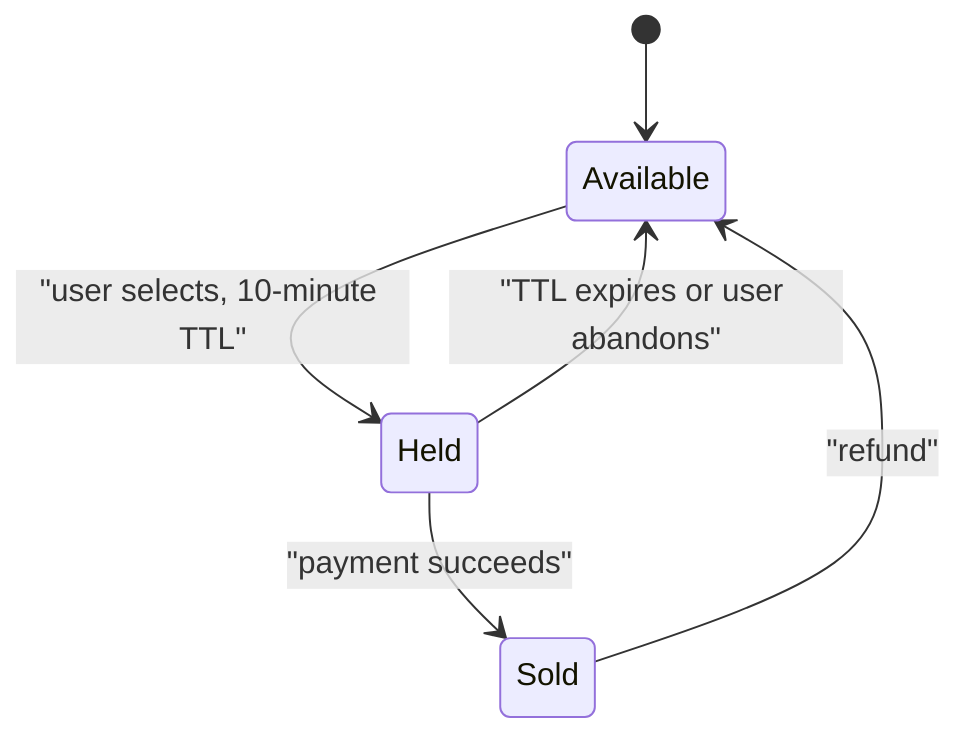
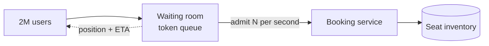

# Design Ticketmaster {#ch-design-ticketmaster}

> Sell a hundred thousand seats to two million people at once without selling one seat twice.

**In this chapter:** requirements and the shape of the load · reserve-then-confirm · the hot-row problem · the virtual waiting room · payment and idempotency · what to degrade

## 💡 The Core Idea

Almost every system in this part is designed for volume. This one is designed for **contention**. Two
million people want the same ten thousand rows in the same thirty seconds, and the entire design exists
to serialise access to a small set of records without either overselling or grinding to a halt.

That flips the usual advice. Eventual consistency is unacceptable for seat state, caching the thing
everyone wants is useless because it changes every millisecond, and the answer is not to scale the hot
path but to **admit fewer people to it**.

> The winning move is a queue in front of the system, not a faster system. You cannot cache your way out
> of contention.

## How It Works

### Requirements

**Functional:** browse events, view seat availability, hold specific seats, pay, receive a ticket. Cancel
and refund.

**Out of scope:** dynamic pricing, resale, recommendations, venue seat-map authoring.

**Non-functional:** a seat must never be sold twice — this is the one place strong consistency is
non-negotiable. Availability views may be stale by a second. The system must survive a 100× traffic
spike lasting minutes.

**Scale:** ordinary load is a few hundred requests a second. An on-sale for a large tour is 2 million
concurrent users in the first minute against 100,000 seats — perhaps 50,000 requests a second, with
almost all of them targeting one event.

### Reserve, then confirm

A seat has three states, and the middle one is what makes the design work.



**The hold is short-lived and expires by itself; nothing depends on the user coming back.**

```typescript
// The conditional update is the whole guarantee: exactly one caller can win.
async function hold(db: Db, seatId: string, userId: string, ttlMs: number): Promise<boolean> {
  const rows: number = await db.update(
    `UPDATE seats SET state = 'held', held_by = $2, held_until = $3
     WHERE id = $1 AND (state = 'available' OR (state = 'held' AND held_until < now()))`,
    [seatId, userId, new Date(Date.now() + ttlMs)],
  );
  return rows === 1; // 0 means someone else got there first
}
```

Payment happens **outside** the transaction. Holding a database lock while waiting on a payment provider
would hold it for that provider's p99 — seconds, occasionally minutes — and at 50,000 requests a second
the connection pool is gone long before that.

Expired holds are released by a sweeper job, and the `held_until < now()` clause in the update means a
stale hold is reclaimable even before the sweeper reaches it. That belt-and-braces detail is worth
saying out loud: a system that depends on a background job to be correct is a system that breaks when
the job is behind.

### The hot row

Every request in an on-sale targets one event. Three things keep that from serialising the whole system:

| Technique                       | What it does                                                |
| ------------------------------- | ------------------------------------------------------------ |
| Seat-level rows, not event-level | Contention spreads across 100,000 rows instead of one counter |
| Optimistic conditional updates   | No blocking lock; losers fail fast and retry with a different seat |
| Section-level availability counters, cached | The browse view reads an approximate number, never the seat table |

Availability shown to a browsing user is deliberately approximate and cached for a second or two. Exact
availability is only ever established at the moment of the hold, by the conditional update itself.

### The virtual waiting room

This is the component that actually makes an on-sale survivable, and it is the answer interviewers are
listening for.



**Admission control converts an unbounded spike into a rate the booking system was provisioned for.**

Users get a queue token on arrival, see their position, and are admitted at a controlled rate — a few
thousand a second, matched to what the seat store can sustain. The queue itself is cheap: a token, a
position, and a page that polls. Everything expensive stays behind it.

The rate is a dial that can be turned down during an incident, which makes it a load-shedding mechanism
as well as a fairness one.

### Payment and idempotency

A payment call that times out may still have succeeded. Every step in the confirm flow therefore carries
an idempotency key derived from the hold:

| Step                  | Idempotency key      | On retry                                |
| --------------------- | -------------------- | --------------------------------------- |
| Charge                | `hold:{holdId}`      | The provider returns the original charge |
| Convert hold to sold  | Conditional on `held_by = user AND state = 'held'` | No-op if already sold |
| Issue ticket          | `ticket:{holdId}`    | Returns the existing ticket             |

If the charge succeeds and the seat conversion fails, the flow compensates with a refund rather than
leaving money taken and no ticket issued. That is a saga, and the compensating step must exist before
the feature ships.

### What to degrade

Under an on-sale spike, decide in advance what stops working:

| Degrade                                       | Keep                          |
| --------------------------------------------- | ----------------------------- |
| Recommendations, "you may also like"           | Browse, hold, pay             |
| Exact remaining-seat counts                    | Approximate section counts    |
| Email confirmations (queue them)               | The ticket itself             |
| Seat-map rendering at full fidelity            | A list of available sections  |

## When to Use It

Reserve-then-confirm under admission control is the shape of every scarce-inventory problem: flash
sales, exam slots, appointment booking, vaccine scheduling, limited-edition drops.

| If the requirement adds…                | The design changes to…                                     |
| --------------------------------------- | ----------------------------------------------------------- |
| Seats are fungible (general admission)   | A counter with atomic decrement replaces per-seat rows       |
| The sale runs for weeks, not minutes     | Drop the waiting room; ordinary capacity is enough           |
| Overselling is acceptable and refundable | Optimistic accept plus reconciliation, which is far cheaper  |
| Global audience, one inventory           | Inventory stays in one region; everything else is regional   |

## Common Mistakes

**❌ Holding a database lock across the payment call**

> `SELECT ... FOR UPDATE`, then `await paymentProvider.charge(...)`, then `COMMIT`.

The row is locked for the payment provider's latency, and the connection pool is exhausted within
seconds of the on-sale opening.

**✅ Hold with a TTL, pay outside the transaction**

> A conditional update takes the hold in one statement; the charge happens after it commits, and an
> expiry reclaims the seat if the user disappears.

**❌ An event-level availability counter**

Every request in the sale contends on one row, and the throughput of the entire system becomes the
throughput of that row.

**❌ Caching seat availability**

Whatever you cache is wrong within a millisecond, and a user who selects a seat the cache called
available gets an error at the worst possible moment. Cache section-level approximations and be explicit
that they are approximate.

## 🔑 Key Takeaways

- This is a contention problem, not a volume problem, and admission control is the primary tool.
- Reserve-then-confirm with a short TTL is what lets payment happen outside the database transaction.
- A single conditional update is the correctness guarantee; exactly one caller can win a seat.
- Availability shown while browsing is approximate by design, and only the hold establishes truth.
- Every step of the confirm flow needs an idempotency key, because a timed-out payment may have succeeded.

## Interview Questions

**Q: Two users click the same seat at the same millisecond. What happens?**

Both issue the same conditional update; the database serialises them on that row and exactly one reports
one affected row. The winner gets a ten-minute hold, the loser gets zero rows and an immediate "seat
taken" with a suggested alternative. No application-level locking is involved, and no seat is ever held
twice.

**Q: The payment succeeds but the confirmation write fails. What state is the user in?**

Charged with no ticket, which is unacceptable, so the flow needs a compensating refund and a retry path
keyed on the hold id. Because both the charge and the conversion are idempotent, the retry either
completes the booking or the compensation refunds it — and the pending state must be visible to the user
rather than hidden.

**Q: When would you deliberately allow overselling?**

When the inventory is not truly scarce and a refund is cheap — airline seats and hotel rooms are the
classic examples, where a predictable no-show rate makes controlled overbooking more profitable than
strict correctness. It is the wrong trade for a concert seat, where there is no substitute and the
customer is standing outside a venue.

## What to Read Next

- [Chapter ?? — Transactions at Scale](#ch-database-transactions) — the isolation and locking that the hold depends on
- [Chapter ?? — Resilience Patterns](#ch-resilience-patterns) — load shedding and degradation under a spike
- [Chapter ?? — Consistency and CAP](#ch-consistency-and-cap) — why this is the one feature that cannot be eventually consistent
