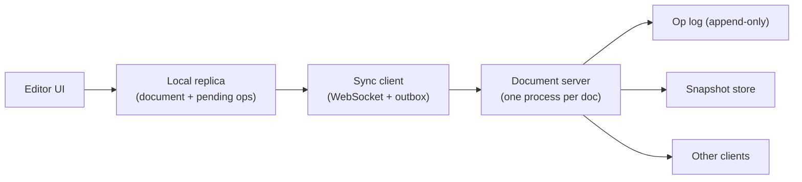

# Design a Collaborative Document Editor {#ch-design-collaborative-editor}

> Let fifty people type into the same paragraph, some of them offline, and have every screen end up identical.

**In this chapter:** the convergence problem · OT versus CRDT · the document data model · the sync protocol · undo in a shared document

## 💡 The Core Idea

The hard part is not sending keystrokes over a socket. It is that two people edit **the same position** at
the same moment, one of them on a train with no signal, and both edits have to survive. A lock would solve
it and destroy the product. So the design gives every replica the right to edit immediately and makes the
merge rule mathematical instead of negotiated.

That single constraint — **the local edit renders before the server has heard of it** — decides the rest.
The client owns a full replica, the server is a relay with a log, and the only question left open is which
merge rule you pick.

> This is a frontend round wearing a distributed systems costume. Say that out loud early.

## How It Works

### Requirements

**Functional:** several people type in one document and see each other's text and cursors within a few
hundred milliseconds. Edits made offline merge on reconnect. Undo reverses your own last change, not a
colleague's.

**Out of scope:** comments, suggestion mode, media embeds, permissions.

**Non-functional:** a local keystroke paints in under 16 ms — never behind a round trip. Replicas that have
seen the same edits show the same document. A client offline for a day still merges.

**Scale:** most documents have 1–5 concurrent editors; design for 50, with a tail of documents holding 5 MB
of text and ten years of history.

### Architecture



**Every edit applies locally first, then queues; the server is never on the typing path.**

The server is deliberately dull: route operations to the other clients, append them to a log, snapshot
occasionally. It is **stateful per document** — one document, one process — which gives a single ordering
point and makes fan-out trivial.

### The convergence rule: OT or CRDT

| | **Operational Transformation** | **CRDT** |
| --- | --- | --- |
| How it merges | Rewrites an incoming operation against ones it did not see | Every character has an identity; merge is a set union |
| Needs a central server | Yes — it orders operations | No |
| Cost on disk | Small: text plus a log | Larger: metadata per character, plus tombstones |
| Offline for hours | Painful — the transform chain grows | Natural |

Pick **CRDT** here, because "offline edits merge" is in the requirements and it is the clause OT struggles
with. Name what it costs: metadata per character, and tombstones that never fully leave.

> ⚠️ Do not claim to implement either from scratch. The senior answer names a library — Yjs, Automerge —
> states the property it needs, and spends the time on what the library does not solve.

### Data model

A CRDT sequence stores characters, not offsets. An offset is meaningless once a remote edit lands above it.

**The unit of the document:**

```typescript
interface CharId {
  readonly replica: string; // one per tab, not per user
  readonly counter: number; // monotonic within that replica
}

interface Char {
  readonly id: CharId;
  readonly value: string;
  readonly after: CharId | null; // the character this one was inserted after
  deleted: boolean;              // a tombstone, never a splice
}
```

Deletion sets a flag. Removing the element would break any concurrent insert pointing at it, so the
character stays and the renderer skips it. Two inserts after the same character are ordered by comparing
`CharId` — an arbitrary rule, but an **identical** one on every replica, which is the whole trick.

### Interface

One socket, and a separate lane for presence:

```typescript
type ClientMessage =
  | { type: "ops"; docId: string; ops: readonly Op[]; since: number }
  | { type: "awareness"; cursor: { anchor: CharId; head: CharId } };

type ServerMessage =
  | { type: "ops"; ops: readonly Op[]; seq: number }
  | { type: "snapshot"; state: Uint8Array; seq: number } // on join, or when far behind
  | { type: "awareness"; peers: readonly Peer[] };
```

Awareness — cursors, selections, who is here — is **disposable**: high frequency, worthless a second later,
and never written to the log. Putting it on the durable channel is what turns a 5 KB document into a 40 MB
log.

### Undo that belongs to you

`Ctrl+Z` must not delete a colleague's sentence, so undo is not a global stack. Each replica keeps its own
stack of inverse operations and applies the inverse as a **fresh edit**, which then merges like any other.
History stays append-only; nothing rewinds.

### Optimisations

**Snapshot and compact.** Replaying ten years of operations to open a document is not viable. Snapshot every
few thousand operations; a joining client gets the snapshot plus the tail.

**Batch by frame.** Fifty people typing at 8 characters a second is 400 messages a second per document if
each keystroke is a message. Coalesce per animation frame — one message every ~16 ms — and the CRDT merges
the batch identically.

## When to Use It

| If the requirement says…            | The design changes to…                                            |
| ----------------------------------- | ------------------------------------------------------------------ |
| Conflicts are rare, offline is not needed | Last-write-wins per field — a CRDT is over-engineering        |
| The server must approve every edit  | Server-authoritative, or OT; local-first is off the table          |
| Structured records, not free text   | A map CRDT per field, far cheaper than a sequence                   |

## Common Mistakes

**❌ Sending cursor positions as integer offsets**

> `{ cursor: 412 }`

Character 412 is a different character the moment a remote insert lands above it. Cursors anchor to a
`CharId`, like everything else. Blocking the keystroke on an acknowledgement is the same mistake in the
time dimension: typing that waits for the server feels broken at 80 ms and unusable at 300 ms.

**✅ One process per document**

> Route by `docId` so a single process owns the log tail. Ordering and fan-out become trivial, and the
> system shards perfectly, because documents never talk to each other.

## 🔑 Key Takeaways

- The requirement that decides the architecture is "the local edit renders before the server sees it".
- CRDTs buy offline merge and pay in per-character metadata and tombstones that never leave.
- Positions in a shared document are character identities, never integer offsets.
- Presence is disposable traffic and must not share a channel with durable operations.
- Undo is per replica and applies an inverse operation forward; it never rewinds shared history.

## Interview Questions

**Q: Two people insert a character at the same position at the same moment. What decides the order?**

Both inserts name the same predecessor, so the replicas compare the two identifiers — replica id and
counter — using a total order every replica computes the same way. It is arbitrary but deterministic, which
is all convergence needs. One character lands first, and everybody sees the same one first.

**Q: When would you not use a CRDT?**

When nothing is offline and the data is structured rather than free text. A form with independent fields
converges fine with last-write-wins per field, and a server-authoritative model is easier to reason about
and audit. CRDTs earn their metadata cost only when concurrent edits to one sequence are normal.

**Q: A client has been offline for a week and reconnects. What happens?**

It sends its queued operations and asks for everything since its last sequence number; if that tail is
large, the server sends a snapshot instead and the client merges its pending edits on top — safe precisely
because the merge is order-independent. The risk to name is the outbox: if it only ever lived in memory,
the week of work is gone, so it belongs in IndexedDB.

## What to Read Next

- [Chapter ?? — Offline-First Architecture](#ch-offline-first-architecture) — the storage and sync queue this design assumes
- [Chapter ?? — Real-Time Communication](#ch-realtime-communication) — choosing the transport, and what holding the connections costs
- [Chapter ?? — Consistency and CAP](#ch-consistency-and-cap) — why a CRDT is an availability choice, not a cleverness choice
