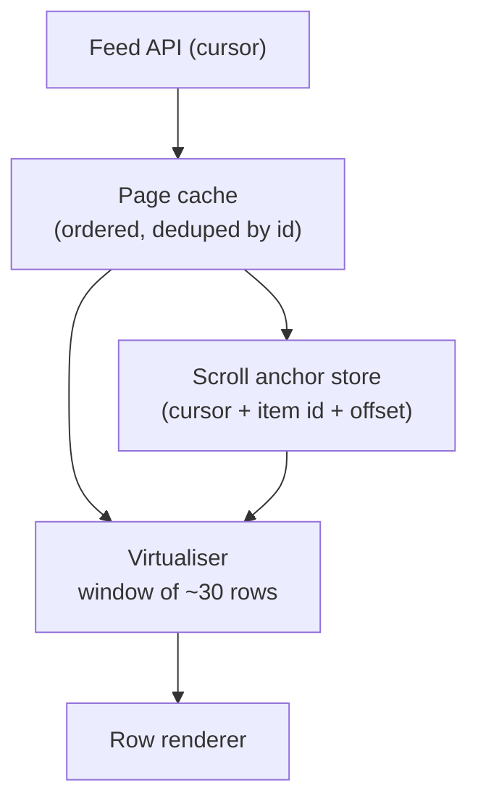

# Design an Infinite Feed {#ch-design-infinite-feed}

> Scroll for an hour on a three-year-old Android without the tab growing, stuttering, or losing your place.

**In this chapter:** the two budgets · cursor pagination · virtualisation and scroll anchoring · images without layout shift · restoring position after navigation

## 💡 The Core Idea

A feed is unbounded and a device is not. Two separate budgets have to hold at once, and confusing them is
the classic mistake: the **network budget** is how much data you fetch, and the **render budget** is how many
DOM nodes exist. "Load more" only addresses the first. After two thousand posts the page is slow because
there are two thousand posts *in the document*, not because the JSON was large. So the design keeps a
sliding window of rows in the DOM, and treats scroll position as data the system stores and restores
deliberately rather than something the browser happens to get right.

> The senior signal here is naming the render budget before anyone asks about performance.

## How It Works

### Requirements

**Functional:** endless vertical scroll over mixed text and image posts. New posts appear while the user
reads. Opening a post and pressing back returns to the same row.

**Out of scope:** ranking, ads, comments, composing.

**Non-functional:** interaction stays under 200 ms (INP) during scroll, cumulative layout shift under 0.1,
and memory flat after two thousand items. First screen is usable in under 2 seconds on a mid-range phone.

**Scale:** a session is 200–3,000 items. Pages of 20. Assume a feed that changes while it is being read.

### Architecture



**The page cache grows; the DOM does not. The anchor store is what survives navigation.**

### Pagination: cursors, not offsets

Offsets are wrong the moment the feed changes underneath the reader.

| | **Offset** (`?page=3`) | **Cursor** (`?after=eyJzIjo...`) |
| --- | --- | --- |
| A post is inserted at the head | Every later page shifts — the user sees a duplicate | Unaffected: the cursor names a position, not a count |
| A post is deleted | One item is silently skipped | Unaffected |
| Cost on the server | `OFFSET 60` scans and discards 60 rows | Index seek from the cursor's key |

The cursor is opaque to the client and encodes the sort key plus a tiebreaker id, so ordering is total and
paging can never loop:

```typescript
interface FeedPage {
  readonly items: readonly FeedItem[];
  readonly nextCursor: string | null; // null means the end, not an error
}

interface FeedItem {
  readonly id: string;
  readonly kind: "text" | "image";
  readonly width: number;  // intrinsic media size, sent by the server
  readonly height: number; // so the client can reserve space before loading
}
```

`width` and `height` look like clutter and are the reason the feed does not jump. Without them the client
cannot reserve space, and every image that loads pushes the text the reader is looking at down the page.

### Virtualisation and the anchoring problem

Render roughly one viewport of rows plus a screen of overscan either side — around 30 — and give the
scroller a spacer sized from measured heights, with an estimate for rows not yet seen.

The subtle part is what happens when an estimate turns out wrong. Correcting the height of a row **above**
the viewport moves everything below it, and the content under the reader's thumb jumps.

**Correct a height, then cancel the shift:**

```typescript
function applyHeightCorrection(el: HTMLElement, deltaAbove: number): void {
  if (deltaAbove === 0) return;
  // The row above grew or shrank; move the scroll by the same amount so the
  // visible content stays exactly where it was.
  el.scrollTop += deltaAbove;
}
```

Variable-height rows without this fix are the single most common reason a hand-rolled virtual list feels
broken.

> ⚠️ CSS `content-visibility: auto` skips rendering work but does not remove nodes. It lowers the render
> budget without lowering the memory one, so it complements virtualisation rather than replacing it.

### Images

Reserve the box before the bytes arrive with `aspect-ratio` from the server-sent dimensions, load below the
fold with `loading="lazy"`, and set `fetchpriority="high"` on the first one or two only. That combination
is what buys a CLS near zero rather than a stream of small shifts that add up.

### Restoring position

Browser scroll restoration works on a fixed-height document, which a virtualised feed is not. Store the
anchor instead — the cursor that was loaded, the id of the top visible item, and the pixel offset within it
— and on return refetch that page, scroll to the **item**, then apply the offset. Anchoring to an id rather
than a pixel is what survives the feed having changed while the user was away.

### Optimisations

**Prefetch one page early.** Trigger the next fetch when the last loaded row is about two screens away, not
when it enters the viewport, so the loader is never seen on a normal scroll.

**Never inject above the viewport.** New posts go into the cache and surface as a "12 new posts" pill.
Inserting them into the DOM above the reader moves the page under them, which reads as a bug.

## When to Use It

| If the requirement says…                | The design changes to…                                       |
| --------------------------------------- | ------------------------------------------------------------- |
| The list must be crawlable or linkable  | Numbered pages with real URLs — infinite scroll has no SEO story |
| Rows are a fixed height                 | Drop measurement entirely; the maths becomes multiplication      |
| Fewer than ~200 rows, all text          | Render them all — virtualisation is complexity you do not need   |

## Common Mistakes

**❌ Paginating with `page` and `limit` on a live feed**

> `GET /feed?page=3&limit=20`

One insert at the head and page 3 now repeats an item from page 2. Users report it as "the same post
twice", and it is never reproducible on a quiet test account.

**✅ Reserve space from intrinsic dimensions**

> Send `width` and `height` with every media item, set `aspect-ratio` from them, and layout shift stops
> being a problem you have to chase later.

## 🔑 Key Takeaways

- Network cost and DOM cost are separate budgets; loading less data does not make a long list fast.
- Cursor pagination is required, not preferred, once the underlying list can change while it is read.
- Height corrections above the viewport must be cancelled with an equal scroll adjustment, or the page jumps.
- Server-sent media dimensions are what make layout shift a solved problem rather than a chased one.
- Scroll restoration anchors to an item id, never to a pixel offset in a virtualised document.

## Interview Questions

**Q: Users say posts appear twice as they scroll. What is happening?**

The API is almost certainly paginating by offset while the feed is changing. A new post at the head pushes
everything down by one, so the next page starts one row earlier and repeats an item — and a deletion causes
the mirror-image bug, a silently skipped post. Cursor pagination fixes it, and deduplicating by id in the
page cache is the cheap safety net.

**Q: The list is virtualised and still janky on Android. Where do you look?**

At what each row does rather than how many exist. Common causes are images without reserved space forcing
layout on every load, a row re-rendering on every scroll frame because the handler updates state, and
expensive work such as date formatting done per render rather than once at cache time. Profile a scroll and
check whether the long frames are layout or script — the fix differs.

**Q: When would you not build infinite scroll at all?**

When the content has to be findable — search results, documentation, anything crawlable — or when users
need the footer. Infinite scroll trades linkable, reachable pages for engagement, and that is a product
decision, not a technical one. Saying so is the answer the interviewer is listening for.

## What to Read Next

- [Chapter ?? — Rendering Optimisation](#ch-rendering-and-streaming) — the frame budget the virtualiser is protecting
- [Chapter ?? — Image Optimisation](#ch-asset-delivery) — formats, sizing and priority for the media in these rows
- [Chapter ?? — Core Web Vitals](#ch-core-web-vitals) — where the INP and CLS numbers in the requirements come from
