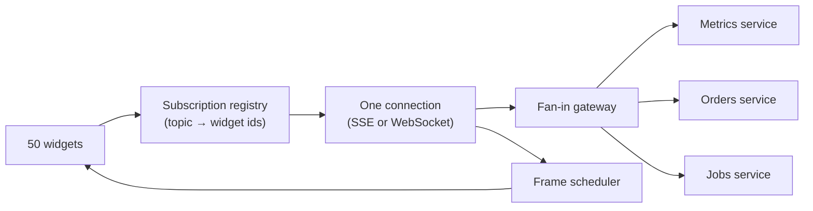

# Design a Live Dashboard {#ch-design-live-dashboard}

> Keep fifty widgets live on one screen over a single connection, and drop data rather than frames.

**In this chapter:** multiplexing one connection · polling versus SSE versus WebSocket · coalescing updates · the render budget · degrading one widget instead of the page

## 💡 The Core Idea

Fifty widgets built independently will each open their own subscription, and the result is fifty
connections, fifty timers and fifty re-render paths competing for one main thread. The scarce resources are
**connections and frames**, not data. So the dashboard owns one transport and one scheduler: widgets
declare what they need, and a registry multiplexes those declarations onto a single stream.

The other half of the design is admitting that the server can produce updates faster than a screen can show
them — at which point the correct behaviour is to **throw data away**, not to queue it.

> Sixty frames a second is the ceiling. A widget updating faster than that is spending CPU on pixels nobody sees.

## How It Works

### Requirements

**Functional:** up to 50 widgets on one screen, each bound to a different metric. Update rates range from
once a second to once an hour. Users rearrange and filter; layout persists.

**Out of scope:** widget authoring, alerting rules, historical exploration.

**Non-functional:** p95 from server event to painted pixel under 500 ms for live widgets. One connection per
tab. A single failing metric degrades one widget, never the page. A backgrounded tab costs almost nothing.

**Scale:** 5,000 concurrent viewers, ~200 distinct topics, and a burst rate of 2,000 events a second across
all of them.

### Architecture



**One connection in, one scheduler out. Widgets never touch the network or the clock themselves.**

The gateway is what stops the browser knowing about the backend's shape. Three services become one stream
of topic-tagged messages, and adding a fourth service changes nothing on the client.

### Choosing the transport

| | **Polling** | **SSE** | **WebSocket** |
| --- | --- | --- | --- |
| Direction | Client asks | Server pushes | Both ways |
| Reconnect and replay | Trivial — it is just a request | Built in, with `Last-Event-ID` | Write it yourself |
| Proxy and HTTP/2 friendliness | Perfect | Good | Sometimes blocked |
| Cost at 5,000 viewers | High: request overhead per widget per interval | One held response each | One held socket each |

**Choose SSE.** The dashboard is almost entirely server-to-client; subscribe and unsubscribe are a handful
of requests an hour and do not justify a duplex socket. Reconnection with replay comes free, which is the
part hand-rolled WebSocket code usually gets wrong.

> ⚠️ Keep polling for the slow widgets. A metric that changes hourly does not belong on a live stream, and
> mixing the two is a design decision worth stating rather than an inconsistency to hide.

### Interface

Subscriptions are topics, and every message carries the topic so the registry can route it:

```typescript
type Update =
  | { topic: string; at: number; value: number }
  | { topic: string; at: number; error: "unavailable" }; // per topic, never global

interface Registry {
  subscribe(topic: string, widgetId: string): void;
  unsubscribe(widgetId: string): void; // reference-counted: last widget out closes the topic
}
```

Reference counting matters. Two widgets showing the same metric must produce one subscription, and removing
a widget must not silently kill a topic another one is still using.

### The render budget

Updates arrive whenever they arrive; the screen repaints 60 times a second. Buffer between the two.

**Coalesce per frame, keep only the newest value per topic:**

```typescript
const pending = new Map<string, Update>();
let scheduled = false;

function onUpdate(u: Update): void {
  pending.set(u.topic, u); // an older value for the same topic is simply dropped
  if (scheduled) return;
  scheduled = true;
  requestAnimationFrame(() => {
    scheduled = false;
    flush(pending); // one store commit, one render pass
    pending.clear();
  });
}
```

Two rules follow from this and both are load-bearing. Widgets subscribe to **their topic**, not to the whole
store, so an update to one metric re-renders one widget. And charts draw to canvas rather than to hundreds
of SVG nodes, because at fifty widgets the DOM node count decides the frame time.

### Degrading well

Failure is per topic. A widget whose stream errors shows its last value with a "stale" marker and a
timestamp; it does not throw, and it does not blank its neighbours. On disconnect the connection retries
with backoff and jitter, and on reconnect it resubscribes and asks for the current value of each topic.
When the tab is hidden, unsubscribe from the fast topics and resubscribe on `visibilitychange` — fifty idle
dashboards on one laptop is a real scenario, and it is what drains the battery.

## When to Use It

| If the requirement says…                    | The design changes to…                                       |
| ------------------------------------------- | ------------------------------------------------------------- |
| Users send commands as well as read          | WebSocket, for the duplex channel SSE cannot give             |
| Every event matters and none may be dropped  | A durable queue and cursors — coalescing is no longer allowed |
| Data changes every few minutes               | Polling with `stale-while-revalidate`; a stream earns nothing  |

## Common Mistakes

**❌ One connection per widget**

> Fifty `EventSource` objects, one per tile.

Browsers cap connections per origin, so the last widgets never connect at all, and the server holds fifty
times the sockets it needs.

**❌ Queueing every update to render it**

A metric arriving at 200 Hz does not need 200 renders a second. Queueing them makes the UI lag further
behind reality the busier the system gets — the opposite of what a dashboard is for.

**✅ An error boundary per widget, not per page**

> A failing topic renders a stale tile. Forty-nine correct numbers are far more useful than one error page.

## 🔑 Key Takeaways

- Multiplex every widget onto one connection through a reference-counted subscription registry.
- SSE fits a read-mostly dashboard and gives reconnection with replay that WebSocket code has to hand-roll.
- Coalesce updates per animation frame and keep only the newest value per topic — dropping data is correct here.
- Widgets subscribe per topic so one metric changing re-renders one tile.
- Failure and staleness are per widget; a dashboard that blanks on one bad stream has the wrong error model.

## Interview Questions

**Q: Why one connection rather than one per widget?**

Browsers limit concurrent connections per origin, so past a handful of widgets the rest never connect at
all, and each connection costs the server memory and a file descriptor at 5,000 viewers. Multiplexing also
puts subscription lifetime in one place, which is what makes reference counting and resubscribe-on-reconnect
possible at all.

**Q: The backend emits 2,000 events a second. How do you keep the UI at 60 fps?**

Coalesce by topic into a buffer flushed once per animation frame, keeping only the newest value for each —
intermediate values have no meaning on a gauge. Then make sure a flush re-renders only the widgets whose
topics changed, and draw charts to canvas so the node count stays flat. If it is still slow, the problem is
per-widget render cost, not the transport.

**Q: When is dropping updates the wrong call?**

When each event is a fact rather than a sample — a trade, an audit entry, a message. There you need a
durable queue, cursors and acknowledgements, and the UI has to show a backlog rather than a current value.
The question to ask in the round is whether the widget shows *state* or *events*; only state can be coalesced.

## What to Read Next

- [Chapter ?? — Real-Time Communication](#ch-realtime-communication) — the transport comparison in full, and what held connections cost
- [Chapter ?? — Frontend Real-Time Features](#ch-frontend-real-time-features) — reconnection, jitter and recovering missed messages on the client
- [Chapter ?? — Rendering Optimisation](#ch-rendering-optimisation) — the frame budget the scheduler in this design is protecting
