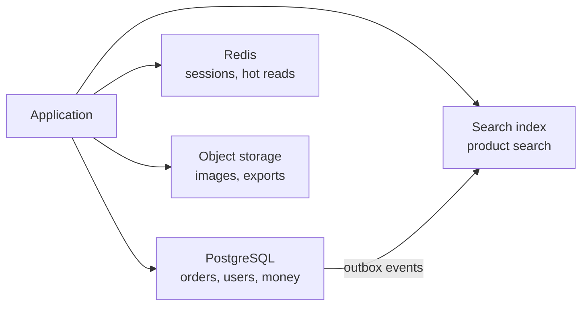

# Choosing a Datastore {#ch-choosing-a-datastore}

> Pick a store from the access patterns and the consistency requirement, and defend the choice without saying "it scales better".

**In this chapter:** the five store families · access patterns before schemas · ACID and BASE · normalise or denormalise · polyglot persistence · the migration you cannot undo

## 💡 The Core Idea

Every datastore is a set of trade-offs frozen into a product. Relational databases pay write cost for
query flexibility and correctness guarantees. Key-value stores give up querying for latency. Document
stores give up joins for locality. The choice is therefore not "which is best" but "which trade-offs
match what this system does most often".

That is why the honest process starts with the access patterns, not the entities. Write down the five
queries the system will run a thousand times a second, and the store usually picks itself.

> Relational is the default, and departing from it needs a reason a sentence long. "We might need to
> scale" is not that sentence.

## How It Works

### The five families

| Family        | Shape                          | Strong at                                 | Weak at                              | Examples                |
| ------------- | ------------------------------ | ----------------------------------------- | ------------------------------------ | ----------------------- |
| Relational    | Tables with a fixed schema      | Joins, transactions, ad-hoc queries        | Horizontal write scaling             | PostgreSQL, MySQL       |
| Document      | Self-contained JSON documents   | Reading one aggregate in one hit           | Cross-document joins and consistency | MongoDB, DynamoDB (document mode) |
| Key-value     | Opaque value behind a key       | Sub-millisecond reads, huge throughput     | Any query that is not by key         | Redis, DynamoDB, Memcached |
| Wide-column   | Rows keyed by partition + sort  | Enormous write volume, time-series ranges  | Ad-hoc queries, joins                | Cassandra, ScyllaDB     |
| Graph         | Nodes and edges                 | Traversals many hops deep                  | Aggregate reporting, bulk writes     | Neo4j, Neptune          |

A search engine and an object store belong on the same shortlist, even though they are not "databases".
They own the two problems relational stores handle worst: ranked full-text queries and large binary
objects.

### Access patterns before schemas

Relational modelling starts from the entities and lets the query planner work out the rest. Every other
family works the other way round: **the primary key is the query plan**, and getting it wrong means a
migration rather than an index.

```typescript
// DynamoDB-style single-table design. The key IS the access pattern.
interface OrderItem {
  pk: string;   // "USER#42"        — partition: everything for one user is co-located
  sk: string;   // "ORDER#2026-09-02#8821" — sort: newest-first range queries for free
  status: "pending" | "shipped";
  total: number;
}

// "The last 20 orders for user 42" is one query against one partition.
// "All orders over £500 across all users" is a full scan — and if you need it, this is the wrong store.
```

Ask the question before choosing the key: which queries must be fast, and which may be slow or offline?

### ACID and BASE

| | ACID (relational) | BASE (most NoSQL) |
| --- | ----------------- | ----------------- |
| Writes | Atomic across rows and tables | Atomic within one document or partition |
| Reads | See a consistent snapshot | May see stale data |
| Failure | Rolls back | Converges later |
| Buys | Correctness with no application effort | Availability and write throughput |
| Costs | Coordination, which limits write scaling | Correctness becomes the application's job |

The practical translation: with BASE, the invariants a database used to enforce — uniqueness, referential
integrity, a balance that cannot go negative — move into your code, and every one of them is now a race
condition you have to think about.

### Normalise or denormalise

| | Normalised | Denormalised |
| --- | ---------- | ------------ |
| Write | One place to update | Every copy must be updated |
| Read | Joins at query time | One read, no joins |
| Storage | Minimal | Duplicated |
| Risk | Slow reads at scale | Copies drifting out of sync |

Normalise by default; denormalise a specific read path once it is measurably too slow, and be explicit
about who keeps the copies in step. A denormalised field with no owner is a bug on a delay.

> ⚠️ Denormalisation is a caching decision wearing a schema costume. It has the same failure mode —
> stale data — with none of a cache's expiry. Give every duplicated field a rule for when it is refreshed.

### Polyglot persistence

Most real systems use two or three stores, each for what it is good at.



**One store owns each fact; the others are derived and rebuildable.**

The rule that keeps this sane: **exactly one store is the source of truth for each piece of data.**
Everything else is a projection that can be thrown away and rebuilt. The moment two stores both claim
to own a fact, you have a reconciliation problem that never ends.

Each additional store costs backups, monitoring, a failure mode and someone who understands it. Three is
a lot for a small team.

## When to Use It

| Requirement                                     | Store                       | Why                                        |
| ----------------------------------------------- | --------------------------- | ------------------------------------------ |
| Transactions across entities, money, inventory   | Relational                  | ACID without writing it yourself           |
| Reads by key at very low latency                 | Key-value                   | Nothing else is in the same range          |
| One aggregate read and written as a whole        | Document                    | Locality; no joins needed                  |
| Millions of writes a second, time-ordered        | Wide-column                 | Built for exactly this write pattern       |
| "Friends of friends who bought X"                | Graph                       | Multi-hop traversal in a relational store is a self-join per hop |
| Ranked full-text search                          | Search engine               | Inverted index and relevance scoring       |
| Large binary objects                             | Object storage              | A database row is the wrong home for a 4 MB image |

## Common Mistakes

**❌ Choosing NoSQL for scale you do not have**

> "We picked Cassandra because we might get big."

A single PostgreSQL instance handles tens of thousands of transactions a second and terabytes of data.
Most products never leave that envelope, and the ones that do have the revenue to migrate.

**✅ Choosing for the access pattern you actually have**

> "Writes are 400 a second and every query is by user ID with a date range, so a single Postgres with a
> composite index is right, and I will revisit if writes pass 5,000."

**❌ Modelling a document store like a relational one**

Storing normalised documents and joining them in application code gives you a slow relational database
with no query planner and no transactions.

**❌ Two sources of truth**

Writing the same fact to Postgres and Elasticsearch from the application means the two will diverge, and
nothing will tell you which is right. Write to one and derive the other.

## 🔑 Key Takeaways

- Start from the access patterns; in every non-relational store the primary key is the query plan.
- Relational is the default, and moving away from it needs a specific reason about access shape or write volume.
- BASE moves correctness from the database into your application, where every invariant becomes a race condition.
- Denormalisation is a cache with no expiry, so every duplicated field needs a named refresh rule.
- Exactly one store owns each fact; everything else is a rebuildable projection.

## Interview Questions

**Q: SQL or NoSQL for this system — how do you answer without hedging?**

Name the access patterns first, then the consistency requirement, then pick. If queries are varied and
the data has relationships and money is involved, relational. If every query is by a known key, writes
are enormous, and the aggregate is self-contained, a key-value or wide-column store. State the write
volume at which you would revisit.

**Q: What do you actually lose by moving from PostgreSQL to DynamoDB?**

Joins, ad-hoc queries, and multi-entity transactions in their general form. In exchange you get
predictable single-digit-millisecond reads and effectively unlimited write scaling. The real cost is
that new query patterns may require a new index or a data migration, because the key design encodes the
queries you thought of at the start.

**Q: When is denormalisation worth it?**

When a read path is measurably too slow with joins and the duplicated field changes rarely relative to
how often it is read — a product name on an order line, say. It stops being worth it when the copied
value changes often, because then every write fans out and the copies drift whenever one of those
updates fails.

## What to Read Next

- [Chapter ?? — Sharding](#ch-sharding) — what to do when one machine no longer holds the data
- [Chapter ?? — Consistency and CAP](#ch-consistency-and-cap) — the guarantees each family can offer
- [Chapter ?? — Caching](#ch-caching) — the layer that usually removes the need for a different store
