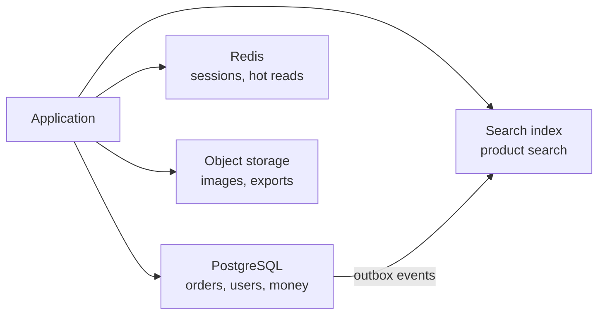

# Choosing a Datastore and Replicating It {#ch-choosing-a-datastore}

> Pick a store from the access patterns, copy it across machines, and say exactly what a reader sees while the copies disagree.

**In this chapter:** access patterns before schemas · ACID and BASE · one owner per fact · leaders, lag and failover · routing reads

## 💡 The Core Idea

Every datastore is a set of trade-offs built into a product. Relational databases pay write cost for
flexible queries and correctness. Key-value stores give up querying to win latency. Document stores give
up joins to keep related data together. So the question is never "which is best". It is "which
trade-offs match what this system does most often".

Once you have chosen, you copy the data to more than one machine. That is **replication**, and it buys
two separate things. **Durability** means losing one machine does not lose the data. **Read capacity**
means several machines can answer queries. It costs one thing: the copies are never identical at the
same instant, so someone can read a value that is already out of date.

> Relational is the default, and leaving it needs a reason one sentence long. "We might need to scale"
> is not that sentence.

## How It Works

### The families

| Family      | Strong at                                 | Weak at                              | Examples             |
| ----------- | ----------------------------------------- | ------------------------------------ | -------------------- |
| Relational  | Joins, transactions, ad-hoc queries        | Scaling writes across machines       | PostgreSQL, MySQL    |
| Document    | Reading one aggregate in one hit           | Joins and consistency across documents | MongoDB            |
| Key-value   | Sub-millisecond reads, huge throughput     | Any query that is not by key         | Redis, DynamoDB      |
| Wide-column | Enormous write volume, time-ordered ranges | Ad-hoc queries, joins                | Cassandra, ScyllaDB  |
| Graph       | Traversals many hops deep                  | Reporting, bulk writes               | Neo4j                |

### Access patterns before schemas

Relational modelling starts from the entities and lets the query planner do the rest. Every other family
works the other way round. **The primary key is the query plan**, and a wrong key means a migration, not
a new index.

**A DynamoDB-style single-table key:**

```typescript
interface OrderItem {
  pk: string; // "USER#42" — everything for one user lives in one partition
  sk: string; // "ORDER#2026-09-02#8821" — sorted, so newest-first ranges are free
  status: "pending" | "shipped";
  total: number;
}

// "The last 20 orders for user 42" is one query against one partition.
// "All orders over £500 across all users" is a full scan. If you need it, this is the wrong store.
```

### ACID and BASE

|          | ACID (relational)                 | BASE (most NoSQL)                        |
| -------- | --------------------------------- | ---------------------------------------- |
| Writes   | Atomic across rows and tables     | Atomic within one document or partition  |
| Reads    | A consistent snapshot             | May be stale                             |
| Buys     | Correctness with no extra code    | Availability and write throughput        |
| Costs    | Coordination, which limits writes | Correctness becomes your code's job      |

With BASE, the rules the database used to enforce move into your code. Uniqueness, foreign keys and "a
balance cannot go negative" each become a race condition you must handle yourself.

### One owner per fact

Normalise by default. Denormalise one read path only once it is measurably too slow, and name who keeps
the copies in step.

> ⚠️ Denormalisation is a cache dressed as a schema. It fails the same way, with stale data, but it has
> no expiry. Give every duplicated field a rule for when it is refreshed.

Most real systems use two or three stores, each for what it does well.

**Polyglot persistence in one system:**



**One store owns each fact; the others are derived from it and can be rebuilt.**

If two stores both claim a fact, they drift apart and nothing tells you which is right. Write to one
and derive the rest.

### Leaders and topologies

| Topology      | Writes go to                          | Conflicts                  | Use for                              |
| ------------- | ------------------------------------- | -------------------------- | ------------------------------------ |
| Single-leader | One node, copied outwards             | Impossible                 | Almost everything — the default      |
| Multi-leader  | Any leader, in several regions        | Certain, must be resolved  | Writes in two regions, offline clients |
| Leaderless    | Several replicas at once, by quorum   | Likely, resolved at read   | Cassandra-style stores               |

Single-leader removes write conflicts, so it wins unless the requirements force otherwise.

### Synchronous or asynchronous

|                        | Synchronous                           | Asynchronous                 |
| ---------------------- | ------------------------------------- | ---------------------------- |
| Write latency          | Leader plus the slowest replica       | Leader only                  |
| Loss if the leader dies | None, for acknowledged writes        | Everything not yet shipped   |
| Availability           | A stalled replica blocks writes       | Replicas cannot block writes |

Production usually runs **semi-synchronous**. One replica confirms each write; the rest follow later.
You get a durable second copy, and no single slow replica can stop the system.

### Replica lag

Lag is the delay between a write committing on the leader and appearing on a replica: milliseconds
normally, minutes while a replica rebuilds. Users see it as three distinct bugs.

| Anomaly          | What the user sees                          | Fix                                     |
| ---------------- | ------------------------------------------- | --------------------------------------- |
| Read-your-writes | "I saved it and it did not save"            | Send that user to the leader briefly    |
| Monotonic reads  | A value appears, then vanishes on refresh   | Pin a session to one replica            |
| Causal order     | A reply shows before the comment it answers | Read both from the same replica         |

**Routing a read by lag tolerance:**

```typescript
interface ReplicaHealth { name: string; lagMs: number }

function pickReplica(replicas: ReplicaHealth[], toleranceMs: number): string | null {
  const fresh = replicas.filter((r: ReplicaHealth) => r.lagMs <= toleranceMs);
  if (fresh.length === 0) return null; // fall back to the leader rather than serve stale data
  return fresh[Math.floor(Math.random() * fresh.length)].name;
}
```

Default every read to a replica, and mark the few endpoints that need the leader: a user's own recent
write, and anything about money, stock or permissions. The opposite default never gets cleaned up.

### Failover and split brain

When the leader dies, a replica is promoted. You detect the failure with a heartbeat timeout, pick the
replica with the newest log position, and point clients at it. Then you make sure the old leader
**cannot** come back as a leader.

> ⚠️ That last step is the one people forget. If the old leader recovers and still thinks it is primary,
> two nodes accept writes and the data splits — **split brain**. Fencing prevents it: a rising term
> number that storage checks on every write. Automatic failover without fencing is a data-loss mechanism.

With asynchronous replication, failover also loses every write the old leader confirmed but had not
shipped. So "does failover lose data?" has an honest answer: yes, up to the replication lag.

## When to Use It

| Requirement                                   | Choice                                    | Why                                     |
| --------------------------------------------- | ----------------------------------------- | --------------------------------------- |
| Transactions across entities, money, stock    | Relational                                | ACID without writing it yourself        |
| Reads by key at very low latency              | Key-value                                 | Nothing else is in the same range       |
| Millions of time-ordered writes a second      | Wide-column                               | Built for exactly this write pattern    |
| Ranked full-text search                       | Search engine, derived from the main store | Inverted index and relevance scoring   |
| One database, uptime matters                  | One leader plus a sync replica in another zone | Survives a zone without losing writes |
| Writes genuinely needed in two regions        | Multi-leader with a conflict rule         | The only option, so own its cost        |

## Common Mistakes

**❌ Choosing NoSQL for scale you do not have**

> "We picked Cassandra because we might get big."

One PostgreSQL instance handles tens of thousands of transactions a second and terabytes of data. Most
products never leave that range, and the ones that do can afford to migrate.

**✅ Choosing for the access pattern you actually have**

> "Writes are 400 a second and every query is by user ID with a date range. One Postgres with a
> composite index is right, and I will revisit if writes pass 5,000."

**❌ Treating replicas as a backup**

Replication copies mistakes perfectly. A `DELETE` without a `WHERE` reaches every replica in
milliseconds.

**✅ Replicas for availability, backups for recovery**

Replicas cover a machine or zone dying. Point-in-time backups cover bad data, and a scheduled restore
proves they work.

## 🔑 Key Takeaways

- Start from the access patterns, because in every non-relational store the primary key is the query plan.
- Relational is the default, and leaving it needs a specific reason about access shape or write volume.
- Exactly one store owns each fact, and every other copy is a projection you can rebuild.
- Replication buys durability and read capacity, and it charges staleness for both.
- Asynchronous failover loses every write not yet shipped, and failover without fencing risks split brain.

## Interview Questions

**Q: SQL or NoSQL for this system — how do you answer without hedging?**

Name the access patterns first, then the consistency requirement, then pick. Varied queries, related
data and money point to relational. Every query by a known key, huge write volume and self-contained
records point to key-value or wide-column. State the write volume at which you would revisit.

**Q: What do you actually lose by moving from PostgreSQL to DynamoDB?**

Joins, ad-hoc queries and general multi-entity transactions. You gain predictable low-latency reads and
near-unlimited write scaling. The real cost is that a new query pattern may need a new index or a data
migration, because the key encodes the queries you thought of at the start.

**Q: Your primary dies. What is lost?**

With asynchronous replication, every write the leader confirmed but had not shipped — usually under a
second, more if the replica was lagging. With a synchronous replica, nothing that was confirmed.
Semi-synchronous replication exists to balance exactly that trade.

**Q: A user says their profile update "did not save". Diagnose it.**

Almost certainly replica lag. The write went to the leader, and the next read hit a replica that had not
applied it yet. Confirm by checking lag at that time, then fix it with read-your-writes routing, not by
changing the consistency of the whole system.

**Q: When would you accept multi-leader replication?**

Only when writes must succeed in more than one region and cross-region latency is unacceptable, or when
clients write offline and sync later. Conflicts then become certain, so I would require a resolution
rule the domain accepts, such as a CRDT or a business merge rule. Last-write-wins on data that matters
is not that rule.

## What to Read Next

- [Chapter ?? — Sharding and Transactions at Scale](#ch-sharding) — the other axis: splitting data rather than copying it
- [Chapter ?? — Reliability, Consistency and CAP](#ch-consistency-and-cap) — the vocabulary for what a replica may show, and where failover sits in an availability target
