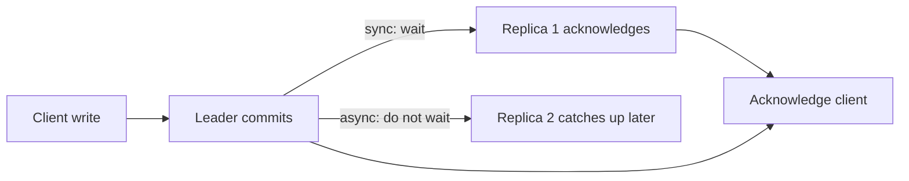

# Replication {#ch-replication}

> Copy data across machines for reads and for survival, and know exactly what a reader can see while the copies disagree.

**In this chapter:** why replicate at all · single-leader, multi-leader, leaderless · synchronous versus asynchronous · replica lag and how it shows up · failover and split brain · read routing

## 💡 The Core Idea

Replication keeps the same data on more than one machine. It buys two different things that people
often conflate: **durability**, because a lost machine has not taken the only copy, and **read
capacity**, because several machines can answer queries. It costs one thing, and the whole subject is
about that cost — the copies are never all identical at the same instant, so somebody can read a value
that is already out of date.

> Replication does not make the data safer to *read*. It makes it harder to *lose*. Those are different
> guarantees, and interviewers check whether you know which one you just claimed.

## How It Works

### Three topologies

| Topology       | Writes go to                     | Conflicts        | Use for                                     |
| -------------- | -------------------------------- | ---------------- | ------------------------------------------- |
| Single-leader  | One node, replicated outwards     | Impossible       | Almost everything — the default             |
| Multi-leader   | Any leader, in several regions    | Certain, must be resolved | Multi-region writes, offline clients |
| Leaderless     | Several replicas directly, by quorum | Likely, resolved at read | Dynamo-style stores: Cassandra, Riak |

Single-leader is the right answer unless the requirements force otherwise, because it removes write
conflicts entirely. Multi-leader is what you reach for when writes must be accepted in two regions and
the latency of crossing the ocean is unacceptable — and it means adopting a conflict-resolution strategy
on day one, not later.

### Synchronous or asynchronous



**Synchronous replication trades write latency for a guarantee that at least one copy survives the leader.**

| | Synchronous | Asynchronous |
| --- | ----------- | ------------ |
| Write latency | Leader plus the slowest acknowledging replica | Leader only |
| Data loss on leader failure | None, for acknowledged writes | Everything not yet shipped |
| Availability | A stalled replica blocks writes | Replicas cannot block writes |

The usual production setting is **semi-synchronous**: one replica acknowledges synchronously, the rest
follow asynchronously. That gives a durable second copy without letting any single slow replica stop the
system.

### Replica lag

Lag is the delay between a write committing on the leader and being visible on a replica. Milliseconds
normally, seconds under write bursts, minutes when a replica is rebuilding or a long transaction blocks
apply.

It shows up as three distinct user-visible bugs:

| Anomaly              | What the user sees                                        | Fix                                     |
| -------------------- | --------------------------------------------------------- | --------------------------------------- |
| Read-your-writes     | "I saved it and it did not save"                           | Route that user to the leader briefly   |
| Monotonic reads      | A value appears, then disappears on refresh                | Pin a session to one replica            |
| Causal order         | A reply shows before the comment it answers                | Order by a causal token, or read both from one replica |

```typescript
interface ReplicaHealth { name: string; lagMs: number }

// Route reads to a replica only while its lag is inside what this endpoint tolerates.
function pickReplica(replicas: ReplicaHealth[], toleranceMs: number): string | null {
  const fresh = replicas.filter((r: ReplicaHealth) => r.lagMs <= toleranceMs);
  if (fresh.length === 0) return null; // fall back to the leader rather than serve stale data
  return fresh[Math.floor(Math.random() * fresh.length)].name;
}
```

Alerting on lag matters as much as measuring it. A replica hours behind is not a replica — promoting it
during an incident loses every write since it fell behind.

### Failover and split brain

When the leader dies, one replica is promoted. The steps are simple to say and where most of the danger
lives:

1. Detect the failure — usually a heartbeat timeout, and too short a timeout causes false failovers.
2. Choose a new leader — the replica with the most recent log position.
3. Reconfigure clients and replicas to follow it.
4. Ensure the old leader **cannot** come back as a leader.

> ⚠️ Step 4 is the one people forget. If the old leader recovers and still believes it is primary, two
> nodes accept writes and the data diverges — split brain. Fencing, usually a monotonically increasing
> term or epoch number that the storage layer checks, is what prevents it. An automatic failover without
> fencing is a data-loss mechanism.

With asynchronous replication, failover **loses** any write the old leader had acknowledged but not
shipped. That is the honest answer to "does failover lose data": yes, up to the replication lag, unless
writes were synchronous.

### Routing reads

| Read                                   | Send to           | Why                                    |
| -------------------------------------- | ----------------- | -------------------------------------- |
| Immediately after that user's own write | Leader            | Read-your-writes                       |
| Money, inventory, permissions           | Leader            | A stale answer is a wrong answer       |
| Dashboards, listings, search results    | Replica           | Seconds of staleness are invisible     |
| Analytics and reports                   | A dedicated replica | Long queries must not touch the serving path |

The pattern that scales: default every read to a replica, and mark the specific endpoints that need the
leader. The opposite default — leader unless proven otherwise — never gets cleaned up.

## When to Use It

| Situation                                    | Setup                                  |
| -------------------------------------------- | -------------------------------------- |
| One database, uptime matters                  | Single leader plus one sync replica in another zone |
| Read-heavy workload                           | Several async replicas, reads routed by default |
| Users on two continents, reads dominate       | Regional read replicas, writes to one region |
| Writes genuinely needed in two regions        | Multi-leader, with a conflict strategy decided up front |
| Analytics competing with production traffic   | A separate replica nothing user-facing reads |

## Common Mistakes

**❌ Treating replicas as a backup**

> "We have three replicas, so we do not need backups."

Replication copies mistakes perfectly. A `DELETE` without a `WHERE` replicates in milliseconds, and a
corrupted page replicates with it. Backups protect against a different class of failure entirely.

**✅ Replicas for availability, backups for recovery**

> Replicas handle a machine or a zone dying; point-in-time backups handle bad data, tested by a
> scheduled restore.

**❌ Reading immediately after a write from a replica**

The most common replication bug in production, and the one users report most clearly.

**❌ Automatic failover with no fencing**

Two leaders, divergent writes, and a manual merge afterwards. Fence the old leader or make failover
manual.

## 🔑 Key Takeaways

- Replication buys durability and read capacity, and charges staleness for both.
- Single-leader avoids write conflicts entirely and is the default; multi-leader means owning conflict resolution from day one.
- Asynchronous failover loses every write not yet shipped, so the data-loss window equals the replication lag.
- Fencing the old leader is what prevents split brain, and automatic failover without it is a data-loss mechanism.
- Replicas are not backups — they replicate mistakes exactly as fast as they replicate data.

## Interview Questions

**Q: Your primary dies. What is lost?**

With asynchronous replication, every write acknowledged by the leader but not yet shipped — typically
under a second of writes, more if the replica was lagging. With a synchronous replica, nothing that was
acknowledged. That is precisely the trade semi-synchronous replication is designed to balance.

**Q: A user reports that their profile update "did not save". Diagnose it.**

Almost certainly replica lag: the write went to the leader and the subsequent read went to a replica that
had not applied it. Confirm by checking lag at that timestamp, then fix it with read-your-writes routing
rather than by changing the consistency model of the whole system.

**Q: When would you accept multi-leader replication?**

When writes must succeed in more than one region and cross-region write latency is unacceptable, or when
clients write offline and sync later. Both make conflicts inevitable, so I would only accept it alongside
a resolution strategy the domain supports — a CRDT, a version vector, or a merge rule the business
agrees with. Last-write-wins on data that matters is not that strategy.

## What to Read Next

- [Chapter ?? — Sharding](#ch-sharding) — the other axis: splitting data rather than copying it
- [Chapter ?? — Consistency and CAP](#ch-consistency-and-cap) — the vocabulary for what a replica may show
- [Chapter ?? — Reliability and Availability](#ch-reliability-and-availability) — where failover sits in an availability target
