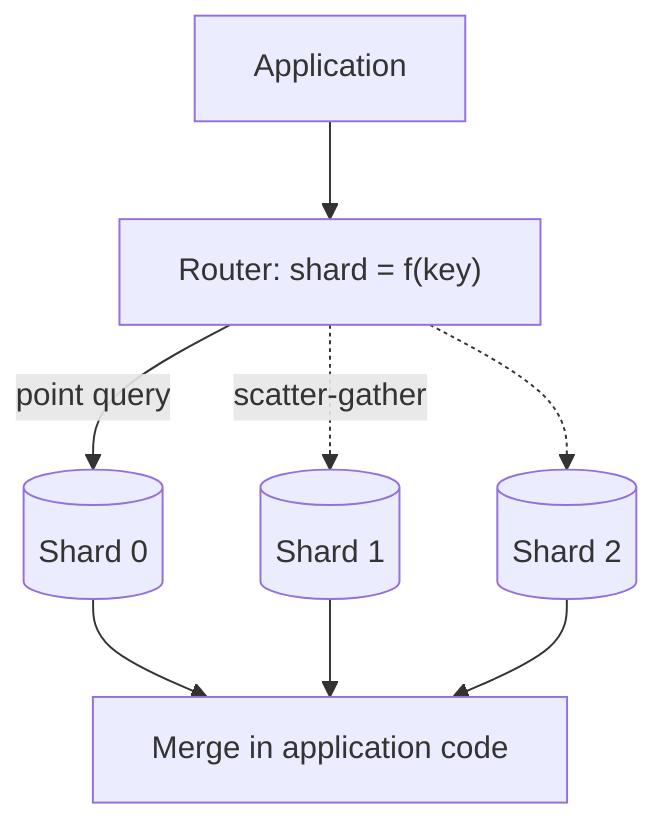

# Sharding and Transactions at Scale {#ch-sharding}

> Split data across machines, pick a shard key you will not regret, and keep your writes correct once one transaction no longer covers them.

**In this chapter:** the three strategies · consistent hashing · choosing a shard key · hot shards and hot rows · transactions on one shard · sagas, the outbox and idempotency

## 💡 The Core Idea

Sharding splits one database into several. Each shard holds a slice of the data, and none holds enough
to be a bottleneck. It is the only lever that scales writes, which is why it exists. It is also the
last lever to pull.

The cost is that every query changes shape. The system must know which shard to ask before it can ask.
A question that spans shards becomes a fan-out and a merge in application code.

Transactions change shape too. A group of writes commits together for free on one database, but only
inside one shard once the data is split. The senior answer is to arrange not to need a
distributed transaction: keep related data together, and use sagas, the outbox and idempotency for the
rest.

> ⚠️ Shard only after caching, read replicas and connection pooling are used up. Those handle reads,
> which most systems run out of first. Sharding fixes write throughput and data volume, and it is
> expensive to reverse.

## How It Works

A router sits between the application and the shards. It computes the shard from the shard key and
sends the query to one machine. When the query has no shard key, it must ask all of them.



**One shard when the query carries the shard key; all of them when it does not.**

### The three strategies

| | Range | Hash | Directory |
| --- | --- | --- | --- |
| **Shard chosen by** | Which interval the key falls in | A hash of the key | A lookup table |
| **Range queries** | Stay on one shard | Hit every shard | Depend on placement |
| **Distribution** | Uneven; new data clusters | Uniform | Whatever you decide |
| **Reach for it when** | Time-series data queried by date | Point lookups on a high-cardinality key | You must control placement per entity |

**Hash-based routing, the default for user data:**

```typescript
import { createHash } from "node:crypto";

// The same user always lands on the same shard — that is the whole contract.
function shardIndex(key: string, shardCount: number): number {
  return parseInt(createHash("md5").update(key).digest("hex").slice(0, 8), 16) % shardCount;
}
```

That modulo is also the flaw. `hash % 4` and `hash % 5` disagree about nearly every key. Adding one
shard moves almost all the data.

### Consistent hashing

Consistent hashing removes the modulo. Keys and shards both sit on a ring, and a key belongs to the
first shard clockwise from it. A new shard takes keys only from its neighbour, so about `1/N` of the
data moves. Placing each shard at many points on the ring — **virtual nodes** — keeps the slices even.

### Choosing a shard key

The shard key decides everything downstream, and it is the hardest decision to reverse.

| Property | Why it matters |
| --- | --- |
| **High cardinality** | Few distinct values means few possible shards, and load piles onto them |
| **Matches the common query** | The usual query then touches one shard instead of all |
| **Keeps atomic writes together** | Writes that must commit together only can if they share a shard |
| **Immutable and not time-ordered** | A changed key moves the row; a sequential one sends every new write to one shard |

Hash `user_id` for user data. Key messages by `conversation_id`, so one conversation is one query. Key
orders by `tenant_id`, so an account's order and its line items commit in one local transaction.

### Hot shards and hot rows

Keys spread evenly, but requests do not. A celebrity account lands all its work on one shard. Cache
a read-heavy hot key, or split it across buckets. Give a write-heavy one its own shard.

A hot **row** is worse: a global counter, the last seat, one product's stock. No isolation level fixes
it, because every writer queues for the same lock. Split it into N counter rows and sum on read. Or
use **reserve-then-confirm**: hold the seat for ten minutes, take payment outside the transaction, and
let an expiry job release unconfirmed holds.

### Cross-shard queries and re-sharding

A query without the shard key is **scatter-gather**. It is as slow as the slowest shard, and its tail
latency gets worse as shards are added. Avoid it by matching the key to the main access pattern, by
denormalising, and by sending global questions such as reporting to a warehouse.

**Splitting a full shard — there is no cheap version, only a careful one:**

```text
1. Stand up the new shard, empty.
2. Double-write: every write goes to both old and new placement.
3. Backfill the historical rows, verifying as you go.
4. Shift reads across gradually, and keep the old copy readable.
5. Stop double-writing, then delete the old data — last, and only once reads are clean.
```

### Transactions inside one shard

Inside a shard, ordinary transactions still work. **Read committed** is the right default, and it is
PostgreSQL's. Its gap is the **lost update**: two read-modify-writes both read 100, both write 50, and
50 disappears. That gap matters for balances, counters and stock.

**Let the database do the arithmetic, in one conditional statement:**

```sql
UPDATE inventory SET quantity = quantity - 1
WHERE sku = 'A1' AND quantity > 0; -- zero rows affected means sold out
```

When logic must run in between, lock. **Optimistic** locking adds a version column and retries on
conflict; it suits rare conflicts. **Pessimistic** locking uses `SELECT ... FOR UPDATE`; it suits frequent
ones. Serializable prevents every anomaly but turns contention into errors the code must retry.

> ⚠️ Never hold a database lock across a network call. A row locked while you wait for a payment
> provider stays locked for the provider's p99.

### Once a write spans shards or services

| Need | Answer |
| --- | --- |
| Two writes in one shard | An ordinary transaction — choose the key so they land together |
| Two writes in two shards | Some stores support it, at a latency cost; most do not |
| Two writes in two services | A **saga**: a chain of local transactions, each with a compensation |
| A message sent with a write | The **outbox**: write the event in the same local transaction |

**Two-phase commit** holds locks over the network and blocks everyone if the coordinator dies. A
**saga** commits each step locally instead. If step three fails, it runs compensations for steps two
and one, such as a refund. A crash between writing a row and publishing a message loses one of them.
The **outbox** fixes this: write the event to a table in the same transaction, and a relay publishes it.

**Outbox and idempotent consumer together:**

```typescript
// Same transaction: either the order and its event both exist, or neither does.
async function placeOrder(db: Db, order: Order): Promise<void> {
  await db.transaction(async (tx: Tx) => {
    await tx.insert("orders", order);
    await tx.insert("outbox", { id: order.id, type: "order.placed", payload: order });
  });
}

// The relay retries, so delivery is at-least-once. The consumer makes it effectively-once.
async function onOrderPlaced(db: Db, event: OutboxEvent): Promise<void> {
  await db.transaction(async (tx: Tx) => {
    const fresh: boolean = await tx.insertIfAbsent("processed_events", { id: event.id });
    if (!fresh) return; // already handled — a duplicate delivery
    await tx.update("inventory", { sku: event.payload.sku, delta: -1 });
  });
}
```

**Idempotency** makes all of this safe. Every retry-based pattern will sometimes apply an operation
twice. A unique event id, checked in the same transaction as the effect, makes the repeat a no-op.

## When to Use It

| Situation | Choose |
| --- | --- |
| Reads are the bottleneck | Replicas and caching — not sharding |
| Data or write throughput exceeds one primary | Shard, with consistent hashing from day one |
| Stock or seats under heavy contention | A conditional update, or reserve-then-confirm |
| A workflow spanning services | A saga with compensations, never two-phase commit |
| A write that must also emit an event | The outbox, with idempotent consumers |

## Common Mistakes

❌ **Sharding early, "to be ready".** Every query, migration and incident gets harder from that day.
✅ Use up vertical scaling, replicas and caching first, and shard against a measured limit.

❌ **Plain modulo hashing.** It breaks the first time you add a shard, which is when you need it most.
✅ Consistent hashing with virtual nodes, from the start.

❌ **Assuming transactions still work.** A write across two shards is no longer atomic. ✅ Choose the
key so anything atomic stays on one shard, and use a saga for the rest.

❌ **Write, then publish.** A crash between the two loses the event or sends a phantom one. ✅ Write
to an outbox in the same transaction.

## 🔑 Key Takeaways

- Sharding is the only lever that scales writes, and the only one whose cost is permanent.
- The shard key decides query cost and transaction scope, so choose it from the list of top queries and atomic writes.
- Consistent hashing with virtual nodes moves about `1/N` of the keys when a shard is added, where plain modulo moves almost all of them.
- Read committed still allows lost updates, so counters and stock need a conditional update or explicit locking.
- Across shards and services there is no free transaction, only sagas, the outbox and idempotent consumers.

## Interview Questions

**Q: When do you shard, and what would you do instead?**

When writes or data volume exceed one machine, and not before. Reads are handled by caching and
replicas, which are far cheaper, so a read bottleneck is not a sharding argument. Before sharding,
scale the instance up, add replicas, pool connections and move expensive views into a read model.

**Q: What makes a good shard key?**

High cardinality, so load spreads. Present in the common query, so most reads hit one shard. Shared
by writes that must commit together, so they stay in one local transaction. Immutable and not
time-ordered, so rows never move and writes do not pile onto the newest shard.

**Q: Two users buy the last item at the same time. How do you stop overselling?**

Make the decrement conditional and atomic in one statement, and treat zero affected rows as sold out.
If stock must be held while payment completes, switch to reserve-then-confirm with an expiry. Holding
a database lock across a payment call is not viable.

**Q: An order service and a payment service must both succeed. Would you use two-phase commit?**

No. Two-phase commit holds locks across the network and blocks everyone if the coordinator fails. Use
a saga: each service commits locally, and a failure runs compensations such as a refund. Publish each
step through an outbox, and make every consumer idempotent, because retries will deliver twice.

## What to Read Next

- [Chapter ?? — Choosing a Datastore and Replicating It](#ch-choosing-a-datastore) — replicas, the read-side answer to try first
- [Chapter ?? — Service Boundaries and the API Gateway](#ch-service-boundaries) — sagas and the outbox in the context that needs them
- [Chapter ?? — Reliability, Consistency and CAP](#ch-consistency-and-cap) — the other meaning of consistency, and the one CAP is about
