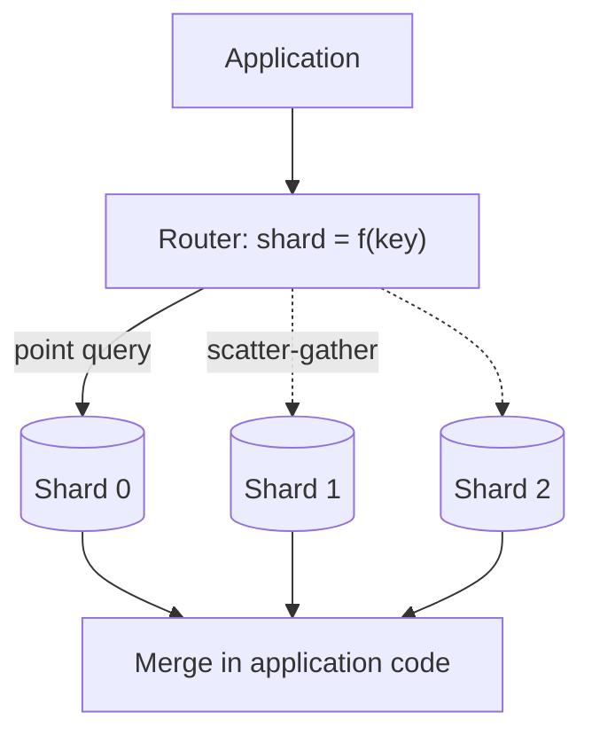

# Sharding {#ch-sharding}

> Split data across machines, pick a shard key you will not regret in a year, and know what it costs to change your mind.

**In this chapter:** the three strategies · consistent hashing · choosing a shard key · hot shards · cross-shard queries · re-sharding

## 💡 The Core Idea

Sharding splits one database into several, each holding a slice of the data. Together they hold all of
it; individually, none of them holds enough to be a bottleneck. It is the only lever that scales
writes, which is why it exists and why it is last on the list.

The cost is that it changes the shape of every query. A system with one database has one place to ask;
a sharded system has to know which shard before it can ask at all, and any question that spans shards
becomes a fan-out and a merge in application code. That trade — unlimited write capacity in exchange
for a permanently harder data layer — is the whole decision.

> ⚠️ Shard only after caching, read replicas and connection pooling have been used up. Those handle
> reads, which is what most systems actually run out of first. Sharding addresses write throughput and
> data volume, and it is not reversible cheaply.

## How It Works

A router sits between the application and the shards. It computes the target shard from the shard key
and forwards the query to exactly one machine — or, when it cannot, to all of them.



**One shard when the query carries the shard key; all of them when it does not.**

Three neighbouring terms get confused, and the distinction is worth stating cleanly:

| Technique | Solves | Data layout |
| --- | --- | --- |
| **Sharding** | Write capacity and storage limits | Split across servers |
| **Replication** | Read capacity and availability | A full copy on each server |
| **Partitioning** (table partitions) | Query and maintenance cost on one server | Split within one server |

### The three strategies

| | Range | Hash | Directory |
| --- | --- | --- | --- |
| **Shard chosen by** | Which interval the key falls in | A hash of the key | A lookup table |
| **Range queries** | Stay on one shard | Hit every shard | Depends on placement |
| **Distribution** | Uneven; new data clusters | Uniform | Whatever you decide |
| **Rebalancing** | Hard | Very hard without consistent hashing | Easy — change the mapping |
| **Costs** | Write hotspots on the newest range | No efficient range scans | An extra hop, and a directory to keep available |
| **Reach for it when** | Time-series data queried by date | Point lookups on a high-cardinality key | Placement must be controlled per entity |

**Hash-based routing, the default for user data:**

```typescript
import { createHash } from "node:crypto";

// The same user always lands on the same shard — that is the whole contract.
function shardIndex(key: string, shardCount: number): number {
  return parseInt(createHash("md5").update(key).digest("hex").slice(0, 8), 16) % shardCount;
}
```

That modulo is also the flaw. `hash % 4` and `hash % 5` disagree about nearly every key, so adding a
single shard moves almost all the data.

### Consistent hashing

Consistent hashing removes the modulo. Keys and shards are both placed on a ring, and a key belongs to
the first shard clockwise from it. Adding a shard takes keys from its neighbour and leaves everyone
else untouched: roughly `1/N` of the data moves rather than all of it.

Placing each physical shard at many points on the ring — **virtual nodes** — is what keeps the slices
even. With one point each, a few shards get large arcs by luck.

```typescript
interface RingPoint { shard: string; position: number }

// 150 virtual nodes per shard: with one point each, a few shards win large arcs by luck.
function buildRing(shards: string[], virtualNodes: number = 150): RingPoint[] {
  const points: RingPoint[] = shards.flatMap((shard: string) =>
    Array.from({ length: virtualNodes }, (_, i: number) => ({
      shard,
      position: ringPosition(`${shard}:${i}`),
    })),
  );
  return points.sort((a: RingPoint, b: RingPoint) => a.position - b.position);
}

// The first point clockwise from the key, wrapping past the end of the ring.
function locate(ring: RingPoint[], key: string): string {
  const position: number = ringPosition(key);
  return (ring.find((p: RingPoint) => p.position >= position) ?? ring[0]).shard;
}
```

Adding an eleventh shard to a ring of ten moves about a tenth of the keys. Plain modulo hashing would
move roughly ninety percent of them, which in practice means an outage or a migration measured in
weeks.

### Choosing a shard key

The shard key decides everything downstream, and it is the hardest decision to reverse.

| Property | Why it matters |
| --- | --- |
| **High cardinality** | Few distinct values means few possible shards, and load piles onto them |
| **Matches the common query** | If the usual query carries the key, it touches one shard instead of all |
| **Immutable** | A changed shard key means physically moving the row to another machine |
| **Uncorrelated with time** | Anything sequential sends every new write to the same shard |

| Entity | Key | Reasoning |
| --- | --- | --- |
| Users | `user_id`, hashed | High cardinality, and almost every query is per-user |
| Messages | `conversation_id` | Keeps a whole conversation on one shard, so reading it is one query |
| Orders | `user_id` or `tenant_id` | Collocates an account's data with the account |
| Events | `user_id` with a time range within the shard | Per-user scans stay local; global scans go to a warehouse |

Bad keys share one shape: too few values, or values that increase. A status column, a boolean, a
country code where most users are in one country, an auto-increment id, a timestamp — each of them
concentrates traffic somewhere.

### Hot shards

Even a well-distributed key can produce uneven traffic, because keys are distributed and requests are
not. An account with ten million followers generates far more work than a typical one, and all of it
lands on whichever shard holds them.

```typescript
// Spread one hot entity across buckets on write, and merge on read.
const bucketedKey = (entityId: string, buckets = 10): string =>
  `${Math.floor(Math.random() * buckets)}_${entityId}`;

async function readHotEntity(entityId: string, buckets = 10): Promise<Row[]> {
  const keys = Array.from({ length: buckets }, (_, i: number) => `${i}_${entityId}`);
  return (await Promise.all(keys.map((k: string) => db.get(k)))).flat();
}
```

Bucketing suits read-heavy hot keys. A write-heavy one is usually better given its own shard, and a
read-heavy one is often better cached than resharded — see
[Chapter ?? — Caching](#ch-caching).

### Cross-shard queries

A query without the shard key has to ask every shard and merge the answers. That is scatter-gather,
and it is as slow as the slowest shard plus the merge — with a tail latency that gets worse as you add
shards, not better.

Three ways to avoid it, in order of preference: choose a shard key that matches the dominant access
pattern; denormalise so the answer lives on one shard; and send genuinely global questions —
analytics, reporting, trending — to a separate store built for scans rather than to the transactional
shards.

### Re-sharding

Shards fill unevenly and eventually one has to be split. There is no cheap version of this, only a
careful one:

```text
1. Stand up the new shard, empty.
2. Double-write: every write goes to both old and new placement.
3. Backfill the historical rows, verifying as you go.
4. Shift reads across gradually, and keep the old copy readable.
5. Stop double-writing, then delete the old data — last, and only once reads are clean.
```

Consistent hashing is what makes step 3 survivable, because it bounds how much data has to move. The
decision to use it is made on day one and cannot be retrofitted without doing exactly this migration.

## When to Use It

| Situation | Shard? |
| --- | --- |
| Data no longer fits one machine | Yes — this is the case sharding exists for |
| Write throughput exceeds one primary | Yes, once batching and a bigger machine are exhausted |
| Reads are the bottleneck | No — replicas and caching, and they are far cheaper |
| Cross-entity reporting is the pain | No — a warehouse, not a reshaped transactional store |
| It fits on a large instance today | No — scale up and revisit in a year |

## Common Mistakes

❌ **Sharding early, "to be ready".** Every query, migration and incident gets harder from that day
onward. ✅ Exhaust vertical scaling, replicas and caching first, and shard against a measured limit.

❌ **A sequential shard key.** Auto-increment ids and timestamps send every new write to the newest
shard, so you have the complexity of many machines and the write capacity of one. ✅ Hash a
high-cardinality key.

❌ **Plain modulo hashing.** It works until the first time you add a shard, which is the moment you
most need it to. ✅ Consistent hashing with virtual nodes, from the start.

❌ **Designing the key before the queries.** A key that does not appear in the common query turns every
read into a scatter-gather. ✅ List the top queries first, then pick the key they all carry.

❌ **Assuming transactions still work.** A transaction across two shards needs two-phase commit or a
saga, and neither is free. ✅ Keep anything that must be atomic on one shard.

## 🔑 Key Takeaways

- Sharding is the only lever that scales writes, and the only one whose cost is permanent.
- The shard key decides everything and is the hardest thing to change — choose it from the query list.
- Plain modulo hashing moves almost all keys when the shard count changes; consistent hashing moves about `1/N`.
- Virtual nodes are what make consistent hashing distribute evenly rather than by luck.
- A query without the shard key is a scatter-gather, and its latency grows as you add shards.

## Interview Questions

**Q: When do you shard, and what would you do instead?**

When writes or data volume exceed what one machine can hold, and not before. Reads are handled by
caching and replicas, which are cheaper in every sense, so a read bottleneck is not a sharding
argument. Ahead of sharding I would scale the instance up, add replicas, pool connections and move
expensive views into a read model — that sequence usually buys years.

**Q: What makes a good shard key?**

High cardinality, so load spreads; present in the common query, so most reads hit one shard;
immutable, because changing it means physically moving the row; and uncorrelated with time, because
anything sequential concentrates writes on the newest shard. In practice you list the top few queries
first and pick the key they all carry, rather than picking a key and hoping.

**Q: Why is consistent hashing better than hashing modulo the shard count?**

Because `hash % N` changes for nearly every key when `N` changes, so adding one shard means moving
almost all the data. Consistent hashing puts keys and shards on a ring and gives each key to the next
shard clockwise, so a new shard takes over only its neighbour's arc — about `1/N` of the keys. Virtual
nodes, meaning many ring positions per physical shard, are what keep those arcs even.

**Q: A single customer generates 30% of your traffic. What happens and what do you do?**

All their data sits on one shard, so that shard saturates while the others idle — the hot shard
problem, and a well-chosen key does not prevent it, because keys are distributed evenly and requests
are not. For read-heavy traffic, cache aggressively or split the entity across buckets and merge on
read. For write-heavy traffic, give the account its own shard. Both are exceptions layered on top of
the routing rule, not replacements for it.

## What to Read Next

- [Chapter ?? — Replication](#ch-replication) — the read-side answer, and the one to try first
- [Chapter ?? — Scalability](#ch-scalability) — where sharding sits on the ladder of levers
- [Chapter ?? — Caching](#ch-caching) — what usually removes the pressure that looked like a sharding problem
