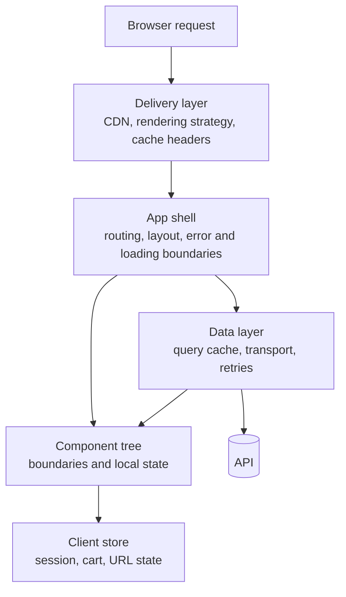

# Frontend System Design Strategy {#ch-frontend-system-design-strategy}

> Drive a frontend design round, which is scored on different things from the backend one.

**In this chapter:** what the frontend round actually scores · the sixty-minute budget · the questions that change the architecture · where state lives · the mistakes that end the round early

## 💡 The Core Idea

A backend design round is scored on capacity. You are asked how the system holds up at ten million users, and the answer is made of shards, queues and replicas.

A frontend round is scored on **boundaries**. The interviewer wants to know where you drew the line between components, where each piece of state lives, what the browser downloads before the page is useful, and what the user sees when the network fails. The load numbers still matter, but they matter because they decide a rendering strategy, not because they decide a shard key.

The most common way to fail is to run a backend round with React nouns in it — drawing a service diagram, labelling one box "frontend", and never opening it.

## How It Works

Sixty minutes, and the interviewer is scoring something different in each stretch of it.

| Minutes | Stage | What is being scored |
| ------- | ----- | -------------------- |
| 0–10 | Requirements | Whether you ask before you draw |
| 10–25 | High-level architecture | Rendering strategy, data flow, API shape |
| 25–35 | Component design | Boundaries, reuse, and where state sits |
| 35–45 | Performance | Whether you budget, or say "optimise later" |
| 45–55 | Deep dive | One hard thing, taken seriously |
| 55–60 | Trade-offs | Whether you can argue against your own answer |

The last row is the one candidates skip and interviewers weight most heavily. A design with no stated cost reads as a design you have not tested.

The architecture stage is where the round is usually lost, because "the frontend" gets drawn as one box. Open it into four, and the rest of the hour has somewhere to go.



**The four layers a frontend answer has to open, and what each one owns.** Naming them early gives the interviewer somewhere to aim the deep dive.

> ⚠️ **Do not spend the deep dive proving you know a library.** The interviewer picks the deep dive to find the edge of your thinking. Answering "how would you handle a dropped connection" with the name of a package ends the probe instead of passing it.

## When to Use It

Every frontend problem has one axis the interviewer will push on. Naming it yourself, early, buys the rest of the hour.

| Problem shape | The axis you will be pushed on | Because |
| ------------- | ------------------------------ | ------- |
| A feed or timeline | Virtualisation and scroll restoration | The list is unbounded and the DOM is not |
| A collaborative editor | Concurrent edits and offline merges | Two people will type in the same place |
| A live dashboard | Update rate against render budget | The data arrives faster than the screen can paint |
| A marketing or catalogue page | What is in the server-rendered HTML | Discoverability and LCP are the same problem |
| An internal admin tool | Permissions, forms and bulk actions | Correctness beats latency here, unusually |

## The Questions That Change the Architecture

Only four answers actually move the design. Ask those first and leave the rest.

**The requirements that have architectural consequences:**

```typescript
interface DesignConstraints {
  scale: number;                       // 10K and 10M DAU are different designs
  discoverable: boolean;               // if true, content must be in the initial HTML
  realtime: "none" | "poll" | "push";  // decides the transport and the state model
  offline: boolean;                    // decides whether writes need a queue
}
```

Everything else — the framework, the CSS approach, the component library — is a preference, and saying so out loud is itself a signal.

**Design a Twitter-style feed:**

❌ "I'll use React with a virtualised list and a global store…"

✅ "Before I draw anything — how many daily actives? Does the feed need to update live, or is a refresh acceptable? Does this page need to be indexed? What is the LCP target?"

The second version costs ninety seconds and changes the rendering strategy, the transport and the state model.

## Deciding Where State Lives

This is the highest-value ten minutes of the round, and the one most candidates rush. Every piece of state has a correct home, and the wrong home is where bugs come from.

| The state | Lives in | Why not somewhere else |
| --------- | -------- | ---------------------- |
| A form field's value | Component state | Lifting it re-renders the tree on every keystroke |
| Theme, locale, feature flags | Context | Read by many, written almost never |
| Session, cart, open modals | A client store | Outlives the screen that created it |
| Anything the server owns | A query cache | It is a *copy*, and copies need invalidation, not reducers |
| Filters, tabs, pagination | The URL | Otherwise the back button and a shared link both lie |

The fourth row is the one that separates senior answers. Server data in a global store is a cache someone has to invalidate by hand, forever. Naming it as a cache and putting it in a query layer removes a whole category of stale-data bugs.

The fifth row is the cheapest point you can score: putting view state in the URL is one decision that fixes deep linking, the back button, and refresh-survival at once.

## Common Mistakes

❌ **Drawing before asking.** You commit to an architecture built on assumptions, and the interviewer watches you defend it.
✅ Spend the first ten minutes on requirements. Candidates who do this are rarely the ones who run out of time.

❌ **Treating the frontend as an island.** No mention of where tokens live, how data arrives, or what happens on a 500.
✅ Say the full-stack part out loud: the API shape, the auth boundary, the retry behaviour.

❌ **Boxes without reasons.** A component diagram that could describe any application describes none.
✅ For each boundary, say what changes on one side and not the other. That is what a boundary is for.

❌ **One rendering strategy for the whole app.** The catalogue page and the dashboard have opposite needs.
✅ Choose per route — see [Chapter ?? — Choosing Per Route, Not Per App](#ch-choosing-per-route).

❌ **No error, empty or loading states.** Every data-fetching design implicitly has three more screens.
✅ Name them when you draw the fetch, not when asked.

❌ **Leaving accessibility until prompted.** In enterprise work WCAG 2.2 AA is a procurement requirement, not a nicety.
✅ Mention keyboard and focus handling when you design the interaction, once.

## 🔑 Key Takeaways

- The frontend round is scored on boundaries and state placement, not on capacity arithmetic.
- Four requirements change the architecture — scale, discoverability, real-time, offline — and the rest are preferences.
- Server data is a cache, not application state, and calling it that removes a whole class of stale-data bugs.
- View state belongs in the URL, because the back button and a shared link are both part of the design.
- A decision stated without its cost reads as a decision you have not tested; budget five minutes to argue against yourself.

## Interview Questions

**Q: You have sixty minutes and the prompt is "design Google Docs". What happens in the first ten?**

Questions, and only questions. How many people edit one document at once, does it need to work offline, is there a history requirement, and does any of this need to be indexed. Those four answers decide whether I am building a CRDT or a locking model, and whether writes need a local queue. Drawing before I know that means redesigning in front of the interviewer.

**Q: Where does state go, and how do you decide?**

By asking who writes it and how long it outlives the screen. A form field is local because lifting it costs a re-render per keystroke. A cart is a client store because it survives navigation. Anything the server owns goes in a query cache, because it is a copy and its real problem is invalidation. Filters and tabs go in the URL so that refresh and the back button keep working.

**Q: The interviewer says "we do not care about SEO here". What changes?**

The rendering strategy stops being forced. Without a discoverability requirement I can client-render behind an app shell, ship a smaller server surface, and spend the budget on interaction instead. What does *not* change is LCP — a slow first paint is still a slow first paint, and an internal tool with a four-second load is a real cost, just one nobody measures.

**Q: When would you argue against the design you have just drawn?**

Always, in the last five minutes, and specifically on the most expensive decision. If I have proposed a client store for session state, the cost is state that outlives the screen and goes stale invisibly. If I have proposed micro-frontends, the cost is coordination and duplicated dependencies. Naming the cost is how I show the decision was a choice rather than a habit.

## What to Read Next

- [Chapter ?? — Driving the Design Round](#ch-driving-the-round) — the shared mechanics of any design interview, backend or frontend
- [Chapter ?? — Back-of-Envelope Estimation](#ch-back-of-envelope-estimation) — turning a user count into a number you can design against
- [Chapter ?? — Design an Infinite Feed](#ch-design-infinite-feed) — the whole framework applied end to end
