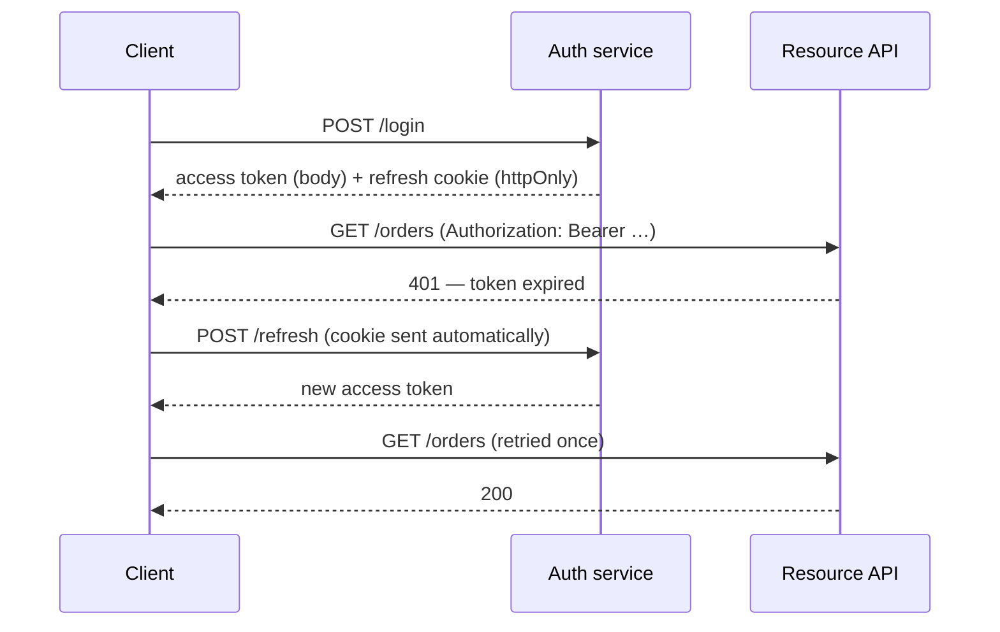

# Frontend Authentication {#ch-frontend-authentication}

> Decide where the credential lives, and be honest about what the client is allowed to enforce.

**In this chapter:** the three places a credential can sit · silent refresh and the thundering herd · guarding routes without lying · multi-tab logout · what the client may never enforce

## 💡 The Core Idea

Two sentences carry most of a frontend auth design.

**The browser has no safe place to put a credential** — only places that fail differently. Memory dies on refresh. `localStorage` is readable by any script that gets injected. An `httpOnly` cookie is invisible to your own code but travels on requests you did not initiate. Choosing between those failure modes is the design, and everything else follows from it.

**Nothing the client does is enforcement.** A route guard, a hidden button and a permission check are all user interface. They make the product coherent; they stop nobody. Every one of them is re-checked on the server or it does not exist. A candidate who says this unprompted has largely passed the auth portion of the round.

The protocol side — session design, token issuance, OAuth flows — is covered in [Chapter ?? — Credentials, Sessions, CORS and CSRF](#ch-credentials-and-sessions) and [Chapter ?? — OAuth, OIDC and Authorisation](#ch-oauth). This chapter is the browser's half.

## How It Works

| Where the credential sits | Survives | Exposed to | Use when |
| ------------------------- | -------- | ---------- | -------- |
| JavaScript memory | Nothing — gone on refresh | Only running code | Short-lived access tokens |
| `localStorage` | Refresh, restart, other tabs | Any injected script | Almost never |
| `httpOnly`, `Secure`, `SameSite` cookie | Refresh, restart, other tabs | Sent automatically on matching requests | The long-lived credential |

The pattern this table points at is a **short-lived access token in memory, with a long-lived refresh token in an `httpOnly` cookie**. Cross-site scripting cannot read either one, and cross-site request forgery cannot use the access token, because it lives in an `Authorization` header a forged form cannot set.



**Silent refresh.** The user never sees the 401, and the long-lived credential never passes through JavaScript.

> ⚠️ **`SameSite` is not a CSRF strategy on its own.** `SameSite=Lax` still permits top-level `GET` navigations, so any state change reachable by a `GET` is still forgeable. Keep mutations on non-idempotent methods and pair the cookie with a token check — see [Chapter ?? — Credentials, Sessions, CORS and CSRF](#ch-credentials-and-sessions).

## When to Use It

The token-in-memory pattern is the default, not the only answer.

| The application | Credential design | Why |
| --------------- | ----------------- | --- |
| A single-page app against your own API | Access token in memory, refresh in a cookie | XSS cannot read it and CSRF cannot use it |
| A server-rendered app, same origin | Plain session cookie, no token in the client | Simpler, instantly revocable, and there is no client to steal from |
| A mobile or native client | Platform secure storage, not the web pattern | The browser's constraints do not apply |
| A public API consumed by third parties | OAuth with per-client tokens | You are not the only client, so session semantics do not fit |

The second row is the one candidates under-use. If the application already renders on the server, introducing tokens buys nothing and costs revocability — a session can be deleted, a token cannot be un-issued.

## Silent Refresh Without a Stampede

The interesting problem is concurrency. A dashboard fires eight requests, the token expires, and eight 401s arrive at once. A naive interceptor starts eight refreshes; seven of them race, and with refresh-token rotation six get rejected and log the user out.

**Single-flight refresh — every caller awaits the same promise:**

```typescript
let token: string | null = null;
let inFlight: Promise<string> | null = null;

function refresh(): Promise<string> {
  // ✅ One refresh in flight; concurrent callers join it instead of starting another.
  inFlight ??= fetch("/auth/refresh", { method: "POST", credentials: "include" })
    .then((res) => {
      if (!res.ok) throw new Error("refresh failed");
      return res.json() as Promise<{ accessToken: string }>;
    })
    .then(({ accessToken }) => accessToken)
    .finally(() => { inFlight = null; });

  return inFlight;
}

async function authedFetch(input: RequestInfo, init: RequestInit = {}): Promise<Response> {
  const res = await fetch(input, withToken(init, token));
  if (res.status !== 401) return res;

  token = await refresh();
  return fetch(input, withToken(init, token)); // retried exactly once
}
```

Three details matter. The promise is shared, so concurrent 401s collapse into one refresh. The retry happens **once** — retrying a second 401 is an infinite loop against an expired session. And `inFlight` is cleared in `finally`, so a failed refresh does not poison every later request with a rejected promise.

Refreshing slightly *before* expiry on a timer is a useful addition, but it is not a replacement: a laptop that slept through the expiry wakes with a dead token and needs the 401 path anyway.

## Guarding Routes Without Lying

Authentication has three states, and designs that model two produce the two worst bugs in the category.

| State | The UI shows | The bug when this state is missing |
| ----- | ------------ | ---------------------------------- |
| Unknown | A skeleton, no redirect | Every refresh bounces the user to the login page |
| Authenticated | The route | — |
| Anonymous | A redirect, preserving the destination | The user logs in and lands on the home page |

On first load the client does not yet know who the user is — the refresh cookie has not been exchanged. Treating that as "anonymous" logs the user out on every hard refresh. Treating it as "authenticated" flashes protected content before the redirect.

Preserve the intended destination through the login round trip, and validate it before redirecting back: an unvalidated `returnTo` parameter is an open redirect, and it is a finding in every penetration test that looks for it.

## Multi-Tab and Logout

The access token lives in memory, so every tab holds its own copy. Logging out in one leaves the others rendering a signed-in interface against a session that no longer exists.

**Telling the other tabs:**

```typescript
const channel = new BroadcastChannel("auth");

export function logout(): void {
  token = null;
  channel.postMessage({ type: "logout" }); // ✅ other tabs drop their copy immediately
  void fetch("/auth/logout", { method: "POST", credentials: "include" });
}

channel.onmessage = (event: MessageEvent<{ type: string }>) => {
  if (event.data.type === "logout") token = null;
};
```

This is a user-experience fix, not a security control. The session is already dead server-side the moment the cookie is cleared, so a tab that missed the broadcast fails on its next request anyway — the message only stops it showing stale data in the meantime. The same channel is worth using for the opposite case: a tab that refreshes successfully can share the new token so the others do not each trigger their own 401.

## Common Mistakes

❌ **Tokens in `localStorage`.** One injected script reads every credential on the origin.
✅ Access token in memory, refresh token in an `httpOnly` cookie.

❌ **Concurrent refreshes.** Eight 401s start eight refreshes and rotation logs the user out.
✅ Single-flight the refresh and have every caller await the same promise.

❌ **Hiding a control instead of blocking the action.** The button is gone; the endpoint is not.
✅ Re-check every permission on the server. The client's copy is presentation.

❌ **No "unknown" auth state.** Either a bounce to login on every refresh, or a flash of protected content.
✅ Model three states and render a skeleton until the session resolves.

❌ **Redirecting to an unvalidated `returnTo`.** An open redirect, used for convincing phishing.
✅ Allow only same-origin relative paths from a known set.

❌ **Assuming logout in one tab logs out the others.** Five tabs keep working with a revoked session.
✅ Broadcast the change across tabs, and let the next 401 finish the job.

## 🔑 Key Takeaways

- The browser has no safe credential store, only stores that fail differently; pick the failure you can live with.
- A short-lived access token in memory plus an `httpOnly` refresh cookie defeats both XSS reading and CSRF using.
- Refresh must be single-flight and retried exactly once, or token rotation turns a burst of 401s into a logout.
- Authentication has three states, and omitting "unknown" causes either a login bounce or a flash of protected content.
- Route guards and hidden buttons are user interface; the server enforces, always, without exception.

## Interview Questions

**Q: Where do you store the token, and why not `localStorage`?**

The access token goes in a module-scoped variable and the refresh token in an `httpOnly`, `Secure`, `SameSite` cookie. `localStorage` is readable by any script that executes on the origin, so a single injected script — from a dependency, a tag manager, anything — exfiltrates every session. The cookie is invisible to JavaScript, and because the access token travels in an `Authorization` header rather than automatically, a forged cross-site request cannot use it either.

**Q: Eight requests get a 401 at the same moment. What happens?**

One refresh. The interceptor holds a single in-flight promise, and callers that arrive during it await the same one rather than starting their own. Without that, eight refreshes race, and with refresh-token rotation the first one invalidates the token the other seven are using, so the user is logged out by their own dashboard. Each request retries exactly once after the refresh resolves; a second 401 is a real failure and goes to login.

**Q: The client hides the delete button for non-admins. Is that authorisation?**

No, it is layout. It stops an admin-only action from appearing in the interface, which is worth doing for coherence, but the endpoint is reachable with a terminal and the role claim in a token is client-visible data. Authorisation is the server's check on every request. I would treat the client's permission map as a copy of the policy for rendering, and never as the policy.

**Q: When would you not use tokens at all?**

When the application is server-rendered on one origin. A plain session cookie is simpler, has nothing for the client to leak, and — the part that usually decides it — is revocable immediately, because deleting the session row ends it. A token cannot be un-issued; you either wait out its lifetime or build the denylist that you adopted stateless tokens to avoid. I would only reach for tokens when several clients or origins are involved.

## What to Read Next

- [Chapter ?? — Credentials, Sessions, CORS and CSRF](#ch-credentials-and-sessions) — the server's half: issuance, rotation and revocation
- [Chapter ?? — OAuth, OIDC and Authorisation](#ch-oauth) — where permissions are actually enforced, and how the model is designed
- [Chapter ?? — XSS Prevention and Untrusted Input](#ch-xss-prevention) — the attack the whole storage argument above is defending against
