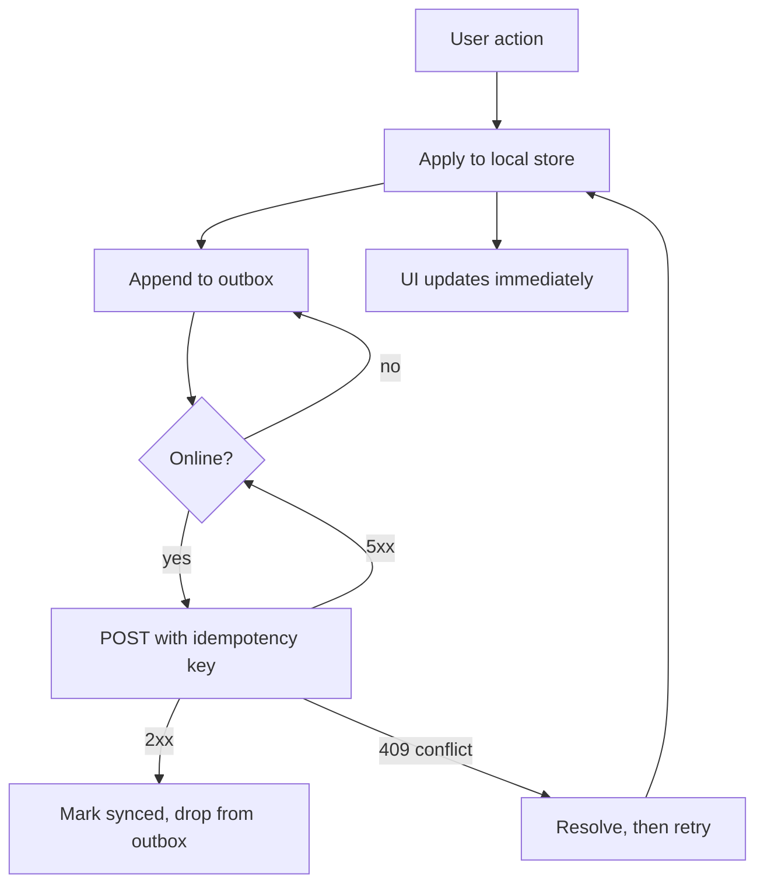

# Offline-First Architecture {#ch-offline-first-architecture}

> Design for the train tunnel, and reconcile the writes that piled up while you were in it.

**In this chapter:** what offline-first actually changes · the outbox pattern · idempotent sync · choosing a conflict strategy · what the UI owes the user

## 💡 The Core Idea

Caching is not offline-first. A cached application can still show a page after the network drops — but the moment the user *writes* something, the design either has an answer or it loses the data.

Offline-first means the local store is what the interface reads from, and the network is a background channel that reconciles it. Every write lands locally first, joins a durable queue, and is replayed when the connection returns. The reads are the easy half and the interviewer knows it; **the round is really about the queue and the merge.**

The mechanics of service workers and IndexedDB belong to the browser platform and are covered in [Chapter ?? — Service Workers](#ch-service-workers) and [Chapter ?? — IndexedDB](#ch-indexeddb). This chapter is about the architecture you build on top of them.

## How It Works

Three layers, and they fail independently. Most designs only think about the first.

| Layer | Holds | Fails as |
| ----- | ----- | -------- |
| Shell | HTML, JS, CSS, fonts | A blank page |
| Read data | Server state the user is looking at | A stale or empty screen |
| Write queue | Mutations not yet accepted | Silent data loss |

The write queue is the **outbox**: a durable, ordered list of intents that survives a reload, a crash and a tab close.



**A write in an offline-first application.** The interface never waits for the network, and nothing leaves the outbox until the server has acknowledged it.

Two properties make this safe. Each queued write carries a **client-generated idempotency key**, so a retry after an ambiguous failure cannot create a duplicate. And entries leave the outbox only on an acknowledgement, never on send.

## When to Use It

Offline-first is not free — it adds a local schema, a migration path and a merge policy. Charge for it only where it pays.

| The application | Design | Why |
| --------------- | ------ | --- |
| Field data capture, inspections, delivery | Full offline-first | The user is routinely out of coverage and writes are the product |
| Notes, task lists, personal documents | Full offline-first | Losing a write the user watched land is unforgivable |
| A read-heavy dashboard or catalogue | Cached shell and stale-while-revalidate | Reads degrade gracefully; there are no writes to lose |
| Payments, bookings, anything with stock | Online-only, with an honest offline message | An optimistic write you cannot honour is worse than a blocked one |

The last row is the judgement call worth stating out loud. Queueing a seat reservation offline means promising a seat you do not have.

## The Outbox

The queue is the part that has to be correct. Keep it small and boring.

**A durable write queue, stored in IndexedDB:**

```typescript
type Op = "create" | "update" | "delete";

interface PendingWrite {
  id: string;          // client-generated, also the idempotency key
  entity: string;      // "todo", "inspection"
  op: Op;
  payload: unknown;
  baseVersion: number; // the server version this edit was made against
  queuedAt: number;
}

async function flush(queue: PendingWrite[]): Promise<void> {
  for (const write of queue) {
    const res = await fetch(`/api/${write.entity}`, {
      method: "POST",
      headers: { "Idempotency-Key": write.id, "Content-Type": "application/json" },
      body: JSON.stringify(write),
    });

    if (res.ok) await markSynced(write.id);        // only now does it leave the queue
    else if (res.status === 409) await resolve(write, await res.json());
    else break;                                    // ✅ stop, keep order, retry later
  }
}
```

Three decisions are encoded there. Writes flush **in order**, because a delete that overtakes its create fails. A non-conflict error **stops the whole flush** rather than skipping ahead, for the same reason. And `baseVersion` travels with the write, which is what lets the server detect a conflict at all.

> ⚠️ **Background Sync is not available everywhere.** The `sync` event gives you a retry after the tab has closed, but support is partial across browsers. Treat it as an optimisation and keep a flush on application start and on the `online` event, or writes from a closed tab never leave the device.

## Choosing a Conflict Strategy

A conflict is two edits against the same `baseVersion`. Every offline design needs an answer, and "last write wins" is a real answer as long as you say what it costs.

| Strategy | Resolution | Cost | Fits |
| -------- | ---------- | ---- | ---- |
| Last write wins | Highest timestamp survives | Silently discards the other edit | Single-user data, low stakes |
| Server wins | Local edit is dropped | The user loses work they saw accepted | Read-mostly reference data |
| Field-level merge | Per-field, newest value each | Can produce a record nobody wrote | Forms with independent fields |
| Prompt the user | Show both, let them pick | Interrupts, and needs a real interface | Rare, high-value conflicts |
| CRDT | Merges by construction | A new data model and library | Collaborative text and lists |

Clock skew makes "highest timestamp" less reliable than it sounds — a device with a wrong clock wins or loses every conflict. A server-assigned version number is a better tiebreaker than a client timestamp.

For collaborative editing the answer is almost always a CRDT; that argument is made in [Chapter ?? — Design a Collaborative Document Editor](#ch-design-collaborative-editor).

## What the UI Owes the User

An offline application that lies is worse than one that refuses to load.

- **Show the write's state**, not just the application's. Pending, synced and failed are three different things, and only the user can decide what to do about the third.
- **Never fake success on a write you cannot honour.** Optimistic is fine when the rollback is cheap; it is not fine for anything involving money or stock.
- **Surface storage pressure.** Browsers evict origin data under pressure, and an eviction that takes the outbox with it is silent data loss. Request persistent storage and tell the user when it is refused.
- **Make failure recoverable.** A write that has failed five times needs a visible retry or an export, not an infinite spinner.

## Common Mistakes

❌ **Treating a cache as an offline strategy.** Reads work, the first write disappears.
✅ Design the outbox first; the read cache is the easy part.

❌ **Retrying without an idempotency key.** An ambiguous timeout becomes two records.
✅ Generate the key on the client, before the first attempt, and reuse it on every retry.

❌ **Flushing the queue in parallel.** A delete arrives before the create it depends on.
✅ Flush in order and stop on the first non-conflict failure.

❌ **No cache versioning.** Users run last month's application indefinitely after a deploy.
✅ Version the caches, and prompt for a reload when a new worker is waiting.

❌ **Ignoring eviction.** The browser reclaims the origin's storage and the outbox goes with it.
✅ Ask for persistent storage, and treat a refusal as a reason to sync more aggressively.

## 🔑 Key Takeaways

- Offline-first is a writes problem; the read cache is the half that looks like the work but is not.
- Every queued write needs a client-generated idempotency key, created before the first attempt.
- Writes flush in order and leave the outbox only on acknowledgement, never on send.
- Pick a conflict strategy explicitly and name its cost — last-write-wins is acceptable, silent data loss is not.
- Browser storage can be evicted, so an outbox is durable only until the origin is under pressure.

## Interview Questions

**Q: A user creates three records offline, then comes back online. Walk me through what happens.**

Each record was written to the local store and appended to an outbox with a client-generated id that doubles as the idempotency key. On reconnect I flush the queue in order, one request at a time, sending the base version with each. A 2xx removes the entry; a 409 goes to the conflict policy; a 5xx or a network error stops the flush so ordering is preserved, and the whole thing retries with backoff.

**Q: Why does the idempotency key have to be generated on the client?**

Because the failure I am protecting against is ambiguous. If the request times out I do not know whether the server applied it, and retrying without a key creates a duplicate. A server-issued key is no use — obtaining it is itself a network call that can fail the same way. Generating it locally before the first attempt makes every retry provably the same write.

**Q: When would you refuse to build offline-first?**

When the write cannot be honoured later. Booking a seat, taking a payment, drawing down stock — queuing those means telling the user something is done when I have no authority to promise it, and the failure surfaces hours later when it is far more expensive. For those I would keep the shell cached so the application still loads, and block the action with an honest message.

**Q: Last-write-wins is simple. What is wrong with it?**

Nothing, if the data is single-user and you say what it costs: one of the two edits is discarded and nobody is told. The failure people underestimate is clock skew — if the tiebreaker is a client timestamp, a device with a wrong clock wins or loses every conflict it is in. I would use a server-assigned version rather than a timestamp, and for anything collaborative I would move to a CRDT instead.

## What to Read Next

- [Chapter ?? — Service Workers](#ch-service-workers) — the mechanism underneath: install, activate, fetch and the update lifecycle
- [Chapter ?? — Caching Strategies and Offline UX](#ch-caching-and-offline) — cache-first, network-first and stale-while-revalidate in detail
- [Chapter ?? — Design a Collaborative Document Editor](#ch-design-collaborative-editor) — where conflict resolution stops being a policy and becomes a data structure
