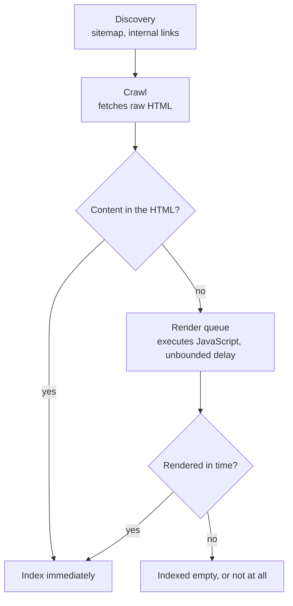

# SEO and Analytics {#ch-seo-and-analytics}

> Design for the two non-human visitors — the crawler and the measurement pipeline — before launch, not after.

**In this chapter:** the crawl-to-index pipeline · URL and canonical architecture at scale · designing the measurement layer · consent as an architectural constraint

## 💡 The Core Idea

Two visitors never appear in a wireframe, and both need decisions made at architecture time.

The **crawler** is a client with no patience and a budget. It fetches your HTML, and if the content is not in it, rendering happens later in a separate queue — or not at all. The **measurement pipeline** is everything downstream of the page that answers whether the product works. Both are cheap to design in and expensive to retrofit, because both are consequences of your URL structure and your rendering strategy, and those are the two things hardest to change after launch.

The tag-by-tag mechanics of meta tags and rendering choice live in [Chapter ?? — SEO and Rendering](#ch-seo-and-rendering). This chapter is the system-design view: what breaks at scale, and what the law constrains.

## How It Works

Indexing is a pipeline with a queue in the middle, and the queue is the whole argument.



**Why server-rendered content is an indexing decision, not a performance one.** The render queue has no guaranteed latency, so client-rendered content is indexed on someone else's schedule.

Two budgets govern how much of your site is seen at all. **Crawl budget** is how many URLs a crawler will fetch per visit, and it is spent on every URL you expose — including the ones you did not mean to. **Index budget** is how many of those it keeps. A catalogue that exposes every filter combination as a distinct URL can spend its entire crawl budget on near-duplicates and leave the actual products unvisited.

## When to Use It

Rendering strategy is a per-route decision, and discoverability is only one of the inputs.

| Page type | Serve as | Honest cost |
| --------- | -------- | ----------- |
| Marketing, articles, landing pages | Static, rebuilt on publish | A publish is a deploy, unless you add incremental revalidation |
| Product and category pages | Static with revalidation | Price and stock can be stale for the revalidation window |
| Search results, filtered lists | Server-rendered, and mostly `noindex` | Costs a server render per request, and earns nothing from indexing |
| Authenticated dashboards | Client-rendered behind the shell | No indexing at all, which is the point |

> ⚠️ **A page that needs fresh stock and good indexing is a genuine conflict.** Serving stale HTML to the crawler and correcting it on the client is the usual answer, and it means accepting that the indexed price may be wrong for the length of the revalidation window. Say which you chose and why.

## URL and Canonical Architecture

This is what actually breaks at scale, and it is a data-modelling problem rather than a markup one.

Every facet, sort order and tracking parameter multiplies your URL space. A catalogue with five filters and three sort orders can generate tens of thousands of URLs describing a few hundred products.

**The rules that keep the URL space finite:**

| Situation | Decision |
| --------- | -------- |
| Filter or sort parameters | One canonical URL per product set; parameters point back to it |
| Tracking parameters (`?ref=`, `utm_*`) | Self-referencing canonical, so the clean URL is what is indexed |
| Paginated lists | Each page self-canonical, linked with `rel="prev"`/`rel="next"` |
| The same product in several categories | One canonical path; the others link to it |
| Localised variants | `hreflang` between them, each self-canonical |

Two failure modes follow from getting this wrong. **Duplicate content** splits ranking signals across URLs that should have been one. **Crawl waste** means the crawler spends its budget on parameter permutations and never reaches the new products. Both are invisible in a staging environment and obvious three months after launch.

## Designing the Measurement Layer

Analytics is a data pipeline with a schema, and treating it as a script tag is how it becomes unusable.

- **Fix the event taxonomy before writing any tracking code.** A small set of named events with a stable property shape is worth more than a hundred ad-hoc ones. If two teams can name the same action differently, the funnel is already broken.
- **Collect through your own endpoint.** A first-party route that forwards to the vendor survives ad blockers, keeps the vendor's code out of the critical path, and gives you one place to strip personal data before it leaves.
- **Separate product analytics from real user monitoring.** They answer different questions, have different sampling needs, and RUM is worthless if it is blocked by a consent banner the vendor tag sits behind.
- **Sample deliberately.** Full-fidelity conversion events, sampled performance events. Sampling the wrong one gives you confident numbers about nothing.
- **Never put identifiers in the event payload.** An email address in an analytics property is a breach waiting for a subject access request.

A taxonomy is worth writing down as types, because that is what stops a second team inventing `add_cart` next to `add_to_basket`.

**The event schema, defined once and imported everywhere:**

```typescript
type EventName = "view_item" | "add_to_basket" | "begin_checkout" | "purchase";

interface EventPayload {
  name: EventName;
  itemId: string;
  value?: number;       // minor units, to avoid float drift
  currency?: string;    // ISO 4217, required whenever value is present
}

// ✅ A union of literals makes an unnamed event a compile error, not a dashboard gap.
export function track(event: EventPayload): void {
  void fetch("/collect", { method: "POST", body: JSON.stringify(event), keepalive: true });
}
```

`keepalive` is what lets the last event of a session survive the page being closed — without it, the purchase that happens just before a redirect is the one you never record.

> ⚠️ **Moving target:** consent frameworks and the vendor APIs that implement them change every year, and a specific consent-mode call signature will be wrong by the time this is read. The durable principle is that measurement must be off until consent is recorded, and the recording must be auditable.

## Consent as an Architectural Constraint

Under the GDPR and the ePrivacy rules, analytics storage on EU traffic needs consent before it is written — and that changes the architecture, not just the banner.

Three consequences are worth naming in a design round. Anything loaded before consent must be **genuinely non-identifying**, which rules out most vendor tags. The consent decision has to be **durable and auditable**, because the regulator's question is what the user agreed to and when. And a meaningful share of traffic will decline, so **the design must produce usable numbers from consented traffic alone** rather than treating refusal as a gap to fill.

Server-side measurement of what you already have — response codes, latency, conversion events recorded as part of the transaction — is not analytics storage on the user's device, and it keeps working when the banner is declined.

## Common Mistakes

❌ **Client-rendering a page that has to rank.** It enters the render queue and is indexed late, or empty.
✅ Put the content that matters in the initial HTML for any route with a discoverability requirement.

❌ **Letting filters generate indexable URLs.** Crawl budget goes on permutations; real pages go unvisited.
✅ Canonicalise the parameter space and `noindex` the combinatorial routes.

❌ **Loading vendor tags before consent.** A compliance finding, and an avoidable one.
✅ Gate the tag on a recorded decision, and measure server-side in the meantime.

❌ **Tracking every click.** Nobody can find the funnel in ten thousand event names.
✅ Define the taxonomy first; track intent and conversion, not interaction.

❌ **Treating analytics as someone else's script.** Third-party tags block the main thread and inflate INP.
✅ Load through your own endpoint, off the critical path, and budget for it like any other asset.

## 🔑 Key Takeaways

- Content that is not in the initial HTML is indexed on the render queue's schedule, which has no guarantee.
- Crawl budget is spent on every URL you expose, so an uncontrolled parameter space starves your real pages.
- Canonicalisation is a URL-architecture decision made at design time, not a meta tag added later.
- An event taxonomy agreed before implementation is the difference between analytics and a pile of names.
- Consent is an architectural constraint: measurement must be off until it is recorded, and the design must work without it.

## Interview Questions

**Q: The marketing team says the catalogue is not ranking. Where do you look first?**

At the URL space before the markup. My first guess is that filters and sort parameters are generating indexable URLs, so crawl budget is being spent on near-duplicates while new products go unvisited, and ranking signals are split across URLs that should have been one. The fix is canonicalisation plus `noindex` on the combinatorial routes. Only after that would I check whether the content is server-rendered at all.

**Q: Why is client-side rendering a problem for SEO if crawlers execute JavaScript?**

Because they execute it later, in a separate queue with no guaranteed latency. A crawler fetches the HTML, finds nothing, and defers rendering — so the page is indexed days after it was published, or with whatever was in the shell. For a site that publishes continuously, that delay is the whole problem. The fix is server-rendered content, not more meta tags.

**Q: Design the analytics for a checkout flow.**

A fixed taxonomy first — view, add to basket, begin checkout, purchase — with a stable property shape agreed with whoever will read the funnel. Events go to a first-party endpoint that forwards to the vendor, so ad blockers and the critical path are both handled and personal data is stripped in one place. Conversion events are recorded server-side as part of the transaction, because those must be right even when the client never reports.

**Q: A third of your users decline consent. How do you still measure anything?**

By moving what I can to the server. Response codes, latency, and the conversion itself are recorded as part of the transaction, not as storage on the user's device, so they are unaffected. What I lose is the client-side journey for that third, and the honest answer is that I model it from the consented population rather than pretending the numbers are complete. Designing as though refusal is an edge case is how reporting ends up wrong by a third.

## What to Read Next

- [Chapter ?? — SEO and Rendering](#ch-seo-and-rendering) — the markup and rendering mechanics this chapter builds on
- [Chapter ?? — Choosing Per Route, Not Per App](#ch-choosing-per-route) — how to make the per-route call the decision table above implies
- [Chapter ?? — Measuring in Production](#ch-measuring-in-production) — real user monitoring, and why it is a separate pipeline
