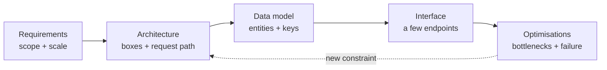

# Driving the Design Round, Backend and Frontend {#ch-driving-the-round}

> Run a design round as a conversation you lead, not a quiz you answer — backend or frontend.

**In this chapter:** what the round measures · the RADIO framework · turning a vague prompt into requirements · how the frontend round is scored differently · the failure modes

## 💡 The Core Idea

A design round has no correct answer. The interviewer already knows how to build a URL shortener. They
are watching how you take a one-line prompt, give it edges, propose something that works, and argue
honestly about its cost.

A candidate who says "I would shard by user ID" and stops has given an answer. A candidate who adds
"that makes per-user reads one hop and global search a scatter-gather — and search is out of scope, so I
take that trade" has shown judgement.

> The round measures how you **narrow** an open problem. Every senior signal — scoping, estimation,
> trade-off language, knowing when to stop — is a form of narrowing.

## How It Works

**RADIO** is the running order. It is not the only framework. But it guards against the two most common
failures: designing before you know the requirements, and running out of time before the interesting part.

| Step | Stands for    | You produce                                                  | Minutes |
| ---- | ------------- | ------------------------------------------------------------ | ------- |
| R    | Requirements  | Functional list, non-functional targets, explicit scope cuts | 8–10    |
| A    | Architecture  | A box diagram and the request path through it                | 10–12   |
| D    | Data model    | Entities, keys, and the store behind each                    | 6–8     |
| I    | Interface     | Three or four endpoints or events, not a full API            | 4–6     |
| O    | Optimisations | Bottlenecks, caching, scaling, failure handling              | 10–15   |

**The flow through a round:**



**RADIO is a running order, not a one-way street — a bottleneck found in O often sends you back to A.**

### R — Requirements

**Functional** — what a user can do. Keep it to three or four verbs: "post a message, read a feed,
follow a user." Name anything beyond that and cut it out loud: "search and direct messages are out of
scope unless you want them."

**Non-functional** — the qualities that change the architecture. Four matter often enough to ask about
every time:

| Quality      | The question to ask                           | Why it changes the design            |
| ------------ | --------------------------------------------- | ------------------------------------ |
| Scale        | Daily active users, requests per second       | Decides single box versus fleet      |
| Latency      | What is the p99 target for the hot path?      | Decides caching and data locality    |
| Consistency  | Can a user see stale data for five seconds?   | Decides replication and store choice |
| Availability | What happens if this is down for ten minutes? | Decides redundancy and failover      |

**Scale** is the number. Get one traffic figure early and derive the rest — see
[Chapter ?? — Back-of-Envelope Estimation](#ch-back-of-envelope-estimation).

> ⚠️ Never invent a requirement silently. Say "I am going to assume 10 million daily active users and a
> 100:1 read-to-write ratio — stop me if that is wrong." An assumption you announce is a design decision.
> An assumption you hide is a mistake waiting to be found.

### A — Architecture

Draw boxes in the order a request travels: client → edge → application → data. Add a box only when a
requirement demands it. Every box you cannot justify is a box the interviewer will ask you to justify.

Then trace one write and one read through the diagram out loud. These are the most valuable two minutes
in the round. They find missing components faster than any amount of staring at the drawing.

### D — Data model

For each entity, give the fields that matter, the primary key, the access pattern and the store. Four
columns, not a full schema.

**A feed service, in the form the round actually wants:**

```typescript
interface Post {
  postId: string;        // Snowflake ID — sortable by time, no central counter
  authorId: string;      // partition key: all of an author's posts land together
  body: string;
  createdAt: number;
}

// Access pattern drives the key. "Show me one author's posts, newest first"
// is a single partition scan if postId sorts by time within authorId.
type PostKey = { authorId: string; postId: string };
```

The key is the design. Say why you chose it and which query it makes expensive.

### I — Interface

Three or four operations. Name them, give the parameters that matter, and say whether each is
synchronous. You are showing that the boxes have a contract, not writing OpenAPI.

### O — Optimisations

This is where the senior signal lives. Work in the same order every time:

1. **Name the bottleneck.** Which component saturates first at the scale you estimated?
2. **Fix it with the cheapest thing that works.** Usually a cache or an async queue, not a rewrite.
3. **Say what the fix costs.** A cache buys latency and pays in staleness. A queue buys throughput and
   pays in eventual consistency and a new failure mode.
4. **Handle one failure.** Pick the component whose loss hurts most and say what happens when it dies.

## When to Use It

| Situation                                     | Do this                                  | Why                                      |
| --------------------------------------------- | ---------------------------------------- | ---------------------------------------- |
| Prompt is one line ("design Twitter")         | Spend the full 10 minutes on R           | The scope is the actual problem          |
| Prompt is already scoped and detailed         | Compress R to 4 minutes, spend it on O   | The interviewer wants depth, not scoping |
| Interviewer keeps adding new asks             | Add each to a visible "out of scope" list | Protects the time budget out loud       |
| You are 30 minutes in and still on data model | Skip I, go straight to O                 | O carries the most signal                |
| The prompt is a client application            | Keep RADIO, but open the frontend box    | The frontend round scores boundaries     |

## The Frontend Round

A backend round is scored on **capacity** — shards, queues and replicas at ten million users. A frontend
round is scored on **boundaries**. Where did you split the components? Where does each piece of state
live? What does the browser download before the page is useful? What does the user see when the network
fails?

Load numbers still matter, but they decide a rendering strategy, not a shard key. The common failure is a
backend round with React nouns: one box labelled "frontend" that is never opened.

RADIO still holds. The steps change what they produce:

| Step | In a frontend round, you produce                                 |
| ---- | ---------------------------------------------------------------- |
| R    | The four constraints below, plus an LCP or interaction target    |
| A    | The four layers of the client, and a rendering strategy per route |
| D    | Where each piece of state lives — the most valuable ten minutes  |
| I    | The API shape the client needs, the auth boundary, retries       |
| O    | Performance budgets, loading, error and empty states, accessibility |

**The requirements that have architectural consequences:**

```typescript
interface DesignConstraints {
  scale: number;                       // 10K and 10M DAU are different designs
  discoverable: boolean;               // if true, content must be in the initial HTML
  realtime: "none" | "poll" | "push";  // decides the transport and the state model
  offline: boolean;                    // decides whether writes need a queue
}
```

The framework, the CSS approach and the component library are preferences. Saying so is itself a signal.

In the A step, open the frontend box into four layers: **delivery** (CDN, rendering strategy, cache
headers), **app shell** (routing, error and loading boundaries), **data layer** (query cache, transport,
retries) and **component tree** (boundaries and local state). Naming them early gives the deep dive a target.

### Deciding Where State Lives

Every piece of state has a correct home. The wrong home is where the bugs come from.

| The state                     | Lives in        | Why not somewhere else                                    |
| ----------------------------- | --------------- | --------------------------------------------------------- |
| A form field's value          | Component state | Lifting it re-renders the tree on every keystroke         |
| Theme, locale, feature flags  | Context         | Read by many, written almost never                        |
| Session, cart, open modals    | A client store  | Outlives the screen that created it                       |
| Anything the server owns      | A query cache   | It is a *copy*, and copies need invalidation, not reducers |
| Filters, tabs, pagination     | The URL         | Otherwise the back button and a shared link both lie      |

The fourth row separates senior answers. Server data in a global store is a cache someone must invalidate
by hand, forever. The fifth row is the cheapest point you can score: one decision fixes deep links, the
back button and refresh.

## Common Mistakes

❌ **Starting with the solution.** "So we would use Kafka and Cassandra and put Redis in front." This
answers a question nobody has asked, and locks you into choices made before you knew the scale.
✅ Start with the shape of the load: "Is this read-heavy? At 100:1 and 10k rps, I lean on caching and read
replicas, and can probably avoid sharding."

❌ **Boxes with no request path.** Nine components and no traced request is a picture, not a design.
✅ Trace one write and one read, always.

❌ **One rendering strategy for the whole app.** The catalogue page and the dashboard have opposite needs.
✅ Choose per route — see [Chapter ?? — Choosing a Rendering Strategy per Route, with SEO](#ch-choosing-per-route).

❌ **No error, empty or loading states.** Every data-fetching design has three more screens.
✅ Name them when you draw the fetch, and mention keyboard and focus handling once, unprompted.

## 🔑 Key Takeaways

- The round measures how you narrow an open problem, not whether you recall an architecture.
- RADIO keeps requirements before design and leaves time for optimisations, where most of the signal is.
- Every assumption must be said out loud, because an announced assumption is a decision and a hidden one is an error.
- A frontend round is scored on boundaries and state placement, and four constraints move its design: scale, discoverability, real-time and offline.
- Finish every "it depends" with the number or condition that decides it, and state the cost of every choice.

## Interview Questions

**Q: You have 45 minutes and the prompt is "design Instagram". What are the first five minutes?**

Restate the product in one sentence. Agree the functional scope out loud — upload a photo, view a feed,
follow a user — and name what you cut, such as stories, search and direct messages. Then ask for or
assume one scale number and one consistency requirement. Nothing gets drawn yet.

**Q: The interviewer says "assume whatever you like" for the scale. What do you do?**

Pick a number, state it, and derive from it rather than asking again. Ten million daily active users, a
100:1 read-to-write ratio and a 3× peak multiplier suit almost any consumer product. The point is that
the number is visible, so both of you design against the same target.

**Q: In a frontend round, where does state go, and how do you decide?**

Ask who writes it and how long it outlives the screen. A form field is local, because lifting it costs a
re-render per keystroke. A cart goes in a client store, because it survives navigation. Server-owned data
goes in a query cache, because it is a copy whose real problem is invalidation. Filters and tabs go in the
URL, so refresh and the back button keep working.

**Q: When would you not follow RADIO in order?**

When the prompt already carries the requirements, or opens with a constraint like "it has to work
offline". Then the interesting work is in architecture and optimisations. Compress requirements, spend the
time where the signal is, and say that you are doing it.

## What to Read Next

- [Chapter ?? — Back-of-Envelope Estimation](#ch-back-of-envelope-estimation) — the numbers that make the R step concrete
- [Chapter ?? — Scalability, Latency and Throughput](#ch-scalability) — the ladder you climb during the O step
- [Chapter ?? — Design an Infinite Feed](#ch-design-infinite-feed) — the frontend round applied end to end
