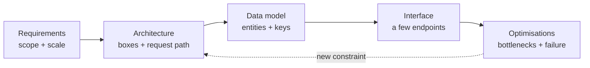

# Driving the Design Round {#ch-driving-the-round}

> Run a 45-minute design round as a conversation you lead, not a quiz you answer.

**In this chapter:** what the round measures · the RADIO framework · turning a vague prompt into requirements · the time budget · the failure modes

## 💡 The Core Idea

A design round has no correct answer. The interviewer already knows how to build a URL shortener. What
they are watching is whether you can take a one-line prompt, turn it into a problem with edges, propose
something that works, and then argue honestly about what it costs. A candidate who says "I would shard
by user ID" and stops has given an answer. A candidate who says "I would shard by user ID, which makes
per-user reads a single hop and makes global search a scatter-gather — and search is not in scope, so I
will take that trade" has shown judgement.

> The round measures how you **narrow** an open problem. Every senior signal — scoping, estimation,
> trade-off language, knowing when to stop — is a form of narrowing.

## How It Works

**RADIO** is the running order. It is not the only framework, but it is the one that keeps you from the
two most common failures: designing before you know the requirements, and running out of time before you
reach the interesting part.

| Step | Stands for    | You produce                                              | Minutes |
| ---- | ------------- | -------------------------------------------------------- | ------- |
| R    | Requirements  | Functional list, non-functional targets, explicit scope cuts | 8–10 |
| A    | Architecture  | A box diagram and the request path through it             | 10–12   |
| D    | Data model    | Entities, keys, and the store behind each                 | 6–8     |
| I    | Interface     | Three or four endpoints or events, not a full API         | 4–6     |
| O    | Optimisations | Bottlenecks, caching, scaling, failure handling           | 10–15   |

**The flow through a round:**



**RADIO is a running order, not a one-way street — a bottleneck found in O often sends you back to A.**

### R — Requirements

Two lists and one number.

**Functional** — what a user can do. Keep it to three or four verbs. "Post a message, read a feed,
follow a user." Anything beyond that, name it and cut it out loud: "search and direct messages are out
of scope unless you want them."

**Non-functional** — the qualities that change the architecture. Only four matter often enough to be
worth asking about every time:

| Quality      | The question to ask                          | Why it changes the design            |
| ------------ | -------------------------------------------- | ------------------------------------ |
| Scale        | Daily active users, requests per second       | Decides single box versus fleet      |
| Latency      | What is the p99 target for the hot path?      | Decides caching and data locality    |
| Consistency  | Can a user see stale data for five seconds?   | Decides replication and store choice |
| Availability | What happens if this is down for ten minutes? | Decides redundancy and failover      |

**Scale** is the number. Get one traffic figure early and derive the rest — see
[Chapter ?? — Back-of-Envelope Estimation](#ch-back-of-envelope-estimation).

> ⚠️ Never invent a requirement silently. Say "I am going to assume 10 million daily active users and a
> 100:1 read-to-write ratio — stop me if that is wrong." An assumption you announce is a design decision.
> An assumption you hide is a mistake waiting to be found.

### A — Architecture

Draw boxes in the order a request travels: client → edge → application → data. Add a box only when a
requirement demands it. Every box you cannot justify is a box the interviewer will ask you to justify.

Then trace one write and one read through the diagram out loud. This is the single highest-value two
minutes in the round — it catches missing components faster than any amount of staring at the drawing.

### D — Data model

For each entity: the fields that matter, the primary key, the access pattern, and the store. Four
columns, not a full schema.

**A feed service, in the form the round actually wants:**

```typescript
interface Post {
  postId: string;        // Snowflake ID — sortable by time, no central counter
  authorId: string;      // partition key: all of an author's posts land together
  body: string;
  createdAt: number;
}

// Access pattern drives the key. "Show me one author's posts, newest first"
// is a single partition scan if postId sorts by time within authorId.
type PostKey = { authorId: string; postId: string };
```

The key is the design. Say why you chose it and what query it makes expensive.

### I — Interface

Three or four operations. Name them, give the parameters that matter, and say whether each is
synchronous. A design round is not an API review — you are showing that the boxes have a contract, not
writing OpenAPI.

### O — Optimisations

This is where the senior signal lives. Work in one order every time:

1. **Name the bottleneck.** Which component saturates first at the scale you estimated?
2. **Fix it with the cheapest thing that works.** Usually a cache or an async queue, not a rewrite.
3. **Say what the fix costs.** A cache buys latency and pays in staleness. A queue buys throughput and
   pays in eventual consistency and a new failure mode.
4. **Handle one failure.** Pick the component whose loss hurts most and say what happens when it dies.

## When to Use It

| Situation                                    | Do this                                          | Why                                  |
| -------------------------------------------- | ------------------------------------------------ | ------------------------------------ |
| Prompt is one line ("design Twitter")         | Spend the full 10 minutes on R                    | The scope is the actual problem      |
| Prompt is already scoped and detailed         | Compress R to 4 minutes, spend it on O            | The interviewer wants depth, not scoping |
| Interviewer keeps interrupting with new asks  | Add each to a visible "out of scope" list         | Protects the time budget out loud    |
| You are 30 minutes in and still on data model | Skip I, go straight to O                          | O carries the most signal            |

## Handling the Prompt You Do Not Know

You will get a domain you have never built. The framework still works, because RADIO is domain-agnostic.
Ask what the product does in one sentence, restate it back, and then reason from the traffic shape:
read-heavy or write-heavy, whether stale data is acceptable, whether items are independent or ordered.
Those three answers pick most of the architecture regardless of the domain.

## Common Mistakes

**❌ Starting with the solution**

> "So we would use Kafka and Cassandra and put Redis in front."

Nobody asked what technologies you like. This answers a question that has not been posed yet, and it
locks you into defending choices you made before you knew the scale.

**✅ Starting with the shape of the load**

> "Before I pick anything — is this read-heavy? If it is 100:1 reads to writes at 10k rps, that pushes me
> towards aggressive caching and read replicas, and I can probably avoid sharding entirely."

**❌ Silence while you think**

Drawing quietly for four minutes reads as being stuck. Narrate: "I am deciding whether the feed is built
on write or on read — let me think about the celebrity case."

**❌ Boxes with no request path**

A diagram of nine components with no traced request is a picture, not a design. Trace one write and one
read, always.

## 🔑 Key Takeaways

- The round measures how you narrow an open problem, not whether you recall an architecture.
- RADIO keeps requirements before design and leaves time for optimisations, where most of the signal is.
- Every assumption you make must be said out loud; an announced assumption is a decision, a hidden one is an error.
- Trace one write and one read through your diagram — it finds missing components faster than reviewing the drawing.
- Finish every "it depends" with the number or condition that decides it.

## Interview Questions

**Q: You have 45 minutes and the prompt is "design Instagram". What are the first five minutes?**

Restate the product in one sentence, then agree the functional scope out loud — upload a photo, view a
feed, follow a user — and name what you are cutting, such as stories, search and direct messages. Then
ask for or assume one scale number and one consistency requirement. Nothing gets drawn in the first five
minutes.

**Q: The interviewer says "assume whatever you like" for the scale. What do you do?**

Pick a number, state it, and derive from it rather than asking again. Something like 10 million daily
active users, a 100:1 read-to-write ratio and a 3× peak multiplier is defensible for almost any consumer
product. The point is that the number is visible, so both of you are designing against the same target.

**Q: When would you not follow RADIO in order?**

When the prompt already carries the requirements, or when the interviewer opens with a specific
constraint like "it has to work offline". Then the interesting work is in architecture and optimisations,
so compress requirements and spend the time where the signal is. Say that you are doing it.

## What to Read Next

- [Chapter ?? — Back-of-Envelope Estimation](#ch-back-of-envelope-estimation) — the numbers that make the R step concrete
- [Chapter ?? — Scalability](#ch-scalability) — the ladder you climb during the O step
- [Chapter ?? — Frontend System Design Strategy](#ch-frontend-system-design-strategy) — the same round when the subject is a client application
