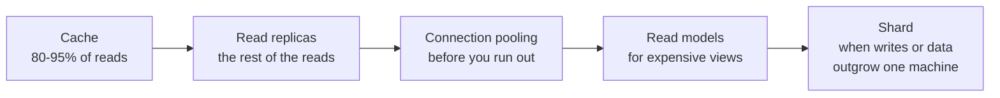

# Scalability {#ch-scalability}

> Reach for the levers in cost order — bigger box, then more boxes, then a smaller database problem — and be able to say why you stopped where you did.

**In this chapter:** the ladder of levers · when a bigger machine is the right answer · statelessness as the price of scaling out · auto-scaling and cooldown · scaling the database

## 💡 The Core Idea

Scalability is not a property you add. It is a sequence of levers, each one cheaper in money and more
expensive in complexity than the last, and the engineering judgement is knowing which one the current
bottleneck actually calls for.

The ladder runs: measure the bottleneck, buy a bigger machine, remove the state, add machines, then
make the database problem smaller. Skipping to the bottom is the classic mistake — teams shard a
database that a read replica and a cache would have carried for another two years, and inherit
permanent operational cost for a problem they did not have.

## How It Works

### The ladder

| Lever | Buys you | Costs you | Reach for it when |
| --- | --- | --- | --- |
| **Right-size** | Nothing new — the capacity you already pay for | An afternoon of profiling | Always first. The bottleneck is often not the one you assumed |
| **Scale up** | 2–10× headroom, in a maintenance window | Money, and a restart | Databases, stateful services, anything you are not ready to re-architect |
| **Go stateless** | The option to scale out at all | Session and file storage moved out | Before the first extra instance, not after |
| **Scale out** | Practically unlimited capacity, plus redundancy | A balancer, and every state assumption you had | Web and API tiers, and anywhere a single node is a single point of failure |
| **Scale the data** | Read capacity, then write capacity | Replication lag, then everything sharding brings | Once the database is the thing that saturates |

### Scaling up, and why it is not the cowardly option

A bigger machine changes no architecture. That is its entire value: it is available today, it carries
no design risk, and it buys the months you need to do the harder thing properly.

Confirm the bottleneck before buying anything, because the wrong upgrade buys nothing at all:

```typescript
interface InstanceMetrics {
  cpuPercent: number;
  memoryPercent: number;
  diskIoWaitPercent: number;
  networkAtLimit: boolean;
}

function bottleneck(m: InstanceMetrics): string {
  if (m.diskIoWaitPercent > 30) return "I/O — faster storage or read replicas, not more vCPU";
  if (m.memoryPercent > 85) return "memory — more RAM, or find the leak";
  if (m.cpuPercent > 80) return "CPU — more cores, or a cheaper query";
  if (m.networkAtLimit) return "network — a larger instance class raises the bandwidth cap";
  return "no clear bottleneck — profile the application before spending anything";
}
```

Two limits end this lever. The technical one is the largest instance a provider sells, and almost
nobody meets it. The economic one arrives far earlier: each doubling roughly doubles the bill while
returning less throughput each time, because most web workloads stop being CPU-bound long before they
run out of cores.

> ⚠️ Vertical scaling requires a restart. On a managed database that is a maintenance window of
> minutes, on the primary, with writes failing throughout. It is cheap in engineering time and not
> free in availability.

### Going stateless

Scaling out only works if any server can answer any request. A server holding local state — sessions
in memory, uploads on disk — is not interchangeable, and adding a second one produces two half-working
systems rather than one bigger one.

**❌ State the next request cannot find:**

```typescript
const sessions = new Map<string, UserSession>(); // lives in one process

function getSession(sessionId: string): UserSession | undefined {
  return sessions.get(sessionId); // only on the server that created it
}
```

**✅ State every server can reach:**

```typescript
interface SessionStore {
  get(sessionId: string): Promise<UserSession | null>;
  set(sessionId: string, session: UserSession, ttlSeconds: number): Promise<void>;
}

async function getSession(store: SessionStore, sessionId: string): Promise<UserSession | null> {
  return store.get(sessionId);
}
```

The same move applies to everything else a process might hold: uploads go to object storage,
configuration comes from the environment or a config service, and in-progress work lives in a queue.
What is left in memory should be safe to lose when the instance does.

### Auto-scaling and the cooldown

Once instances are interchangeable, capacity can follow demand. The policy matters more than the
mechanism, and the asymmetry is the part people get wrong.

```typescript
interface AutoScalingPolicy {
  minInstances: number;
  maxInstances: number;
  scaleOut: { metric: string; threshold: number; forSeconds: number; cooldownSeconds: number };
  scaleIn: { metric: string; threshold: number; forSeconds: number; cooldownSeconds: number };
}

const apiPolicy: AutoScalingPolicy = {
  minInstances: 2, // never 1 — one instance is a single point of failure
  maxInstances: 50,
  scaleOut: { metric: "cpu", threshold: 70, forSeconds: 180, cooldownSeconds: 60 },
  scaleIn: { metric: "cpu", threshold: 30, forSeconds: 600, cooldownSeconds: 300 },
};
```

**Scale out fast, scale in slowly.** Adding an instance you did not need costs a few pennies; removing
one you did need costs an outage during the next spike. A long scale-in cooldown is what stops the
policy oscillating.

CPU is the default trigger and often the wrong one. A service that is waiting on a database is not
CPU-bound, and its queue depth or p99 latency will react long before its processor does.

### Scaling the database

The database saturates last and hurts most, because it is the one tier where "add another" does not
work by itself. The progression is fixed, and each step is cheaper than the next:



**Each step buys time for the next; sharding is the only one you cannot undo cheaply.**

| Where you are | What to do |
| --- | --- |
| Under ~10k req/s, data fits one machine | One primary and a cache. Nothing else is justified |
| Read-bound | Read replicas, and route reads to them by default |
| Running out of connections | A pooler in front, multiplexing many app connections onto few database ones |
| A few expensive read views dominating | A denormalised read model, updated from the write path |
| Writes or data outgrow one machine | Shard, and expect it to change how every query is written |

Two facts to have ready in an interview. Replicas lag — typically milliseconds, up to seconds under
load — so a read immediately after a write must go to the primary or the user will not see their own
change. And connection limits bite earlier than people expect: a hundred application instances holding
ten connections each will exhaust a default PostgreSQL configuration several times over.

## When to Use It

| Situation | The lever |
| --- | --- |
| One tier is saturated and you do not know which resource | Profile first — the upgrade you guess at usually buys nothing |
| A database primary at 85% CPU, no time to re-architect | Scale up. It is the honest answer under pressure |
| A web tier that must survive a node dying | Scale out, minimum two instances, sessions externalised |
| A predictable daily peak | Auto-scaling with a slow scale-in |
| Reads climbing, writes flat | Cache, then replicas — in that order |
| Writes climbing and the primary already maximal | Shard, and budget for it properly |

## Common Mistakes

❌ **Scaling before profiling.** More vCPU does nothing for a service waiting on disk. ✅ Identify which
resource is actually saturated, then buy that one.

❌ **Scaling out a stateful service.** Sticky sessions paper over it until a server dies and takes its
users' sessions with it. ✅ Externalise state before the second instance, not after.

❌ **A minimum of one instance.** Auto-scaling with `min: 1` is a single point of failure with extra
steps. ✅ Two, always, in different availability zones.

❌ **Symmetric cooldowns.** Aggressive scale-in terminates capacity moments before it is needed again.
✅ Scale out in minutes, scale in over tens of minutes.

❌ **Sharding as the first database move.** It multiplies the cost of every query, every migration and
every incident. ✅ Cache, replicate and pool first; shard when the data genuinely does not fit.

## 🔑 Key Takeaways

- Scalability is a ladder of levers in cost order, and the skill is stopping at the right rung.
- A bigger machine is the fastest and lowest-risk answer, and it is the right one more often than it is admitted.
- Statelessness is the precondition for scaling out — not an optimisation to do afterwards.
- Scale out quickly and scale in slowly; the asymmetry is what keeps the policy from oscillating.
- The database progression is cache, replicas, pooling, read models, then sharding — and only the last one is irreversible.

## Interview Questions

**Q: Vertical or horizontal scaling — how do you choose?**

Vertical first, because it changes nothing architecturally and can be done this afternoon. Horizontal
once you need fault tolerance, zero-downtime deploys, or more capacity than one machine sells. The
deciding question is usually availability rather than throughput: a single large instance is a single
point of failure at any size, so anything with a real uptime target ends up horizontal regardless of
load.

**Q: What has to be true before you can scale out?**

The servers must be interchangeable — no session in local memory, no uploaded file on local disk, no
in-process job state. State moves to a shared store, and what is left in the process must be safe to
lose when the instance is replaced. Without that, adding instances produces inconsistent behaviour that
depends on which server answered.

**Q: Your auto-scaling group keeps adding and removing instances every few minutes. What is wrong?**

The scale-in threshold and cooldown are too aggressive relative to scale-out, so removing capacity
immediately re-triggers the scale-out condition. Widen the gap between the thresholds and make the
scale-in cooldown several times longer than the scale-out one. It is also worth checking the metric —
CPU on an I/O-bound service will swing for reasons unrelated to load.

**Q: Reads are slow and the primary is at 90% CPU. Walk through your options.**

Cache first, because it is the only option that removes queries rather than redistributing them, and a
90% hit ratio takes ten times the load off. Then read replicas with reads routed to them by default,
keeping read-after-write on the primary. Then pooling if connections rather than CPU turn out to be
the limit. Sharding does not belong in this list — it addresses writes and data volume, and neither is
the stated problem.

**Q: When would you deliberately not scale a system?**

When the load is a bug. A retry storm, an unindexed query, or an N+1 in a hot endpoint will happily
consume any capacity you buy, and scaling makes the bill grow while hiding the cause. The other case is
a genuine but brief peak that queuing can absorb — moving the work off the request path is cheaper
than provisioning for a spike that lasts ten minutes a day.

## What to Read Next

- [Chapter ?? — Load Balancing](#ch-load-balancing) — the component that makes scaling out possible
- [Chapter ?? — Caching](#ch-caching) — the lever that removes load rather than redistributing it
- [Chapter ?? — Sharding](#ch-sharding) — the last rung, and what it costs
