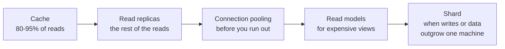

# Scalability, Latency and Throughput {#ch-scalability}

> Read a latency distribution correctly, find the real bottleneck, and pull the cheapest lever that fixes it.

**In this chapter:** latency versus throughput · why the average lies · Little's Law and queueing · the ladder of scaling levers · statelessness and auto-scaling · scaling the database

## 💡 The Core Idea

Latency is how long one request takes. Throughput is how many requests finish per second. They often
move in opposite directions. Batching raises throughput and adds latency. A queue protects throughput
and hurts whoever waits at the back of it.

Scalability is how you keep both numbers inside their targets as load grows. It is not a property you
add. It is a ladder of levers, and each rung is cheaper in money but dearer in complexity than the last.
The ladder runs: measure, buy a bigger machine, remove the state, add machines, then shrink the database
problem. The classic mistake is jumping to the bottom rung and sharding a database that a cache would
have carried for two more years.

> Users feel latency. Bills are paid for throughput. Know which one the requirement is written in.

## How It Works

### Why the average lies

A mean latency of 120 ms fits almost any user experience, because it hides the tail.

| Statistic | Reads as                        | Use it for                                  |
| --------- | ------------------------------- | ------------------------------------------- |
| Mean      | Total time ÷ requests           | Capacity maths only, never user experience  |
| p50       | Half of requests are faster     | The typical case                            |
| p99       | 1 request in 100 is slower      | The SLO people actually set                 |
| p99.9     | 1 request in 1,000 is slower    | What your heaviest users see all the time   |

One page load can make 100 requests. So a user has a good chance of hitting the p99 on at least one.
That is why p99 is not an edge case: at real volume, **the tail is somebody's median**.

Fan-out makes the tail worse. Say one backend call is slow 1% of the time. A request that waits for ten
such calls is slow **1 − 0.99¹⁰ ≈ 9.6%** of the time. Ten calls turn a p99 problem into a p90 problem.
The fixes are fewer calls (batch or denormalise), hedged requests (send a duplicate after the p95 and
take the first answer), or partial results that the UI can show with gaps.

### Little's Law and the queue

**The one formula behind most capacity surprises:**

```text
concurrency = arrival rate × average latency
```

A service handling 500 requests a second at 200 ms each holds 100 requests in flight. With a pool of 50
workers, half the arrivals queue before any work starts. The key consequence: **as utilisation nears 100%, queueing time grows without limit.** At 50%
utilisation, queue wait is about equal to service time. At 90%, it is about nine times service time.
This is why a system that looks fine at 70% CPU falls over at 85%. The CPU number moved a little, and
the wait time moved a lot.

So plan to a utilisation ceiling, not a capacity ceiling. Around 70% is the usual target for a tier
where latency matters. Crossing it is the signal to climb the ladder.

### The ladder of levers

| Lever              | Buys you                                   | Costs you                                  | Reach for it when                                       |
| ------------------ | ------------------------------------------ | ------------------------------------------ | ------------------------------------------------------- |
| **Right-size**     | The capacity you already pay for            | An afternoon of profiling                   | Always first. The bottleneck is often not the one you guessed |
| **Scale up**       | 2–10× headroom, in a maintenance window     | Money, and a restart                        | Databases, stateful services, anything not ready to change |
| **Go stateless**   | The option to scale out at all              | Moving sessions and files out               | Before the first extra instance, not after              |
| **Scale out**      | Near-unlimited capacity, plus redundancy    | A load balancer, and every state assumption | Web and API tiers, and any single point of failure      |
| **Scale the data** | Read capacity, then write capacity          | Replication lag, then all sharding brings   | Once the database is the thing that saturates           |

### Scaling up, and why it is not the cowardly option

A bigger machine changes no architecture. It is available today, carries no design risk, and buys
the months you need to do the harder thing properly. But confirm the bottleneck first.

**Naming the resource that is actually saturated:**

```typescript
interface InstanceMetrics {
  cpuPercent: number;
  memoryPercent: number;
  diskIoWaitPercent: number;
  networkAtLimit: boolean;
}

function bottleneck(m: InstanceMetrics): string {
  if (m.diskIoWaitPercent > 30) return "I/O — faster storage or read replicas, not more vCPU";
  if (m.memoryPercent > 85) return "memory — more RAM, or find the leak";
  if (m.cpuPercent > 80) return "CPU — more cores, or a cheaper query";
  if (m.networkAtLimit) return "network — a larger instance class raises the bandwidth cap";
  return "no clear bottleneck — profile the application before spending anything";
}
```

The limit is economic, not technical. Each doubling roughly doubles the bill but returns less
throughput, because most web workloads stop being CPU-bound long before they run out of cores.

> ⚠️ Vertical scaling needs a restart. On a managed database, that is a maintenance window of minutes
> on the primary, with writes failing throughout. It is cheap in engineering time, not free in
> availability.

### Going stateless

Scaling out only works if any server can answer any request. A server that holds local state, such as
sessions in memory or uploads on disk, is not interchangeable. Adding a second one gives you two
half-working systems, not one bigger one.

**❌ State the next request cannot find:**

```typescript
const sessions = new Map<string, UserSession>(); // lives in one process

function getSession(sessionId: string): UserSession | undefined {
  return sessions.get(sessionId); // only on the server that created it
}
```

**✅ State every server can reach:**

```typescript
interface SessionStore {
  get(sessionId: string): Promise<UserSession | null>;
  set(sessionId: string, session: UserSession, ttlSeconds: number): Promise<void>;
}

async function getSession(store: SessionStore, sessionId: string): Promise<UserSession | null> {
  return store.get(sessionId);
}
```

The same applies to uploads (object storage) and work in progress (a queue). What stays in memory
must be safe to lose when the instance goes.

### Auto-scaling and the cooldown

Once instances are interchangeable, capacity can follow demand. The asymmetry is what people get wrong.

| Direction | Trigger        | Sustained for | Cooldown  | Why                                |
| --------- | -------------- | ------------- | --------- | ---------------------------------- |
| Scale out | CPU above 70%  | 3 minutes     | 1 minute  | A spare instance costs pennies     |
| Scale in  | CPU below 30%  | 10 minutes    | 5 minutes | A missing instance costs an outage |

**Scale out fast, scale in slowly.** A long scale-in cooldown is what stops the policy from swinging
back and forth. Set the minimum to two instances, in different availability zones, never one.

CPU is the default trigger and often the wrong one. A service that waits on a database is not
CPU-bound. Its queue depth or p99 latency reacts long before its processor does, and Little's Law says
why: the queue is where the load shows first.

### Scaling the database

The database saturates last and hurts most, because "add another" does not work on its own there.



**Each step buys time for the next; sharding is the only one you cannot undo cheaply.**

Two facts to have ready. Replicas lag, by seconds under load, so a read right after a write must go
to the primary. And connection limits bite early: a hundred app instances with ten connections each
exhaust a default PostgreSQL setup several times over.

## When to Use It

| Symptom                                        | Likely cause                          | The lever                                            |
| ---------------------------------------------- | ------------------------------------- | ---------------------------------------------------- |
| p50 fine, p99 terrible                         | GC pauses, cold caches, one slow shard | Group slow requests by tenant and instance, then fix the outlier |
| Slow only at peak                              | Utilisation past the ceiling           | Auto-scale on queue depth, or shed load              |
| A database primary at 85% CPU, no time to redesign | Plain saturation                   | Scale up. It is the honest answer under pressure     |
| A web tier that must survive a node dying      | A single point of failure              | Scale out, two instances minimum, sessions externalised |
| Reads climbing, writes flat                    | Read load                              | Cache, then replicas, in that order                  |
| Fast at home, slow abroad                      | Geography: London to Sydney is ~250 ms of light in fibre | CDN, edge caching, regional read replicas |

## Common Mistakes

❌ **Optimising the average.** The mean improves when fast requests get faster, which no user notices.
✅ Optimise the percentile the requirement names. "p99 went from 1.2 s to 380 ms" is a result.

❌ **Scaling before profiling.** More vCPU does nothing for a service waiting on disk. ✅ Find the
saturated resource, then buy that one.

❌ **Scaling out a stateful service.** Sticky sessions hide it until a server dies and takes its users'
sessions with it. ✅ Externalise state before the second instance, not after.

❌ **Symmetric cooldowns.** Fast scale-in removes capacity moments before it is needed again. ✅ Scale
out in minutes, scale in over tens of minutes.

❌ **Sharding as the first database move.** It adds cost to every query, migration and incident.
✅ Cache, replicate and pool first. Shard when the data truly does not fit.

## 🔑 Key Takeaways

- Latency and throughput trade against each other, so every performance requirement must say which one it means.
- The mean hides the tail, and at real volume the p99 is somebody's median experience.
- Little's Law shows that wait time explodes as utilisation nears 100%, so plan to a ceiling near 70%.
- Scalability is a ladder of levers in cost order, and a bigger machine is the right rung more often than people admit.
- Statelessness comes before scaling out, and in the database, sharding is the last and only irreversible step.

## Interview Questions

**Q: Vertical or horizontal scaling — how do you choose?**

Vertical first, because it changes nothing in the architecture and can happen this afternoon.
Horizontal once you need fault tolerance, zero-downtime deploys, or more than one machine can give. The
deciding factor is usually availability, not throughput. One large instance is a single point of
failure at any size.

**Q: p50 is 40 ms and p99 is 3 seconds. Where do you look?**

At something that hurts a few requests badly, not all requests slightly. Think cold caches, garbage
collection pauses, one slow shard, lock contention, or a code path only large accounts reach. Group the
slow requests by tenant, endpoint and instance first. The tail almost always shares an attribute.

**Q: Your service looks fine at 70% CPU and falls over at 85%. Why?**

Queueing. By Little's Law, in-flight work equals arrival rate times latency. As utilisation nears 100%,
queue wait grows far faster than the CPU number. A small rise in load becomes a large rise in latency,
which is why capacity plans target a ceiling around 70%.

**Q: When would you accept worse latency on purpose?**

When throughput or cost matters more. Batching writes, buffering telemetry and queueing background jobs
all delay single items but make the system cheaper and sturdier. The condition is that no user waits on
the result. The moment one does, the trade reverses.

## What to Read Next

- [Chapter ?? — Load Balancing](#ch-load-balancing) — the component that makes scaling out possible
- [Chapter ?? — Caching](#ch-caching) — the largest single lever on read latency and database load
- [Chapter ?? — Sharding and Transactions at Scale](#ch-sharding) — the last rung, and what it costs
