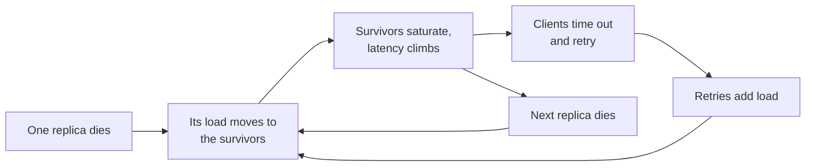

# Reliability, Consistency and CAP {#ch-consistency-and-cap}

> Put a number on how often a system may be down or stale, and pick the redundancy that pays for it.

**In this chapter:** the nines and the error budget · how systems fail · CAP and PACELC · the consistency spectrum · quorums and consensus

## 💡 The Core Idea

Every part of a system breaks. Disks fail, networks split and deploys go wrong. Reliability means the
*system* keeps serving while its *parts* fail. The answer is redundancy: more than one copy of each thing.

But copies bring a second problem. Once data lives on more than one machine, the copies can disagree.
Consistency is the set of promises a system makes about that disagreement. Stronger promises need
coordination, and coordination costs latency and availability. Both halves of this chapter are budgets.

> Ask two questions before you design anything. How many minutes a month may this be down? And which
> read, in which feature, may be how stale?

## How It Works

### The nines

| Availability | Downtime per year | Per month | What it takes                              |
| ------------ | ----------------- | --------- | ------------------------------------------ |
| 99%          | 3.65 days         | 7.2 h     | One machine, someone on call                |
| 99.9%        | 8.8 h             | 43 min    | Redundant instances, automated deploys      |
| 99.99%       | 52 min            | 4.3 min   | Multi-zone, automatic failover, no manual step |
| 99.999%      | 5.3 min           | 26 s      | Multi-region active-active, and a budget to match |

Each extra nine costs roughly ten times more than the last. Most internal tools do not need three nines.
Most payment paths need four. Naming the right target is a stronger answer than naming the highest.

**Dependencies multiply.** A service that needs three dependencies, each at 99.9%, cannot beat about
**99.7%**. That is roughly 26 hours of downtime a year.

**Serial and redundant availability:**

```typescript
// Serial dependencies multiply down; independent copies of one thing multiply up.
const serial = (...availabilities: number[]): number =>
  availabilities.reduce((acc: number, a: number) => acc * a, 1);

const redundant = (single: number, copies: number): number => 1 - Math.pow(1 - single, copies);

serial(0.999, 0.999, 0.999); // 0.997    — three hard dependencies
redundant(0.99, 3);          // 0.999999 — three independent copies
```

The key word is **independent**. Three replicas in one rack share a power supply. They are not three
copies of anything.

### SLI, SLO and the error budget

| Term         | What it is                                  | Example                                   |
| ------------ | ------------------------------------------- | ----------------------------------------- |
| SLI          | The measurement                             | Share of requests served under 300 ms     |
| SLO          | The internal target for that measurement    | 99.9% under 300 ms, over 30 days          |
| SLA          | The promise in the contract, with a penalty | 99.5%, or the customer gets credit        |
| Error budget | The failure you allow: 100% − SLO           | 0.1% of 30 days = 43 minutes              |

The error budget turns "should we ship this risky change?" from an argument into arithmetic. If the
budget is intact, ship. If it is spent, the next job is reliability. Always set the SLO tighter than the
SLA, so your own alarm fires before the contract's.

### How systems fail

A **single point of failure** is any part with no replica. People forget to count the load balancer, the
primary database, a shared session cache, a DNS zone and a certificate with no renewal job. Find them on
the diagram: point at each box and ask what happens when it disappears.

A **cascading failure** turns a small problem into an outage.



**A cascade is a feedback loop: the response to failure becomes the cause of more failure.**

Timeouts, retry budgets, circuit breakers and load shedding break the loop. They are taught in
[Chapter ?? — Resilience Patterns](#ch-resilience-patterns). What belongs here is headroom. A tier at 80%
of capacity cannot absorb a lost replica. Plan for N+1 at minimum, and N+2 across zones.

Keep the **readiness** check shallow. If it fails whenever the database is slow, every instance leaves
the pool at once, and a slow database becomes a total outage.

### Redundancy and recovery

Active-passive keeps an idle standby and fails over in seconds to minutes. Active-active uses every node
and fails over at once. Both cost about twice one copy. Recovery has two numbers, set separately:

- **RPO (recovery point objective)** is how much data you may lose. Nightly backups mean 24 hours.
- **RTO (recovery time objective)** is how long recovery may take. A 2 TB restore takes hours.

> ⚠️ High availability and disaster recovery are different investments. HA survives a node or zone
> failing, automatically. DR survives a lost region or corrupted data, usually with a human involved. A
> highly available system can still lose everything to one `DELETE` without a `WHERE`.

### What CAP actually says

Redundant data brings the second budget. CAP describes a distributed system during a **network
partition**, when nodes cannot reach each other. During a partition, the system must choose:

| Choice | Behaviour during a partition                            | Example stores                       |
| ------ | ------------------------------------------------------- | ------------------------------------ |
| **CP** | Refuse requests it cannot serve correctly               | etcd, ZooKeeper, Spanner             |
| **AP** | Answer from any reachable node, and reconcile later     | Cassandra, DynamoDB (eventual reads) |

Networks do partition, so "CA" is not a design choice. It is a single machine.

> ⚠️ Do not treat CAP as a permanent label. A CP system is unavailable only *for the affected keys,
> during a partition*. Partitions are rare. The trade you feel every day is PACELC.

### PACELC: the everyday trade

**If** there is a **P**artition, choose **A**vailability or **C**onsistency. **E**lse, choose
**L**atency or **C**onsistency.

The "else" branch is the daily one. A write confirmed by a quorum across three zones is slower than one
confirmed by a single node. You are paying milliseconds for agreement. DynamoDB and Cassandra favour
latency by default; Spanner pays latency for global consistency.

### The consistency spectrum

Choose the model per feature, not per system. Most products need three or four at once.

| Model                | Promise                                         | Use it for                                     |
| -------------------- | ----------------------------------------------- | ---------------------------------------------- |
| **Linearisable**     | Every read sees the latest write, in one order  | Balances, seat booking, unique usernames       |
| **Causal**           | Dependent operations appear in order            | A comment thread: no reply before its parent   |
| **Read-your-writes** | A client always sees its own writes             | A user editing their profile                   |
| **Eventual**         | Copies agree once writes stop                   | Feeds, view counts, likes                      |

Linearisable costs a consensus round per write. Eventual costs almost nothing, until a stale read breaks a
rule. **Read-your-writes is the cheapest fix for the most common complaint.** After a write, send that
user's reads to the primary for longer than the replica lag. It is a routing change, nothing more.

### Quorums and consensus

A leaderless store tunes consistency with three numbers. **N** is the number of replicas. **W** is how
many must confirm a write. **R** is how many a read asks. **When W + R > N, the read set and write set
overlap**, so a read sees the latest write. N=3, W=2, R=2 is the usual balance: both paths survive one
lost node.

Overlap is not a global order, though. Two concurrent writes can land on different sets and conflict.

**Consensus** (Raft, Paxos) gives that order. A leader appends each write to its log and commits once a
majority confirms. A five-node cluster commits with three and survives two failures. Use an odd number
of nodes to avoid split votes. Without a majority, the cluster stops accepting writes — that is CP by
design.

When replicas do accept conflicting writes, something must decide. **Last write wins** keeps the newer
timestamp and silently drops the other write. It is the default in many stores, so say so when you
propose it. **Version vectors** detect the conflict and hand both versions to the app. **CRDTs** are data
types that always merge the same way.

## When to Use It

| Situation                           | Choose                                     | Why                                         |
| ----------------------------------- | ------------------------------------------ | ------------------------------------------- |
| Internal admin tool                 | 99%, one zone, daily backup                | Downtime is an annoyance, not lost revenue  |
| Consumer read path                  | 99.9%, multi-zone, eventual replicas       | Cheap to reach, visible when missed         |
| Payments, inventory, uniqueness     | 99.99%, linearisable, CP                   | A wrong answer costs more than an error page |
| A user editing their own data       | Read-your-writes on top of eventual        | Cheap, and fixes the visible complaint      |

## Common Mistakes

**❌ Backups that have never been restored**

You do not have a backup, you have a file. The first restore reveals the missing grants, the wrong
Postgres version and the four hours it really takes.

**✅ A timed restore drill each quarter, recorded against the stated RTO**

**❌ Calling the whole system "eventually consistent"**

Then checkout charges twice. A single label for the whole system means the design has not been done.

**✅ A per-feature table**

> "Feed and counters are eventual. Profile reads are read-your-writes. Payments and seats are
> linearisable and go to the primary."

## 🔑 Key Takeaways

- Availability is a budget with a cost curve, and each extra nine costs roughly ten times more.
- Serial dependencies pull availability down, and only independent redundancy pushes it up.
- The error budget turns reliability from an argument into arithmetic about whether to ship.
- CAP only applies during a partition; the latency-versus-consistency trade in PACELC is the one you pay every day.
- Consistency is chosen per feature, and read-your-writes fixes the most common staleness complaint at almost no cost.

## Interview Questions

**Q: Your service calls four dependencies, each 99.9% available. What is your ceiling?**

About 99.6% if every call is required — roughly 35 hours of downtime a year. To do better, the service
must not need all four. Cache what you can, make non-critical calls optional with a degraded response,
and keep timeouts short so a slow dependency does not eat the request budget.

**Q: What is the difference between high availability and disaster recovery?**

HA keeps serving through a node or zone failure, automatically, in seconds. DR restores service after
losing a whole environment or the data itself, often with a human involved. They protect against
different events, so having one does not mean you have the other.

**Q: A user says their profile edit "did not save" in an eventually consistent system. What do you do?**

It almost certainly saved, and the read hit a lagging replica. Add read-your-writes: route that user's
reads to the primary for longer than the observed lag. That is a routing change, not a new consistency
model.

**Q: When is eventual consistency not acceptable?**

When acting on a stale read breaks a rule the system must keep. Two people buy the last seat, an account
goes below zero, or two users claim one username. The test is not whether staleness is visible. It is
whether stale data can produce a state the system calls illegal.

## What to Read Next

- [Chapter ?? — Resilience Patterns](#ch-resilience-patterns) — timeouts, retries and circuit breakers that stop a cascade
- [Chapter ?? — Choosing a Datastore and Replicating It](#ch-choosing-a-datastore) — the mechanism that creates the staleness this chapter measures
- [Chapter ?? — Sharding and Transactions at Scale](#ch-sharding) — what happens when one operation spans several stores
