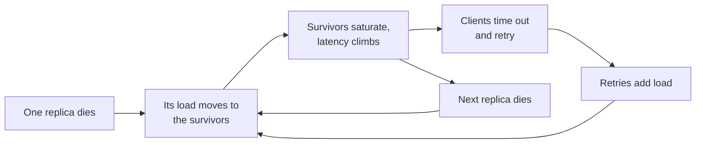

# Reliability and Availability {#ch-reliability-and-availability}

> Put a number on how often a system may be wrong or absent, and design the redundancy that number pays for.

**In this chapter:** the nines and what they cost · SLI, SLO and the error budget · single points of failure · cascading failure · redundancy and failover · RPO and RTO

## 💡 The Core Idea

Reliability is not "the system does not break". Every component breaks; disks fail, networks partition,
deploys go wrong, and providers have bad days. Reliability is the property that the *system* keeps
serving while its *parts* fail. That only happens if failure was designed for, which means someone
decided in advance how much unavailability is acceptable and what redundancy is worth paying for.

> Availability is a budget, not an aspiration. Ask "how many minutes a month may this be down?" before
> asking "how do we make it never go down?"

## How It Works

### The nines

| Availability | Downtime per year | Per month | What it takes                              |
| ------------ | ----------------- | --------- | ------------------------------------------ |
| 99%          | 3.65 days         | 7.2 h     | One machine, someone on call                |
| 99.9%        | 8.8 h             | 43 min    | Redundant instances, automated deploys      |
| 99.99%       | 52 min            | 4.3 min   | Multi-zone, automatic failover, no manual step in the recovery path |
| 99.999%      | 5.3 min           | 26 s      | Multi-region active-active, and a budget to match |

Each nine costs roughly an order of magnitude more than the last. Most internal tools do not need three
nines; most payment paths need four. Naming the right target is a stronger answer than naming the
highest one.

**Dependencies multiply.** A service that calls three dependencies, each at 99.9%, cannot itself exceed
99.9%³ ≈ **99.7%** — about 26 hours of downtime a year — unless it can survive one of them being absent.

```typescript
// Serial dependencies multiply; redundant replicas of one dependency compound the other way.
const serial = (...availabilities: number[]): number =>
  availabilities.reduce((acc: number, a: number) => acc * a, 1);

const redundant = (single: number, copies: number): number => 1 - Math.pow(1 - single, copies);

serial(0.999, 0.999, 0.999); // 0.997  — three hard dependencies
redundant(0.99, 3);          // 0.999999 — three independent copies of one thing
```

The second formula is why redundancy works, and the word doing the work is **independent**. Three
replicas in one rack share a power supply, so they are not three copies of anything.

### SLI, SLO and the error budget

| Term  | What it is                                       | Example                                     |
| ----- | ------------------------------------------------ | ------------------------------------------- |
| SLI   | The measurement                                  | Fraction of requests served under 300 ms    |
| SLO   | The internal target for that measurement          | 99.9% of requests under 300 ms, over 30 days |
| SLA   | The contractual promise, with a penalty attached  | 99.5%, or the customer gets credit          |
| Error budget | The permitted failure: 100% − SLO          | 0.1% of 30 days = 43 minutes                |

The error budget is the useful part. It converts "should we ship this risky change?" from an argument
into arithmetic: if the budget is intact, ship; if it is spent, the next work item is reliability. Set
the SLO below the SLA, always, so the internal alarm fires before the contractual one.

### Single points of failure

Any component with no replica takes the whole system with it. The usual suspects are the ones people
forget to count: the primary database, the load balancer itself, a shared cache holding session state, a
DNS zone, a single availability zone, a certificate with an expiry date and no renewal job.

**Finding them is a diagram exercise, not a code exercise.** Point at each box and ask what happens when
it disappears. If the answer is "everything stops", it is a single point of failure, and either it gets
a replica or the outage it will eventually cause is an accepted risk.

### Cascading failure

The failure mode that turns a small problem into an outage.



**A cascade is a feedback loop: the response to failure becomes the cause of more failure.**

Three things break the loop, and all three belong in the answer:

| Guard              | What it stops                                        |
| ------------------ | ---------------------------------------------------- |
| Timeouts and retry budgets | Retries multiplying load without limit       |
| Circuit breakers   | Requests to a dependency that is already failing      |
| Load shedding      | Accepting work the system cannot finish anyway        |

The patterns themselves are in [Chapter ?? — Resilience Patterns](#ch-resilience-patterns). What belongs
here is the reason: headroom. A tier running at 80% of capacity has no room to absorb a lost replica.
Plan capacity so that losing one node still leaves the rest below saturation — usually N+1 at minimum,
N+2 across zones.

### Health checks

A load balancer can only route around a failure it can see.

| Check     | Asks                                        | Used for                                  |
| --------- | ------------------------------------------- | ----------------------------------------- |
| Liveness  | Is the process alive?                        | Restarting a hung instance                |
| Readiness | Can it serve traffic *right now*?            | Removing an instance from the pool        |
| Deep      | Are its dependencies reachable?              | Diagnostics and dashboards — rarely routing |

Keep readiness shallow. A readiness check that fails when the database is slow will pull every instance
out of the pool at the same moment, converting a degraded database into a total outage.

### Redundancy, failover, and getting the data back

| Model              | Spare capacity     | Failover time  | Cost      |
| ------------------ | ------------------ | -------------- | --------- |
| Active-passive     | Idle standby       | Seconds to minutes | ~2×   |
| Active-active      | All nodes serving  | Immediate      | ~2×, fully used |
| Multi-region active-passive | Warm region in another region | Minutes | High |
| Multi-region active-active  | Both regions serving | Immediate | Highest, plus cross-region consistency work |

Recovery has two numbers, and they are separate decisions:

- **RPO — recovery point objective.** How much data may be lost. Nightly backups mean an RPO of 24
  hours. Continuous replication means seconds.
- **RTO — recovery time objective.** How long recovery may take. Restoring a 2 TB backup is hours; a
  warm standby is minutes.

> ⚠️ High availability and disaster recovery are not the same investment. HA handles a node or a zone
> failing and is automatic. DR handles a region, a corrupted dataset, or a bad migration, and usually has
> a human in the loop. A system can be highly available and still lose everything to one `DELETE` without
> a `WHERE`.

## When to Use It

| Situation                                  | Target                        | Why                                        |
| ------------------------------------------ | ----------------------------- | ------------------------------------------ |
| Internal admin tool                        | 99%, single zone, daily backup | Downtime is an inconvenience, not revenue |
| Consumer read path                         | 99.9%, multi-zone, replicas    | Cheap to reach, visible when missed        |
| Payments or authentication                 | 99.99%, no manual step in failover | An outage blocks every other feature  |
| Analytics pipeline                         | 99%, but RPO near zero         | Lateness is fine; losing events is not     |

## Common Mistakes

**❌ Backups that have never been restored**

> A nightly `pg_dump` to object storage, untested since it was written.

You do not have a backup, you have a file. The first restore is where you discover the missing role
grants, the wrong Postgres version, and the four hours it actually takes. Restore on a schedule.

**✅ A restore drill with the RTO written down**

> Quarterly restore into a scratch environment, timed, with the result recorded against the stated RTO.

**❌ Redundancy that shares a failure domain**

Three instances in one availability zone survive a machine failing and not a zone failing. Count the
thing that is actually shared — the rack, the zone, the region, the provider.

**❌ Retrying without a budget**

Three retries per client during an incident is a 4× traffic multiplier arriving exactly when the system
is weakest. Cap total retries, add jitter, and stop retrying when the circuit is open.

## 🔑 Key Takeaways

- Availability is a budget with a cost curve; each additional nine is roughly ten times more expensive.
- Serial dependencies multiply availability downwards, and only independent redundancy multiplies it upwards.
- The error budget turns reliability from an argument into arithmetic about whether to ship.
- Cascading failure is a feedback loop, and headroom is the cheapest thing that breaks it.
- RPO and RTO are separate decisions, and a backup that has never been restored is not a backup.

## Interview Questions

**Q: Your service calls four dependencies, each 99.9% available. What is your ceiling?**

About 99.6% if every call is required — roughly 35 hours of downtime a year. To do better, the service
must not need all four: cache what can be cached, make non-critical calls optional with a degraded
response, and set timeouts short enough that a slow dependency does not consume the request budget.

**Q: What is the difference between high availability and disaster recovery?**

HA keeps serving through the failure of a component or a zone, automatically, in seconds. DR restores
service after something that took out the whole environment or the data itself, usually in minutes to
hours with a human involved. They protect against different events, so having one does not mean you have
the other.

**Q: How do you decide an SLO?**

Work backwards from what the outage costs and what users notice, not from what sounds impressive. Then
check the number is achievable given the dependencies, because an SLO above your dependency ceiling is a
promise you cannot keep. Set it strictly tighter than any SLA so the internal signal fires first.

## What to Read Next

- [Chapter ?? — Resilience Patterns](#ch-resilience-patterns) — timeouts, retries, circuit breakers and bulkheads
- [Chapter ?? — Load Balancing](#ch-load-balancing) — the component that acts on a health check
- [Chapter ?? — Replication](#ch-replication) — the redundancy that protects the data rather than the compute
