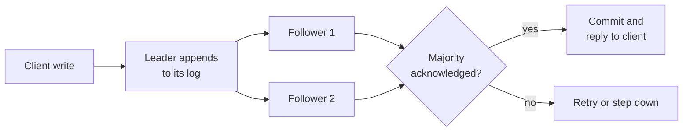

# Consistency and CAP {#ch-consistency-and-cap}

> State exactly which consistency guarantee a feature needs, and pick the replication scheme that pays for it.

**In this chapter:** what CAP really says · PACELC and the everyday trade · the consistency spectrum · quorums · consensus · conflict resolution

## 💡 The Core Idea

Once data lives on more than one machine, the copies can disagree. Consistency is the set of promises a
system makes about that disagreement: whether a reader can see a stale value, whether two readers can see
different values, and whether a writer can immediately read back what they wrote. Stronger promises cost
coordination, and coordination costs latency and availability. That is the entire subject.

> The question is never "is this system consistent?" It is "which read, in which feature, may be how
> stale, and what happens to the user if it is?"

## How It Works

### What CAP actually says

CAP concerns a distributed system during a **network partition** — when nodes cannot reach each other.
During a partition, a system must choose:

| Choice | Behaviour during a partition                         | Example stores                      |
| ------ | ---------------------------------------------------- | ----------------------------------- |
| **CP** | Refuse requests it cannot serve correctly; stay correct | etcd, ZooKeeper, Spanner, MongoDB with majority writes |
| **AP** | Answer from whatever node is reachable; reconcile later | Cassandra, DynamoDB (eventual mode), Riak |

Partition tolerance is not optional — networks partition, so "CA" is not a system you can build, it is a
single machine. The real choice is C or A, and only while partitioned.

> ⚠️ The most common CAP mistake in interviews is treating it as a permanent label. A CP system is not
> slow and unavailable all the time; it is unavailable *for the affected keys, during a partition*.
> Partitions are rare. What you feel every day is the other trade — PACELC.

### PACELC: the trade you actually live with

> **If** there is a **P**artition, choose **A**vailability or **C**onsistency; **E**lse, choose
> **L**atency or **C**onsistency.

The "else" branch is the everyday one. With no partition at all, a write that must be acknowledged by a
quorum across three availability zones is slower than a write acknowledged by one node. Nothing is broken
— you are simply paying milliseconds for agreement.

| System                  | Partition | Normal operation |
| ----------------------- | --------- | ---------------- |
| DynamoDB (default)      | AP        | EL — favours latency |
| DynamoDB (strong reads) | AP        | EC — favours consistency |
| Cassandra               | AP        | EL, tunable per query |
| Spanner                 | CP        | EC — pays latency for global consistency |
| PostgreSQL, single primary | CP     | EC within the primary |

### The consistency spectrum

| Model                  | Promise                                                        | Typical cost         |
| ---------------------- | -------------------------------------------------------------- | -------------------- |
| **Linearisable**       | Every read sees the latest committed write, globally ordered    | Highest — consensus per write |
| **Sequential**         | All nodes see operations in the same order, not necessarily real time | High          |
| **Causal**             | Operations that depend on each other are seen in order          | Moderate             |
| **Read-your-writes**   | A client always sees its own writes                             | Low — routing only   |
| **Monotonic reads**    | A client never sees time go backwards                           | Low — sticky routing |
| **Eventual**           | Copies converge if writes stop                                  | Lowest               |

Most products need a mix, chosen per feature rather than per system:

| Feature                        | Model needed        | Why                                        |
| ------------------------------ | ------------------- | ------------------------------------------ |
| Account balance, seat booking  | Linearisable        | Double-spend is unacceptable               |
| Username registration          | Linearisable        | Uniqueness is a global invariant           |
| A user editing their profile   | Read-your-writes    | They must see their own change             |
| A social feed                  | Eventual            | Seconds of staleness is invisible          |
| A comment thread               | Causal              | A reply must not appear before its parent  |
| View counts, likes             | Eventual            | Approximate is fine                        |

**Read-your-writes is the cheapest fix for the most common complaint.** After a write, route that
client's reads to the primary for a few seconds, or pin them to the replica that has caught up.

```typescript
interface ReadRouter {
  lastWriteAt: Map<string, number>; // userId -> epoch ms
}

// Send a user to the primary briefly after their own write, and to a replica otherwise.
function routeRead(router: ReadRouter, userId: string, replicaLagMs: number): "primary" | "replica" {
  const wroteAt: number | undefined = router.lastWriteAt.get(userId);
  if (wroteAt === undefined) return "replica";
  return Date.now() - wroteAt < replicaLagMs ? "primary" : "replica";
}
```

### Quorums

A leaderless store tunes consistency per operation with three numbers: **N** replicas, **W**
acknowledgements to accept a write, **R** replicas consulted on a read.

**When W + R > N, a read set and a write set must overlap, so the read sees the latest write.**

| N | W | R | Result                                                    |
| - | - | - | --------------------------------------------------------- |
| 3 | 3 | 1 | Fast reads, slow writes, no write tolerance for a lost node |
| 3 | 1 | 3 | Fast writes, slow reads                                    |
| 3 | 2 | 2 | The usual balance — survives one node loss on both paths   |
| 3 | 1 | 1 | Fastest, eventual only                                     |

Quorums give strong-*ish* reads without a leader, but they do not give linearisability on their own —
concurrent writes can still be accepted by disjoint sets and need resolving afterwards.

### Consensus

Strong consistency across replicas needs agreement on an order of operations. Raft and Paxos both work
by electing a leader and committing entries to a majority.



**A majority, not all: a five-node cluster commits with three acknowledgements and survives two failures.**

The practical consequences are what interviews probe. Consensus needs an odd number of nodes to avoid
split votes. It cannot make progress without a majority, which is exactly the CP behaviour CAP
describes. And every write pays at least one round trip to the slowest node in the majority — which is
why Spanner is remarkable rather than routine.

### Conflict resolution

When two replicas accept conflicting writes, something has to decide.

| Strategy                 | How                                                | Loses            |
| ------------------------ | -------------------------------------------------- | ---------------- |
| Last write wins          | Compare timestamps, keep the newer                  | The other write, silently |
| Version vectors          | Detect concurrency, hand both versions to the application | Nothing, but the app must merge |
| CRDTs                    | Data types that merge deterministically (counters, sets, text) | Expressiveness — not every type has one |
| Application merge        | Domain rules decide, such as union of a shopping cart | Requires domain knowledge |

Last write wins is the default in many stores and quietly discards data. Say so when you propose it.

## When to Use It

| Situation                                          | Choose                        | Why                                       |
| -------------------------------------------------- | ----------------------------- | ----------------------------------------- |
| Money, inventory, uniqueness                        | Linearisable, CP              | A wrong answer costs more than an error page |
| High-volume writes, tolerance for staleness         | Eventual, AP                  | Availability and latency win               |
| A user editing their own data                       | Read-your-writes on top of eventual | Cheap, and fixes the visible complaint |
| Collaborative editing                               | CRDT or operational transform | Concurrent writes are the normal case     |
| Cross-region reads with in-region writes            | Eventual reads, primary writes | Geography makes strong global reads expensive |

## Common Mistakes

**❌ Declaring the whole system "eventually consistent"**

Then the checkout double-charges. Consistency is chosen per feature; a single label for the whole system
is a design that has not been done yet.

**✅ A per-feature table**

> "Feed and counters are eventual. Profile reads are read-your-writes. Payments and seat allocation are
> linearisable and go to the primary."

**❌ Claiming CAP forces a permanent choice**

CAP applies during a partition. Outside one, a CP system is available and fast; the trade you feel daily
is latency versus consistency, which is PACELC's "else" branch.

**❌ Treating W + R > N as linearisability**

It guarantees overlap between read and write sets, which is not the same as a global order. Concurrent
writes still conflict, and something must resolve them.

## 🔑 Key Takeaways

- CAP is about behaviour during a network partition; PACELC describes the latency-versus-consistency trade you pay every day.
- Consistency is chosen per feature, not per system, and most products need three or four different models at once.
- Read-your-writes fixes the most common user-visible staleness complaint at almost no cost.
- W + R > N makes read and write sets overlap, but it does not by itself give a global ordering.
- Consensus needs a majority, so it stops accepting writes when one is unavailable — that is CP by design, not a bug.

## Interview Questions

**Q: Your system is eventually consistent and a user says their profile edit "did not save". What do you do?**

It almost certainly saved and the read went to a lagging replica. Add read-your-writes: after a write,
route that user's reads to the primary for longer than the observed replication lag, or pin them to a
replica known to have applied their write. This is a routing change, not a change of consistency model.

**Q: When is eventual consistency unacceptable?**

When a stale read allows an invariant to be broken — two people buying the last seat, an account going
below zero, two users claiming one username. The test is not whether staleness is visible but whether
acting on stale data produces a state the system considers illegal.

**Q: Explain the difference between CP and "slow".**

A CP system refuses to answer requests it cannot serve correctly while it is partitioned from a majority.
Outside a partition it is fully available, and its cost is the extra round trips a quorum write needs.
Conflating the two leads people to reject strong consistency for latency reasons that only apply to
writes, on data where reads dominate.

## What to Read Next

- [Chapter ?? — Replication](#ch-replication) — the mechanism that creates the staleness this chapter measures
- [Chapter ?? — Transactions at Scale](#ch-database-transactions) — what happens when one operation spans several stores
- [Chapter ?? — Choosing a Datastore](#ch-choosing-a-datastore) — which stores offer which guarantees
