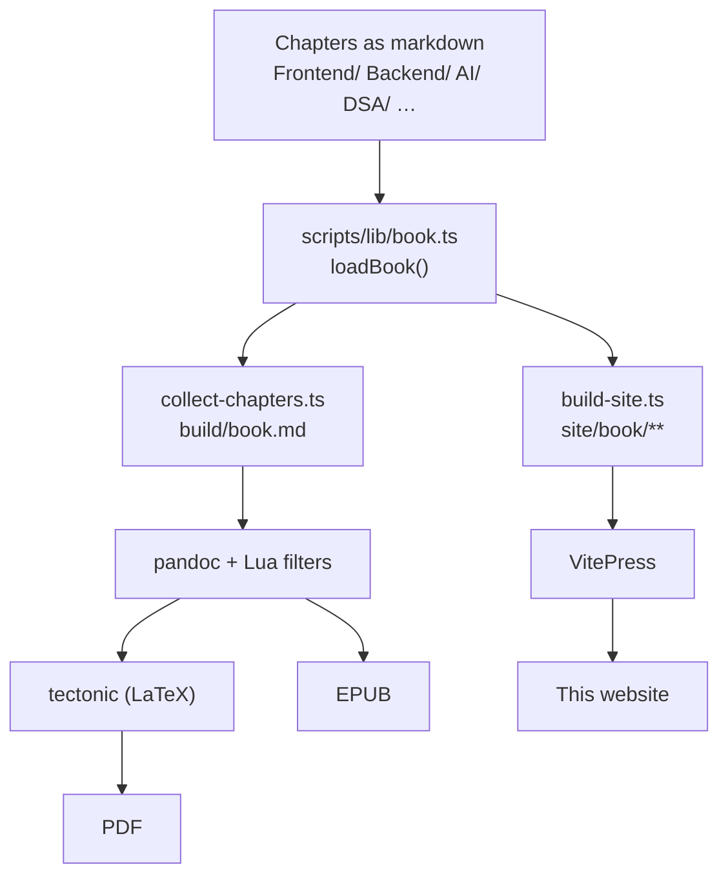
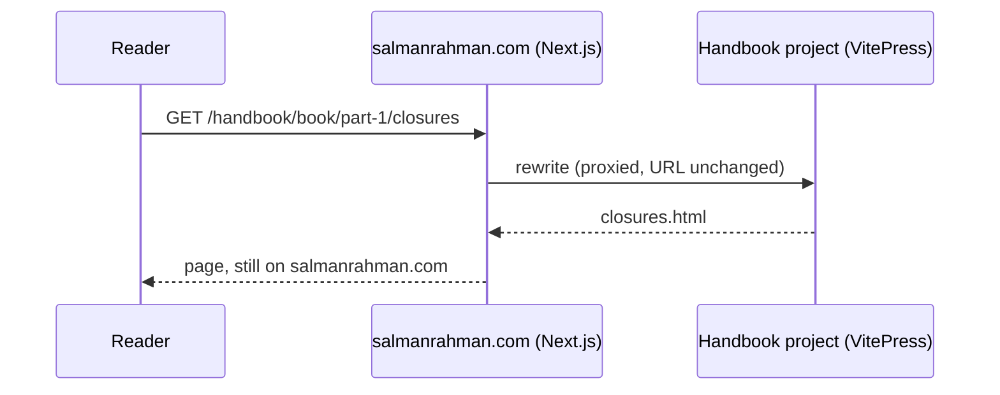
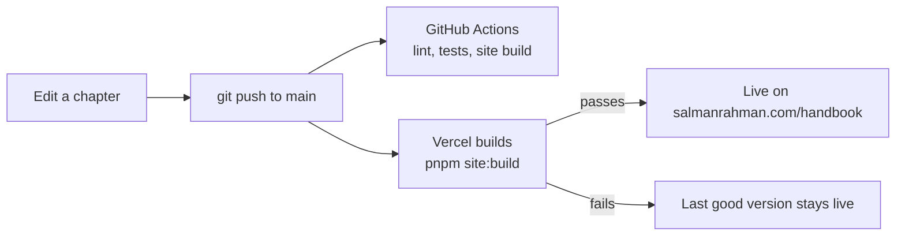

# How This Book Is Built

> One repository of markdown files becomes a print-ready PDF, a valid EPUB and this website. This page shows how, step by step, so you can build it yourself.

This page is for developers. It exists only on the web — the build skips the `site/` folder, so it is never bound into the PDF or the EPUB.

The source is public: [github.com/salmanbd100/full-stack-software-engineer-guide](https://github.com/salmanbd100/full-stack-software-engineer-guide).

## The Big Picture

Every chapter is a markdown file. One TypeScript module reads them all and decides what counts as the book. Three builds use that one module, so the PDF, the EPUB and the website can never disagree about what is in the book.



**One source, three outputs. Only `loadBook()` decides what a chapter is.**

| Output | Command | Lands in | Tools it needs |
| ------ | ------- | -------- | -------------- |
| PDF, both volumes | `pnpm book:pdf`, `pnpm book:companion` | `build/*.pdf` | pandoc, tectonic, mermaid-cli |
| EPUB, both volumes | `pnpm book:epub`, `pnpm book:companion` | `build/*.epub` | pandoc, mermaid-cli, epubcheck (optional) |
| Website | `pnpm site:build` | `site/.vitepress/dist` | Node and pnpm only |

## Build It Yourself

### 1. Install the tools

You need **Node 22.6 or later** and **pnpm 9**. The scripts are TypeScript, and Node runs them directly with `--experimental-strip-types`, so there is no compile step.

**Clone and install:**

```bash
git clone https://github.com/salmanbd100/full-stack-software-engineer-guide.git
cd full-stack-software-engineer-guide
pnpm install
```

That is enough for the website. The PDF and EPUB need four more tools (macOS shown):

**Print toolchain:**

```bash
brew install pandoc tectonic poppler epubcheck
pnpm add -g @mermaid-js/mermaid-cli
```

| Tool | What it does here |
| ---- | ----------------- |
| **pandoc** | Reads the markdown and writes LaTeX (for the PDF) or XHTML (for the EPUB) |
| **tectonic** | A self-contained LaTeX engine. It downloads the packages it needs on the first run |
| **mermaid-cli** (`mmdc`) | Turns every ` ```mermaid ` fence into a vector PDF or an SVG. It brings a headless Chromium, which is why it is a global install and not a dependency |
| **poppler** | `pdftoppm` turns the cover into PNGs; `pdftotext` lets the build check every page reference |
| **epubcheck** | Validates the EPUB. Optional — without it the build says "not validated" and carries on |

### 2. Check the design in seconds

```bash
pnpm book:specimen
```

This typesets `scripts/specimen.md` alone — ten pages that use every part of the print design. Run it after any change to the design. The full book takes minutes; the specimen takes seconds.

### 3. Build the covers, then the books

```bash
pnpm book:cover      # build/cover.png and build/cover-book-2.png
pnpm book:build      # Book 1: PDF + EPUB
pnpm book:companion  # Book 2: DSA Patterns, PDF + EPUB
```

The EPUB needs the cover PNG, so the build stops and tells you if `book:cover` has not run. The first build is slow because every diagram goes through Chromium. Diagrams are cached by content hash in `build/diagrams/`, so the next build skips them.

The end of each build prints three checks. **Read them — silence is the failure mode:**

- characters the fonts cannot draw (should be zero)
- cross-references printed as `(p. ??)` (should be zero)
- the epubcheck result

### 4. Run the website

```bash
pnpm site:dev        # live preview at http://localhost:5173/handbook/
pnpm site:build      # static build into site/.vitepress/dist
```

## How a Chapter Is Written

Each chapter is a markdown file with YAML front matter. The front matter is what places it in the book:

```yaml
---
title: Closures
part: 1
chapter: 3
slug: closures
in_book: true
---
```

| Field | Used for |
| ----- | -------- |
| `part`, `chapter` | Reading order. `pnpm number:chapters` stamps `chapter` from the section order in `scripts/lib/book.ts` |
| `slug` | The chapter's identity. Cross-references point at it, and the website uses it as the URL |
| `in_book: false` | Keeps a file in the repository but out of every build |

**Cross-references never use file paths.** A link to another chapter is written as `[Chapter ?? — Closures](#ch-closures)`, and each H1 carries `{#ch-closures}`. A file path would break in the PDF and the EPUB. A slug can be resolved by each build in its own way:

| Build | `[Chapter ?? — Closures](#ch-closures)` becomes |
| ----- | ------------------------------------------------ |
| PDF | "Chapter 3 — Closures (p. N)", with the real page number |
| EPUB | "Chapter 3 — Closures", as a working link |
| Website | "Closures", linking to `/handbook/book/part-1/closures` |

## The PDF and EPUB, Step by Step

### Step 1 — Collect

`scripts/collect-chapters.ts` asks `loadBook()` for every file, in order. It skips `Archive/`, `scripts/`, `site/` and the other folders in `EXCLUDED_DIRS`, and every file marked `in_book: false`. Then it writes one long file, `build/book.md`. On the way it:

- removes each chapter's front matter, so no chapter can claim the book's title
- moves every heading down one level (`#` becomes `##`), leaving level 1 free for the part pages it adds
- marks the headings in the front and back matter as unnumbered, so the contents stays short

`--volume=companion` does the same for Book 2 and writes `build/companion.md`.

### Step 2 — Pandoc and the Lua filters

`scripts/build-book.sh` runs pandoc over `build/book.md`. All the PDF settings live in one data file, `scripts/book-pdf.yaml`: the engine, the header, the filters, the highlight style and the LaTeX class options. The book metadata — title, author, the fixed EPUB identifier — is in `scripts/book-meta.yaml`.

The Lua filters turn the chapter format into the design, so **a chapter never has to change to suit the design**:

| Filter | Reads | Writes |
| ------ | ----- | ------ |
| `xref.lua` | `#ch-slug` links | "Chapter N — Title (p. P)" in print, a working link in the EPUB |
| `callout-shapes.lua` | `## 💡`, `## 🔑`, `> ⚠️`, bold code labels | Nothing — it only *names* the shapes, so both formats agree what a callout is |
| `callouts.lua` | Those shapes, and every table | The LaTeX boxes from `scripts/tex/blocks.tex` (PDF only) |
| `epub-blocks.lua` | The same shapes | HTML with class names, styled by `scripts/epub.css` (EPUB only) |
| `mermaid.lua` | ` ```mermaid ` fences | A vector PDF for print, an SVG for the EPUB |

> ⚠️ **The order is load-bearing.** `xref.lua` must run first, because `callouts.lua` turns tables into raw LaTeX and links inside them would then be invisible. `mermaid.lua` must run last, because the callout filters need to see a diagram still as a code block. The build also has to run from the repository root, since every path in `book-pdf.yaml` is relative to the working directory.

### Step 3 — The print design

The design is five LaTeX files in `scripts/tex/`. `tokens.tex` holds every value you can tune — trim size, margins, type sizes, colours. The other four only read it:

| File | Holds |
| ---- | ----- |
| `tokens.tex` | Every number and colour. The only file you edit to recalibrate |
| `typography.tex` | Fonts (Source Serif 4, Source Sans 3, Source Code Pro, from `assets/fonts/`) |
| `structure.tex` | Page geometry, part and chapter openings, running heads |
| `blocks.tex` | Callout boxes, code blocks, tables |
| `glyphs.tex` | Fallbacks for characters the main fonts lack |

Tectonic typesets the result into an A4 PDF. The covers are separate LaTeX files (`scripts/cover.tex`, `scripts/cover-book-2.tex`), which `pnpm book:cover` builds and then turns into 1600 × 2560 PNGs.

### Step 4 — The EPUB

The EPUB uses the same collected file and the same classifier. Instead of LaTeX boxes, it gets `epub.css`, ten embedded font files, SVG diagrams and one XHTML file per chapter. epubcheck then validates it.

## The Website, Step by Step

`scripts/build-site.ts` is the website's version of the collector:

1. It calls the same `loadBook()`.
2. It writes each page to `site/book/<route>.md`. Front and back matter go under `front/` and `back/`, and chapters under `part-N/<slug>`.
3. It rewrites every `#ch-slug` link into a site route.
4. It writes `site/.vitepress/sidebar.json`, grouped by part.
5. It checks the hand-written pages (this one, the home page and the config). The build fails if any of them states a count of chapters or interview questions that no longer matches the manuscript.

The generated files are in `.gitignore`. Only the home page, this page and `site/.vitepress/config.ts` are written by hand.

VitePress then builds the static site. Three settings in `config.ts` matter:

**`site/.vitepress/config.ts` (excerpt):**

```typescript
export default withMermaid(
  defineConfig({
    base: "/handbook/", // every URL, asset and sidebar link gets this prefix
    cleanUrls: true, // /book/part-1/closures, not closures.html
    ignoreDeadLinks: false, // a broken link fails the build
  }),
);
```

`withMermaid` comes from `vitepress-plugin-mermaid`. It draws the diagrams in the browser, so the website needs no Chromium at build time.

## Connecting the Book to www.salmanrahman.com

The portfolio at www.salmanrahman.com is a separate Next.js app, in a separate repository (`salman-portfolio`). The book is not copied into it. Instead, there are **two Vercel projects, joined by one rewrite**.



**The reader never leaves salmanrahman.com. The portfolio only forwards the request.**

This split is what makes updates automatic. Pushing to the book repository rebuilds only the handbook project. The portfolio does not need to know the book changed.

### 1. Deploy the book as its own Vercel project

`vercel.json` at the root of the book repository tells Vercel how to build it:

**`vercel.json`:**

```json
{
  "installCommand": "pnpm install --frozen-lockfile",
  "buildCommand": "pnpm site:build",
  "outputDirectory": "site/.vitepress/dist",
  "cleanUrls": true,
  "rewrites": [
    { "source": "/handbook", "destination": "/" },
    { "source": "/handbook/:path*", "destination": "/:path*" }
  ]
}
```

VitePress writes files to the root of `dist/`, but the pages ask for everything under `/handbook/`. The two rewrites strip that prefix, so the project works both on its own `*.vercel.app` address and behind the portfolio.

**Set-up, once:**

1. In Vercel, choose **Add New → Project** and import `salmanbd100/full-stack-software-engineer-guide`.
2. Leave the build settings alone — `vercel.json` sets them. Set the production branch to `main`.
3. Deploy. Note the production address, for example `https://senior-full-stack-handbook.vercel.app`.

### 2. Point the portfolio at it

In the portfolio, `lib/site.ts` names the address, and `next.config.ts` adds the rewrite:

**`lib/site.ts`:**

```typescript
export const HANDBOOK = {
  path: "/handbook",
  origin: process.env.HANDBOOK_ORIGIN ?? "https://senior-full-stack-handbook.vercel.app",
} as const;
```

**`next.config.ts`:**

```typescript
const nextConfig: NextConfig = {
  async rewrites() {
    return [
      { source: HANDBOOK.path, destination: `${HANDBOOK.origin}${HANDBOOK.path}/` },
      {
        source: `${HANDBOOK.path}/:path*`,
        destination: `${HANDBOOK.origin}${HANDBOOK.path}/:path*`,
      },
    ];
  },
};
```

Two details matter:

- **Links to the handbook are a plain `<a>`, not `next/link`.** The handbook is a different app, so the Next.js client router cannot render it. The portfolio's navigation uses a full page load for anything under `/handbook`.
- **`robots.txt` lists both sitemaps** — the portfolio's own and `/handbook/sitemap.xml`, which VitePress writes.

### 3. What happens on every change



**A push is the trigger. A failed build never replaces a working site.**

- **GitHub Actions** (`.github/workflows/lint-docs.yml`) runs the chapter lint, the code-sample compiler, the index check, the tests and the full site build on every push and pull request. A broken link fails the pull request.
- **Vercel** builds every push. A pull request gets its own preview URL; `main` goes to production.
- **The PDF and EPUB are not built in CI or on Vercel.** They need the LaTeX toolchain, so you build them locally with `pnpm book:build`.

### 4. Test the connection locally

Run both apps and point the portfolio at your local book:

```bash
# in the book repository
pnpm site:build && pnpm exec vitepress preview site --port 4173

# in the portfolio repository
HANDBOOK_ORIGIN=http://localhost:4173 pnpm dev
```

Then open `http://localhost:3000/handbook`.

## The Checks That Keep It Honest

| Command | Fails when |
| ------- | ---------- |
| `pnpm lint:docs` | A chapter breaks the chapter standard — eleven rules, compared against `.lint-baseline.json` |
| `pnpm check:code-samples` | A TypeScript fence does not parse (types are compared against a baseline) |
| `pnpm index:check` | The interview-question index is out of date with the chapters |
| `pnpm number:chapters --check` | A `chapter` number disagrees with the section order |
| `pnpm check:versions --check` | A claim that depends on a version does not name the version |
| `pnpm test` | The book model or a script's command-line behaviour changed |
| `pnpm site:build` | A link on the website points nowhere |

The two baselines can only go down. A count that rises fails the build. A count that falls should be committed as the new baseline.

## When Something Goes Wrong

| Symptom | Cause | Fix |
| ------- | ----- | --- |
| `/handbook` shows a 404 locally | The portfolio is forwarding to a Vercel address that has no deployment yet | Set `HANDBOOK_ORIGIN` to your local preview |
| `mmdc is not installed` | mermaid-cli is missing | `pnpm add -g @mermaid-js/mermaid-cli` |
| `build/cover.png does not exist` | The EPUB needs the cover | `pnpm book:cover` |
| "not found in resource path" | pandoc ran from the wrong folder | Use the `pnpm` scripts — they run from the repository root |
| `(p. ??)` in the PDF | A `#ch-` link names a slug no chapter has | Fix the slug; `pnpm lint:docs --rule=broken-link` lists them all |
| The site build fails on a count | A hand-written page states an old number | Use the number the error message gives |

## Read the Book

All 166 chapters and all 734 interview questions are free here — start with the [Preface](/book/front/preface), or go to the [Contents](/book/). The author's site is [www.salmanrahman.com](https://www.salmanrahman.com/).
